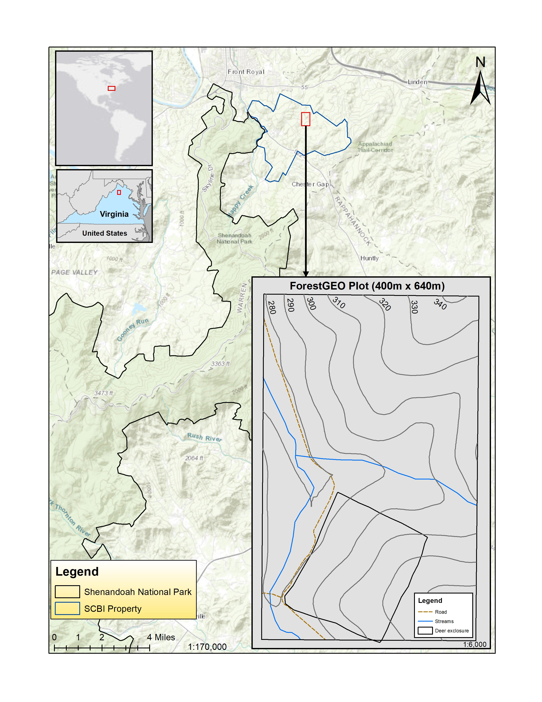

# Physical Environment

## Geographic location
The SCBI ForestGEO Large Forest Dynamics Plot is located within the Smithsonian Conservation Biology Institute (SCBI) in Virginia, USA (38 degrees 53'36.6"N, 78 degrees 08'43.4"W). Elevations range from 273 to 338 meters above sea level (masl) with a topographic relief of 65m [@bourg_initial_2013]. 

The SCBI is within a region encompassing the northern section of the Blue Ridge Mountains and the Appalachian Mountain range. The Shenandoah National Park (elevation range ~171 to ~1,234 masl) [@noauthor_park_nodate] lies directly to the southwest while smaller hills (of which the site is comprised) extend to the northwest. To the east of the site, the smaller hills give way to the lower Piedmont region, while in the west, they give way to the Shenandoah Valley under the Massanutten Mountains.

*Potential data to include:*
- NEON has topography, depth to water table, etc.

## Climate
The forest type across the 25.6-ha plot is homogeneously broadleaf, cold deciduous, with a mean annual temperature of 12.9 degrees C and a mean annual precipitation of 1001 mm. According to the Koppen-Geiger biome classifcation, the plot falls within the Cfa zone, characterized as humid subtropical/midlatitude with significant precipitation year-round. Primary disturbances at the SCBI ForestGEO Plot are natural and consist of wind and ice storms [@andersonteixeira_ctfs-forestgeo:_2015].

*Potential data to include:*
- SCBI weather tower
- NEON
- other (external) products [here](https://github.com/forestgeo/Climate/tree/master/Met_Station_Data/SCBI)

## Soils
*Potential data to include:*
- Data collected by Ben Turner
- NEON data

## Hydrology?
*Potential data to include:*
- NEON has relevant data (Posey STREON site)

[Teixeira et al. 2015](https://onlinelibrary.wiley.com/doi/epdf/10.1111/gcb.12712)