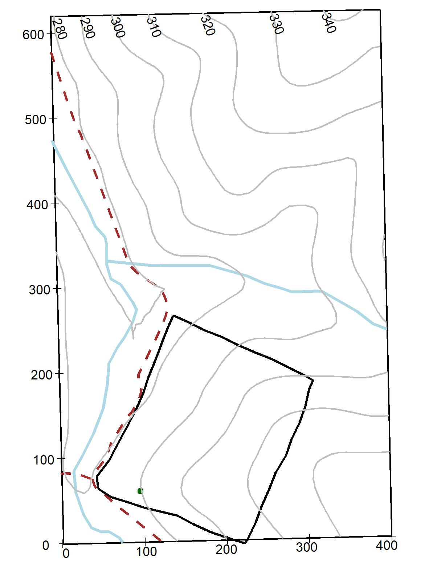
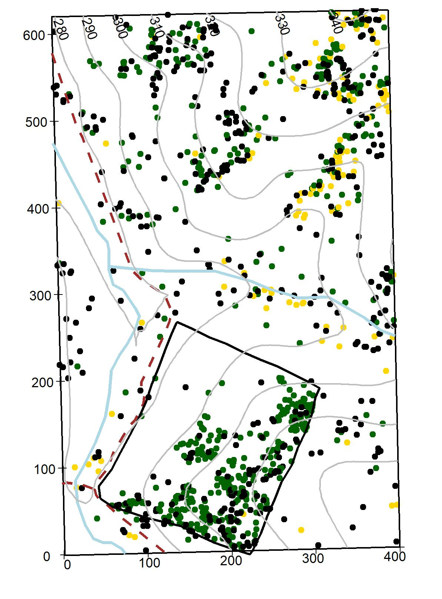
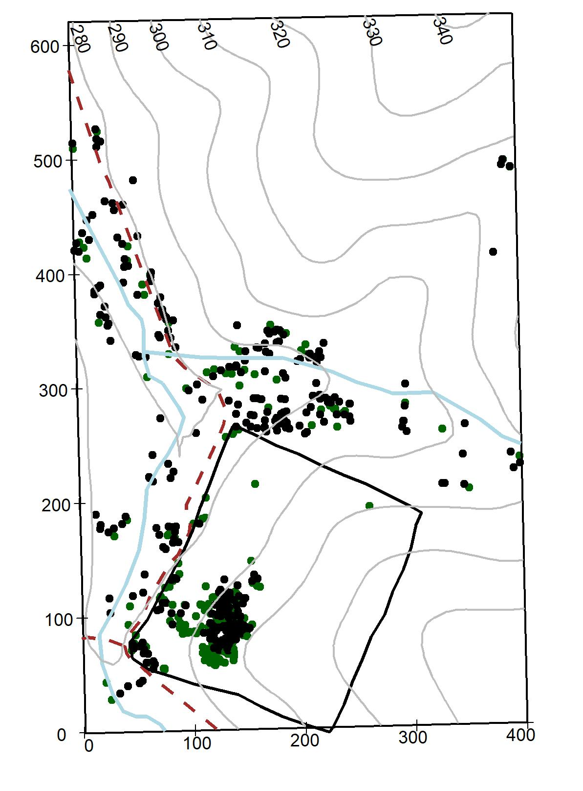
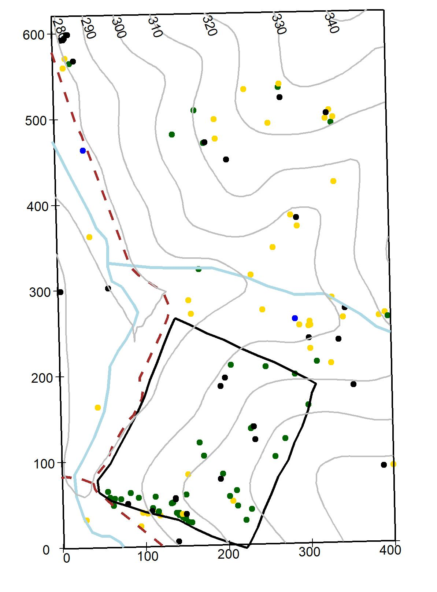
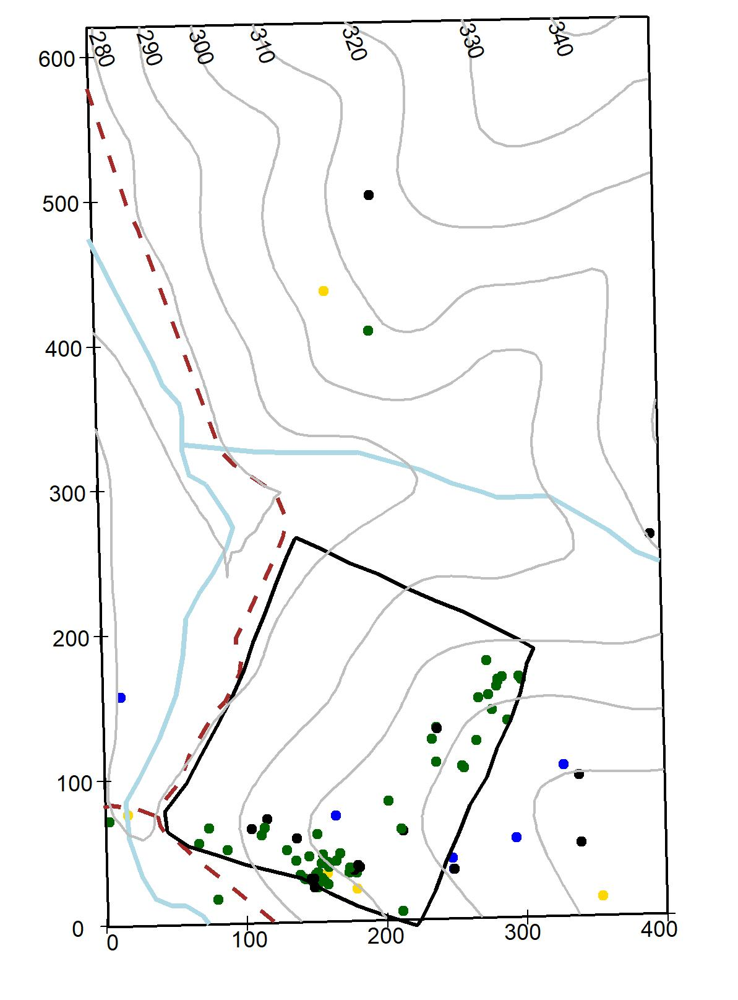
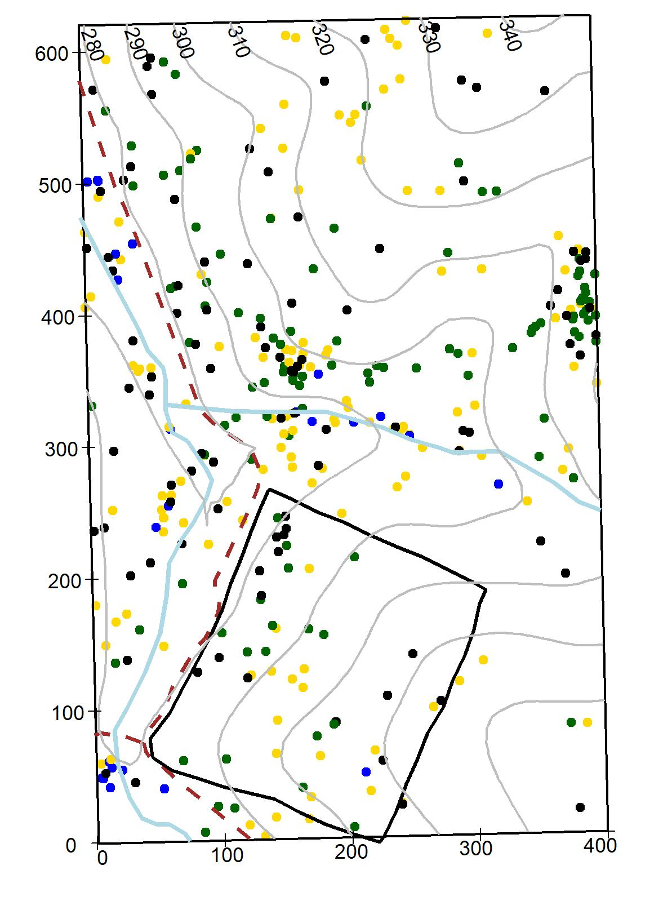
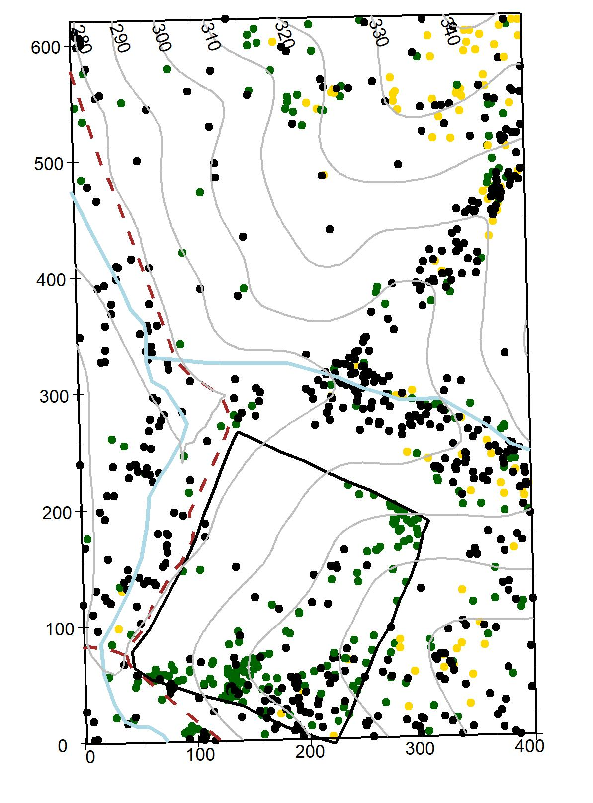

---
output:
  html_document: default
  pdf_document: default
fontsize: 12pt
---
# Species Descriptions

This chapter consist of botanical descriptions and ecological information on the 65 woody species measured within the 25.6- ha SCBI-ForstGEO plot. Species names are arranged alphabetically by family and species; species scientific name, authorship, and common names follow the Flora of Virginia conventions [@weakley_flora_2012]. If a synonym for a species name is given, then it is written after the symbol "=" below the species name used in the plot. The following are the main descriptors used for each species.

*Botanical descriptions*: All species in the plot were given a brief technical plant description summarized from the Flora of Virginia [@weakley_flora_2012] and the “Common Native Trees of Virginia” guide [@powell_common_2007]. Ecological aspects were subtracted from various sources [@weakley_flora_2012, noauthor_missouri_nodate]. Local habitat and species distribution refer to those within the plot.

*Stratum*: Indicates the main canopy position of the species based on the diameter of the species measured at the SCBI plot and by qualitative observations within the forest.

*Native status*: Indicates if the plant species is native or introduced to Virginia [@weakley_flora_2012].

*Conservation status*: Conservation status follows the standards from the IUCN Red List categories [@noauthor_standards_2016]: Least Concern: populations stable or taxon that do not qualify as threatened. Near threatened: taxon close to qualifying as threatened category in the near future). Vulnerable:  A taxon considered to be facing a high risk of extinction in the wild. Endangered: A taxon considered to be facing a very high risk of extinction in the wild. Critically endangered: A taxon considered to be facing an extremely high risk of extinction in the wild.

*Field code*: Species code used in the field and data sets (first two letters of genus and first two letters of species).

*Summary statistics*: A table summarizing basic statistics per species per census within the plot, include:  number of individual (stems), new stems (total stems recruited and recruitment rate), stems dead and annual mortality rates, minimum and maximum DBH, mean growth rate for stems < and > 10 cm.

*Species distribution maps within plot*: Distribution of each species within the 25.6 ha plot is illustrated in an individual topographic map (10-m contour lines). The blue lines represent 2 streams running South-North-N and West-East within the plot, the dotted red line represents a gravel road, and the black thick line represents a 4ha deer exclusion stablished in 1990 [@bourg_initial_2013]. Diameter for live and dead stems stems are symbolized as follow:by a gradient color scale 1-10 cm DBH, green dot; 10.1-50 cm DBH, yellow dot, and 50.1 cm DBH and above, blue dot; dead stems of any size, are represented by a black dot. The maps illustrate the species as surveyed in 2018. 

*Species regional range*: In the online version of this book, we present species range map for all species within the plot, except for *Elaeagnus umbellata*. Maps were sourced from the Botanical Information and Ecology Network [@noauthor_botanical_nodate] and depicts the distribution of the species globally.

*Pictures and graphs*: A leaf or group of leaves images are shown for each species. Leaves were collected fresh, scanned flat and images enhanced using the software GIMP 2.10.8. A 2-cm scale is given in the lower right corner. Pictures of tree cores are shown when available. Those pictures were produced using an Epson Expression 12000XL Photo Scanner. Climate sensitivity graphs built from tree cores show the relationship between multiple climate variables and tree growth, those graphs are only shown for 12 species (see @helcoski_growing_2019 for methods to build graphs).

## Adoxaceae
### *Sambucus canadensis* L. {-#Sambucus-canadensis}
Common name: Common Elderberry. Species code: saca.

Deciduous shrubs 1-4 m bark smooth with abundant lenticels, hairless; leaves compound, opposite, 15-30 cm, leaflets elliptic to lanceolate, 5-11 cm long, acuminate, margin sharply serrate, dark green above and much paler below; flat-topped cluster of flowers (cymes) 5-20 cm wide, flowers white, 3-4 mm, fragant; fruits drupes, 3-6 mm, deep purple or black, borne in flat-topped clusters. Infrequent through the plot, mostly occurring in damp soils. Stratum: understory. Native. Conservation status: Least concern.

{width=50%}{width=50%}

### *Viburnum acerifolium* L. {-#Viburnum-acerifolium}
Common name: Mapleleaf Viburnum. Species code: viac.

Deciduous shrubs, stems 1-2 m, bark smooth, twigs pubescent when young; leaves simple, opposite, 5-10 cm long, ovate or orbicular, rounded or hart-shape basally, palmately veined, three lobed, margin coarsely dentate, pubescent; flowers small, white, appearing in flat topped clusters 2-9 cm wide; drupes globose, 6-9 mm, black or purplish black, occurring in flat topped clusters. Infrequent through the plot, growing in dry areas. Stratum: understory. Native. Conservation status: Least concern.  

{width=50%}{width=50%}

###	*Viburnum prunifolium* L. {-#Viburnum-prunifolium}
Common name: Black Haw. Species code: vipr. 

Deciduous shrubs up to 8 m bark gray-brown breaking up into small square plates; leaves simple, opposite, 3-8 cm long, oval or oblong to elliptic, margin finely serrate,  dark green above and paler below.; flowers very small, white appearing in dense slightly rounded clusters 5-10 cm wide; drupes ellipsoid to subglobose, 8-15 mm, blue-black, hanging in clusters. Common through the plot, in wet to dry areas. Stratum: understory. Native. Conservation status: Least concern.  

{width=50%}{width=50%}

###	*Viburnum recognitum* Fernald {-#Viburnum-recognitum}
  **= *Virbunum dentatum L. var. lucidum***

Common name: Arrow-wood. Species code: vire.

Deciduous shrubs up to 4 m, bark reddish to grayish brown, twigs slender, hairless or slightly pubescent; leaves simple, opposite, 3-8 cm long, ovate to elliptic margin coarsely serrate, shiny dark green above, finely pubescent underside, hair confined to veins axils; flowers small, white appearing in flat topped clusters 3-11 cm wide; drupes subglobose to ellipsoid, 6-8 mm, blue-black, occurring in clusters. Rare through the plot, growing in dry areas. Stratum: understory. Native. Conservation status: Least concern. 

{width=50%}{width=50%}

## Annonaceae
### *Asimina triloba*	(L.) Dunal {-#Asimina-triloba}
Common name: Pawpaw, Common Pawpaw. Species code: astr. 

Shrubs or trees up to 15 m, bark brown, smooth; leaves simple, alternate, 10-35 cm long, obovate-oblong to lanceolate, acute tip, glabrous above, pubescent below; flowers 2-4 cm wide, dark purple to brown; fruit green berries 3-5 cm large, pulpy, edible, resembling a green mango. Growing in semi-wet areas in the plot, evident clonal patch distribution. Stratum: understory. Native. Conservation status: Least concern.

{width=50%}{width=50%}

## Aquifoliaceae
### *Ilex verticillata* (L.) A. Gray {-#Ilex-verticillata}
Common name: Winterberry. Species code: ilve.

Shrubs up to 8 m, rarely resembling a tree, stems glabrous or pubescent; leaves simple, alternate, 2-10 cm long, lanceolate to round-ovate to elliptic, lustrous above, pubescent below, margin serrate; very small flowers growing as clusters at the branch base, flowers white; drupes globose, small 5-7 mm, bright red to yellow. Rare through the plot. Stratum: understory. Native. Conservation status: Least concern.

{width=50%}{width=50%}

## Berberidaceae
### *Berberis thunbergii* DC. {-#Berberis-thunbergii}
Common name: Japanese Barberry. Species code: beth. 

Shrubs up to 2 m, compact, densely branched with thorny stems, bark gray-brown, finely shredded, twigs slender, angled and zigzagged; leaves simple, alternate, 5-30 mm long, spatulate to obovate; flowers solitary or in small clusters, pale yellow, berries ellipsoid to globose, 6-8 mm, showy red. Rare through the plot. Stratum: understory. Introduced (exotic, highly invasive). Conservation status: Least concern.

{width=50%}{width=50%}

## Betulaceae
### *Carpinus caroliniana* Walt. {-#Carpinus-caroliniana}
Common name: American Hornbeam, Ironwood, Muscle tree. Species code: caca.

Small tree or shrub up to 12 m, trunks with irregular, longitudinal ridges, bark smooth and tight; leaves simple, alternate, 3-12 cm long, ovate to elliptic, margin double serrated; flowers small, solitary or in clusters, occurring in long pendulous catkins 2-5 cm long, petals light yellow-green; fruit small nutlet covered by a 3-lobed leafy bract. Abundant in wet areas and inside the deer exclosure. Stratum: understory. Native. Conservation status: Least concern.

{width=50%}{width=50%}

###	*Corylus americana*	Walt. {-#Corylus-americana}
Common name: American Hazelnut, American Filbert. Species code: coam.

Shrubs up to 3.5 m, growing in colonies, twigs pubescent with small glands –lenticels- on bark; leaves simple, alternate, 7-15 cm long, broadly ovate to oval, margins finely double serrate; male flowers green-yellow catkins or female flowers inconspicuous with red styles of the pistils protruding, solitary or in clusters; fruits a small brown, globose nut, covered by leafy bracts, edible. Very rare through the plot. Stratum: understory. Native. Conservation status: Least concern.

{width=50%}{width=50%}

## Cannabaceae
### *Celtis occidentalis*	L. {-#Celtis-occidentalis}
Common name: Common Hackberry, Northern Hackberry. Species code: ceoc.

Tree or thick shrubs up to 25 m bark smooth and gray-brown when young, soon developing corky, irregular ridges at maturity, twigs slender, in zigzag, with numerous lenticels; leaves simple, alternate, 5-12 cm long, rounded or truncate 3-nerved, sometimes pubescent, margins serrate; flowers very small, 2-4 mm, light green; fruit rounded drupes, 7-14 mm in diameter, ellipsoid to globose, dark red to black. Infrequent through the plot. Stratum: understory. Native. Conservation status: Least concern.

{width=50%}{width=50%}

## Caprifoliaceae
### *Lonicera maackii* (Rupr.) Maxim {-#Lonicera-maackii}
Common name: Amur honeysuckle. Species code: loma.

Shrubs up to 5 m, multi-stemmed, bark with long, deep fissures, grayish brown, twigs hairless or slightly pubescent; leaves simple, opposite, 3.5-8.5 cm long, ovate to lance-ovate, 5-7 cm, slightly pubescent on veins underneath: flowers1.5-2.5 cm long, occurring in pairs, very fragrant, petals white becoming yellow; fruit a globose berry, 4-7 mm in diameter, dark red. Infrequent through the plot. Stratum: understory. Introduced, highly invasive. Conservation status: Least concern.

{width=50%}{width=50%}

## Celastracea
### *Euonymus alatus* (Thunb.) Sieb. {-#Euonymus-alatus}
Common name: Winged Euonymus, Burning Bush. Species code: eual.

Shrubs up to 2.5 m, bark gray to gray-brown, splitting revealing a lighter inner bark, twigs green, 4-angled with 2-4 conspicuous wings; leaves simple, opposite,6-8 cm long, elliptical to obovate, margin sharply serrate; flowers solitaries or in clusters of 3, very small, 6-8 mm wide, yellow-green; fruits a small 1-1.5 cm capsule, dark red. Rare through the plot. Stratum: understory. Introduced, highly invasive. Conservation status: Least concern.

{width=50%}{width=50%}

## Cornaceae
### *Cornus alternifolia*	L. f. {-#Cornus-alternifolia}
Common name: Alternate-leaf Dogwood, Pagoda Cornel, Pagoda Dogwood. Species code: coal.

Shrub or small tree up to 8 m, branches spreading young bark smooth, dark-green; leaves simple, alternate, 4-10 cm long, ovate to oblong to elliptic, pubescent and whitish below, crowded at the end of branchlets; flowers small, in cymes, flat topped, white petals flowers appearing before the leaves; fruits 4-7 mm, drupes, globose, blue. Rare through the plot (only 2 living individuals). Stratum: understory. Native. Conservation status: Least concern.

{width=50%}{width=50%}

### *Cornus florida* L. {-#Cornus-florida}
Common name: Flowering Dogwood. Species code: cofl.

Large shrub or small tree up to 10 m, bark reddish brown to black, branches wide; leaves simple, alternate, 6-13 cm long, ovate or elliptic to obovate, slightly pubescent and whitish below; flowers small, in cymes, flat topped, petals white, creamy or rarely pink subtended by bracts, flowers appearing before the leaves; fruits drupes 8-18 mm, subglobose, dark to bright red, in clusters of 5-6 drupes. Common through the plot although evidence of Anthracnose fungus is evident. Stratum: understory. Native. Conservation status: Least concern.

{width=50%}{width=50%}

## Ebenaceae
### *Diospyros virginiana* L. {-#Diospyros-virginiana}

{width=50%}{width=50%}

## Elaeagnaceae
### *Elaeagnus umbellata*	Thunb. {-#Elaeagnus-umbellata}

{width=50%}{width=50%}

## Fabaceae
### *Cercis canadensis* L. {-#Cercis-canadensis}

{width=50%}{width=50%}

### *Robinia pseudoacacia* L. {-#Robinia-pseudoacacia}

{width=50%}{width=50%}

## Fagaceae
### *Castanea dentata* (Marsh.) Borkh. {-#Castanea-dentata}

{width=50%}{width=50%}

### *Fagus grandifolia*	Ehrh. {-#Fagus-grandifolia}

{width=50%}{width=50%}

### *Quercus alba* L. {-#Quercus-alba}

{width=50%}{width=50%}

### *Quercus coccinea* Muenchh. {-#Quercus-coccinea}

{width=50%}{width=50%}

### *Quercus falcata* Michx. {-#Quercus-falcata}

{width=50%}{width=50%}

### *Quercus michauxii* Nutt. {-#Quercus-michauxii}

{width=50%}{width=50%}

### *Quercus montana* Willd. {-#Quercus-montana}

{width=50%}{width=50%}

### *Quercus muehlenbergii* Engelm. {-#Quercus-muehlenbergii}

{width=50%}{width=50%}

### *Quercus rubra*	L. {-#Quercus-rubra}

{width=50%}{width=50%}

### *Quercus velutina* Lam. {-#Quercus-velutina}

{width=50%}{width=50%}

## Hamamelidaceae
### *Hamamelis virginiana* L. var. virginiana {-#Hamamelis-virginiana}

{width=50%}{width=50%}

## Juglandaceae
### *Carya cordiformis* (Wangenh.) K. Koch {-#Carya-cordiformis}

{width=50%}{width=5%}

### *Carya glabra* (P. Mill.) {-#Carya-glabra}

{width=50%}{width=50%}

### *Carya ovalis* (Wangenh.) Sarg. {-#Carya-ovalis}

{width=50%}{width=50%}

### *Carya tomentosa* (Lam. ex Pior.) Nutt. {-#Carya-tomentosa}

{width=50%}{width=50%}

### *Juglans cinerea* L. {-#Juglans-cinerea}

{width=50%}{width=50%}

### *Juglans nigra*	L. {-#Juglans-nigra}

{width=50%}{width=50%}

## Lauraceae
### *Lindera benzoin* (L.) Blume {-#Lindera-benzoin}

{width=50%}{width=50%}

### *Sassafras albidum* (Nutt.) Nees {-#Sassafras-albidum}

{width=50%}{width=50%}

## Magnoliaceae
### *Liriodendron tulipifera*	L. {-#Liriodendron-tulipifera}

{width=50%}{width=50%}

## Malvaceae
### *Tilia americana* L. {-#Tilia-americana}

{width=50%}{width=50%}

## Nyssaceae
### *Nyssa sylvatica* Marsh. {-#Nyssa-sylvatica}

{width=50%}{width=50%}

## Oleaceae
### *Chionanthus virginicus* L. {-#Chionanthus-virginicus}

{width=50%}{width=50%}

### *Fraxinus americana* L. {-#Fraxinus-americana}

{width=50%}{width=50%}

### *Fraxinus nigra* Marsh. {-#Fraxinus-nigra}

{width=50%}{width=50%}

### *Fraxinus pennsylvanica* Marsh. {-#Fraxinus-pennsylvanica}

{width=50%}{width=50%}

## Paulowniaceae
### *Paulownia tomentosa*	(Thunb.) Sieb. & Zucc. ex Steud. {-#Paulownia-tomentosa}

{width=50%}{width=50%}

## Pinaceae
### *Pinus pungens*	Lamb. {-#Pinus-pungens}

{width=50%}{width=50%}

### *Pinus strobus* L. {-#Pinus-strobus}

{width=50%}{width=50%}

### *Pinus virginiana* P. Mill.	{-#Pinus-virginiana}

{width=50%}{width=50%}

## Platanaceae
### *Platanus occidentalis* L. {-#Platanus-occidentalis}

{width=50%}{width=50%}

## Rosaceae
### *Amelanchier arborea*	(Michx. f.) Fern. {-#Amelanchier-arborea}

{width=50%}{width=50%}

### *Crataegus pruinosa* (Wendl. f.) K. Koch var. pruinosa {-#Crataegus-pruinosa}

{width=50%}{width=50%}

### *Prunus avium* (L.) L. {-#Prunus-avium}

{width=50%}{width=50%}

### *Prunus persica* (L.) Batsch {-#Prunus-persica}

{width=50%}{width=50%}

### *Prunus serotina* Ehrh. var serotina {-#Prunus-serotina}

{width=50%}{width=50%}

### *Rosa multiflora* Thunb. ex Murr. {-#Rose-multiflora}

{width=50%}{width=50%}

### *Rubus allegheniensis* Porter {-#Rubus-alleghiensis}

{width=50%}{width=50%}

### *Rubus pensilvanicus*	Poir. {-#Rubus-pensilvanicus}

{width=50%}{width=50%}

### *Rubus phoenicolasius* Maxim. {-#Rubus-phoenicolasius}

{width=50%}{width=50%}

## Sapindaceae
### *Acer negundo* L. var negundo {-#Acer-negundo}

{width=50%}{width=50%}

### *Acer platanoides* L. {-#Acer-platanoides}

{width=50%}{width=50%}

### *Acer rubrum*	L. {-#Acer-rubrum}

{width=50%}{width=50%}

## Simaroubaceae
### *Ailanthus altissima* (P. Miller) Swingle {-#Ailanthus-altissima}

{width=50%}{width=50%}

## Ulmaceae
### *Ulmus americana*	L. {-#Ulmus-americana}

{width=50%}{width=50%}

### *Ulmus rubra*	Muhl. {-#Ulmus-rubra}

{width=50%}{width=50%}
