---
output:
  html_document: default
  pdf_document: default
fontsize: 12pt
---
# Species Descriptions

This chapter consist of botanical descriptions and ecological information on the 65 woody species measured within the 25.6- ha SCBI-ForstGEO plot. Species names are arranged alphabetically by family and species; species scientific name, authorship, and common names follow the Flora of Virginia conventions (Weakley et al, 2012). If a synonym for a species name is given, then it is written after the symbol "=" below the species name used in the plot. The following are the main descriptors used for each species.

*Botanical descriptions*: All species in the plot were given a brief plant description summarized from the Flora of Virginia (Weakley et al, 2012). Ecological aspects were subtracted from various sources (Weakley et al, 2012, Missouri Botanical Garden, https://www.missouribotanicalgarden.org). Habitat and distribution refer to those within the plot. 

*Stratum*: Indicates the main canopy position of the species based on the diameter of the species measured at the SCBI plot and by qualitative observations within the forest.

*Native status*: Indicates if the plant species is native or introduced to Virginia (source Weakley et al, 2012).

*Conservation status*: The conservation for each species follow the categories from the IUCN Red List categories (IUCN Standards and Petitions Subcommittee, 2017): Least Concern: populations stable or taxon that do not qualify as threatened. Near threatened: taxon close to qualifying as threatened category in the near future). Vulnerable:  A taxon considered to be facing a high risk of extinction in the wild. Endangered: A taxon considered to be facing a very high risk of extinction in the wild. Critically endangered: A taxon considered to be facing an extremely high risk of extinction in the wild.

*Field code*: Species code used in the field and data sets (first two letters of genus and first two letters of species).

*Summary statistics*: A table summarizing basic statistics per species per census within the plot, include:  number of individual (stems), new stems (total stems recruited and recruitment rate), stems dead and annual mortality rates, minimum and maximum DBH, mean growth rate for stems < and > 10 cm.
Species distribution maps within plot: Distribution of each species within the 25.6 ha plot is illustrated in an individual topographic map (10-m contour lines). The blue lines represent 2 streams running S-N and W-E, the dotted line represents a gravel road, and the black line represents a 4ha deer exclusion stablished in 1990 [@bourg_initial_2013]. Diameter for live stems are symbolized by a gradient color scale, dead stems are represented by a black dot. The maps illustrate the species as survey in 2018.

*Species regional range*: In the online version of this book, we present species range map for all species within the plot, except for *Elaeagnus umbellata*. Maps were sourced from the Botanical Information and Ecology Network (BIEN, version 4.1, http://bien.nceas.ucsb.edu/bien) and depicts the distribution of the species globally.

*Pictures and graphs*: A leaf or group of leaves images are shown for each species. Leaves were collected fresh, scanned flat and images enhanced using the software GIMP 2.10.8. A 2-cm scale is given in the lower right corner. Pictures of tree cores are shown when available. Those pictures were produced using an Epson Expression 12000XL Photo Scanner. Climate sensitivity graphs built from tree cores show the relationship between multiple climate variables and tree growth, those graphs are only shown for 12 species (see Helckoski et al, 2019 for methods to build graphs).

References 
IUCN Standards and Petitions Subcommittee. 2017. Guidelines for Using the IUCN Red List Categories and Criteria. Version 13.

## Adoxaceae
### *Sambucus canadensis* L. {-#Sambucus-canadensis}
Common name: Common Elderberry. Species code: saca.

Deciduous shrubs, leaflets sharply serrate, flowers fragant, white, drupes deep purple or black. Infrequent through the plot, in damp soils. Stratum: understory. Native. Conservation status: Least concern.

{width=50%}{width=50%}

### *Viburnum acerifolium* L. {-#Viburnum-acerifolium}
Common name: Mapleleaf Viburnum. Species code: viac.

Deciduous shrubs, leaves ovate or orbicular, palmately veined, three lobed, and dentate, flowers white, drupes black or purplish black. Infrequent through the plot, dry soils. Stratum: understory. Native. Conservation status: Least concern. 

{width=75%}{width=25%}

###	*Viburnum prunifolium* L. {-#Viburnum-prunifolium}
Common name: Black Haw. Species code: vipr. 

Deciduous shrubs, leaves oval or oblong, serrate margin, flowers white, drupes blue-black. Common through the plot, in wet to dry areas. Stratum: understory. Native. Conservation status: Least concern. 

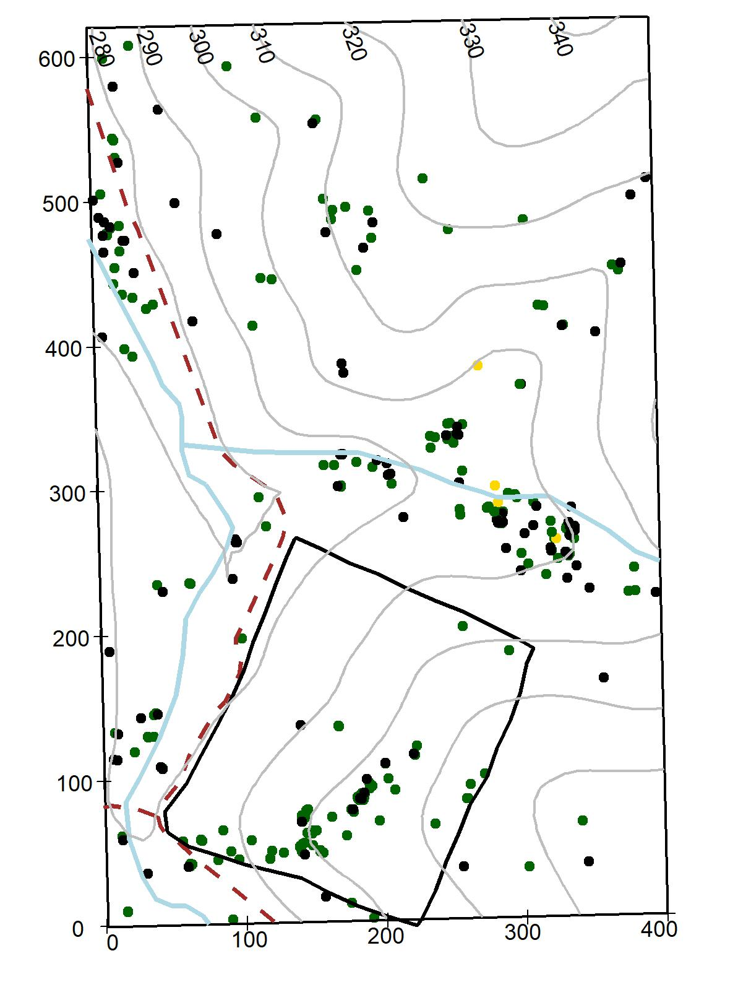{width=75%}{width=25%}

###	*Viburnum recognitum* Fernald {-#Viburnum-recognitum}
  **= *Virbunum dentatum L. var. lucidum***

Common name: Arrow-wood. Species code: vire.

Deciduous shrubs with reddish bark, leaves ovate, serrate margin, hairs on leaf underside confined to veins axils, flowers white, drupes blue-black. Rare through the plot, in dry areas. Stratum: understory. Native. Conservation status: Least concern. 

{width=75%}{width=25%}

## Annonaceae
### *Asimina triloba*	(L.) Dunal {-#Asimina-triloba}
Common name: Pawpaw, Common Pawpaw. Species code: astr. 

Shrubs or trees up to 15 m, bark brown, leaves simple, obovate-oblong to lanceolate, acute tip, glabrous above, pubescent below, flower dark purple to brown, fruit green berries. Growing in semi-wet areas in the plot, evident clonal patch distribution. Stratum: understory. Native. Conservation status: Least concern.

{width=75%}{width=25%}

## Aquifoliaceae
### *Ilex verticillata* (L.) A. Gray {-#Ilex-verticillata}
Common name: Winterberry. Species code: ilve.

Shrubs up to 8 m, stems glabrous or pubescent, leaves lanceolate to round-ovate to elliptic, lustrous above, pubescent below, margin serrate, flowers white, drupes bright red to yellow. Rare through the plot. Stratum: understory. Native. Conservation status: Least concern.

{width=75%}{width=25%}

## Berberidaceae
### *Berberis thunbergii* DC. {-#Berberis-thunbergii}
Common name: Japanese Barberry. Species code: beth. 

Shrubs up to 2 m, compact, thorny stems, leaves small (5-15 mm), spatulate to obovate, flowers yellow, berries ellipsoid to globose, showy red. Rare through the plot. Stratum: understory. Introduced (problematic exotic invasive). Conservation status: Least concern.

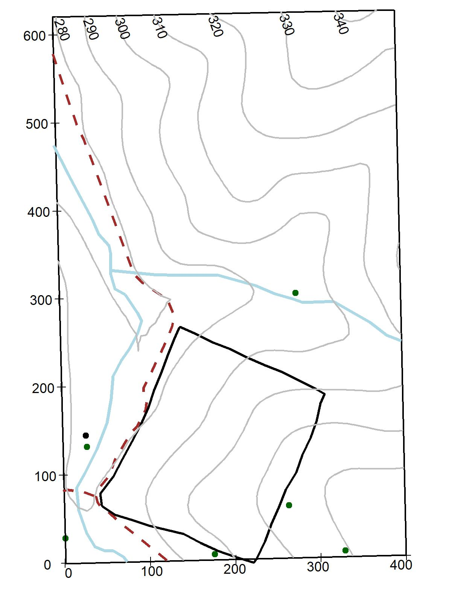{width=75%}{width=25%}

## Betulaceae
### *Carpinus caroliniana* Walt. {-#Carpinus-caroliniana}
Common name: American Hornbeam, Ironwood, Muscle tree. Species code: caca.
Shrubby tree up to 10 m, trucks with irregular, longitudinal ridges, bark smooth and tight, leaves ovate to elliptic, serrate margin, flowers yellow-green, fruit catkins. Abundant in wet areas and inside deer exclosure. Stratum: understory. Native. Conservation status: Least concern.

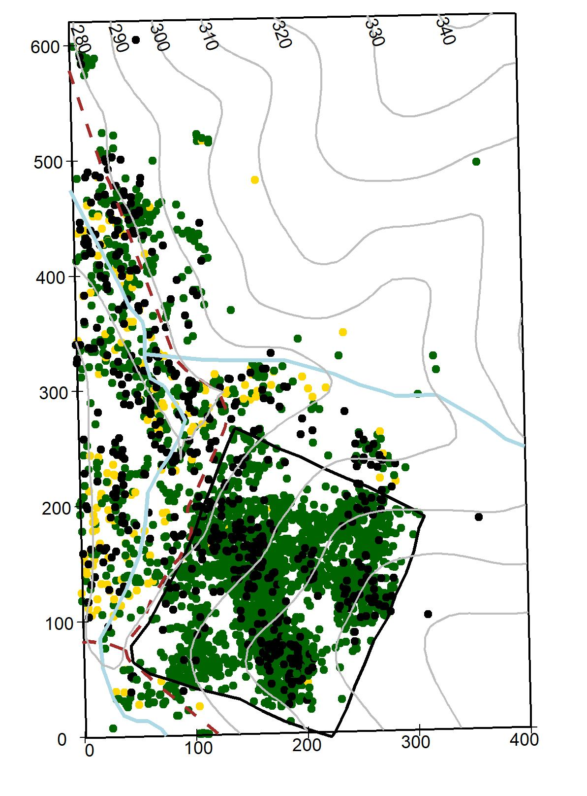{width=75%}{width=25%}

###	*Corylus americana*	Walt. {-#Corylus-americana}
Common name: American Hazelnut, American Filbert. Species code: coam.
Shrubs up to 3.5 m, growing in colonies, leaves broadly ovate, margins finely serrate, male flowers green-yellow catkins or female flowers inconspicuous with red styles of the pistils protruding, fruits a small nut, covered by bracts. Very rare through the plot. Stratum: understory. Native. Conservation status: Least concern.

{width=75%}{width=25%}

## Cannabaceae
### *Celtis occidentalis*	L. {-#Celtis-occidentalis}
Common name: Common Hackberry, Northern Hackberry. Species code: ceoc.
Tree or thick shrubs up to 30 m, leaves rounded or truncate 3-nerved, margins toothed, flowers greenish, fruit drupes, dark red to black. Infrequent through the plot. Stratum: understory. Native. Conservation status: Least concern.

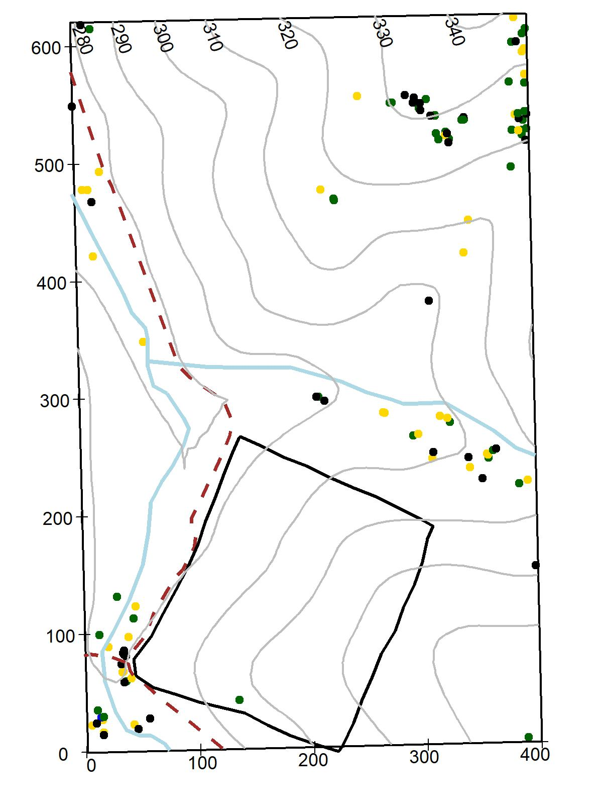{width=75%}{width=25%}

## Caprifoliaceae
### *Lonicera maackii* (Rupr.) Maxim {-#Lonicera-maackii}
Common name: Amur honeysuckle. Species code: loma.
Shrubs up to 5 m, twigs pubescent, leaves ovate to lance-ovate, pubescent on veins, flowers whites, fruit globose red berries. Infrequent through the plot. Stratum: understory. Introduced. Conservation status: Least concern.

{width=75%}{width=25%}

## Celastracea
### *Euonymus alatus* (Thunb.) Sieb. {-#Euonymus-alatus}
Common name: Winged Euonymus, Burning Bush. Species code: eual.
Shrubs up to 2.5 m, twigs 4-angled with 2-4 conspicuous wings, leaves elliptical to obovate, sharply serrate, flowers small, green, fruits capsules. Rare through the plot. Stratum: understory. Introduced. Conservation status: Least concern.

{width=75%}{width=25%}

## Cornaceae
### *Cornus alternifolia*	L. f. {-#Cornus-alternifolia}
Common name: Alternate-leaf Dogwood, Pagoda Cornel, Pagoda Dogwood. Species code: coal.
Shrub or small tree up to 8 m, leaves ovate to oblong to elliptic, crowded at the end of branchlets, flowers small, white, fruits globose drupes blue. Rare through the plot (only 2 living individuals). Stratum: understory. Native. Conservation status: Least concern.

{width=75%}{width=25%}

### *Cornus florida* L. {-#Cornus-florida}
Common name: Flowering Dogwood. Species code: cofl.
Large shrub or small tree up to 15 m, leaves ovate or elliptic to obovate, flowers white, creamy or rarely pink subtended by bracts, fruits globose dark to bright red. Common through the plot although evidence of Anthracnose fungus is evident. Stratum: understory. Native. Conservation status: Least concern.

{width=75%}{width=25%}

## Ebenaceae
### *Diospyros virginiana* L. {-#Diospyros-virginiana}

{width=75%}{width=25%}

## Elaeagnaceae
### *Elaeagnus umbellata*	Thunb. {-#Elaeagnus-umbellata}

{width=75%}{width=25%}

## Fabaceae
### *Cercis canadensis* L. {-#Cercis-canadensis}

{width=75%}{width=25%}

### *Robinia pseudoacacia* L. {-#Robinia-pseudoacacia}

{width=75%}{width=25%}

## Fagaceae
### *Castanea dentata* (Marsh.) Borkh. {-#Castanea-dentata}

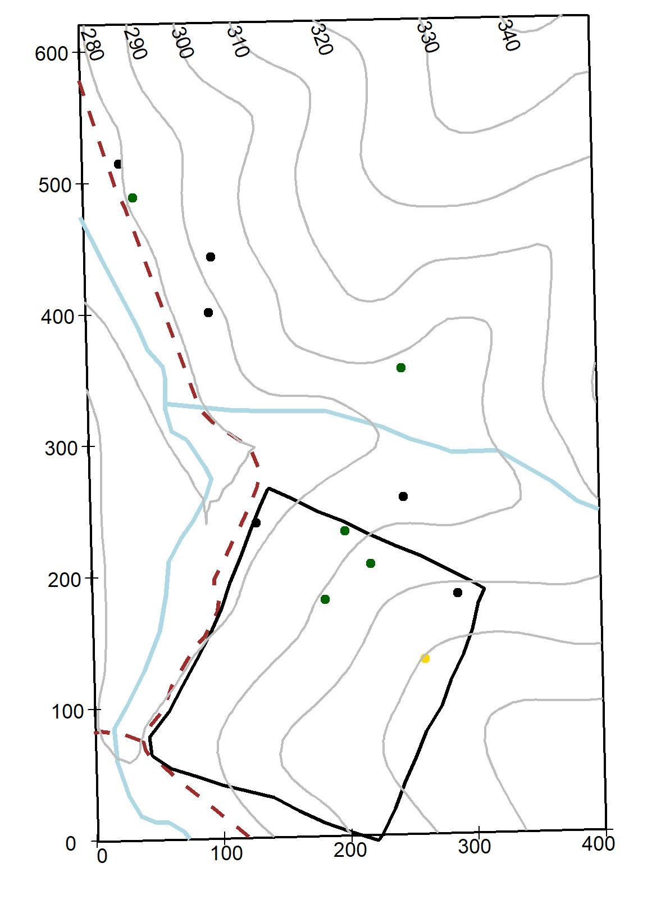{width=75%}{width=25%}

### *Fagus grandifolia*	Ehrh. {-#Fagus-grandifolia}

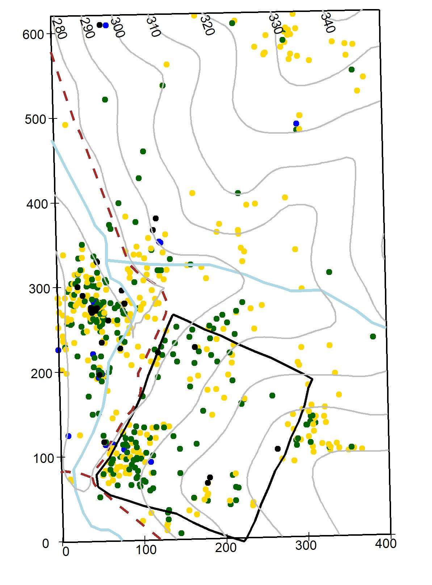{width=75%}{width=25%}

### *Quercus alba* L. {-#Quercus-alba}

{width=75%}{width=25%}

### *Quercus coccinea* Muenchh. {-#Quercus-coccinea}

{width=75%}{width=25%}

### *Quercus falcata* Michx. {-#Quercus-falcata}

{width=75%}{width=25%}

### *Quercus michauxii* Nutt. {-#Quercus-michauxii}

{width=75%}{width=25%}

### *Quercus montana* Willd. {-#Quercus-montana}

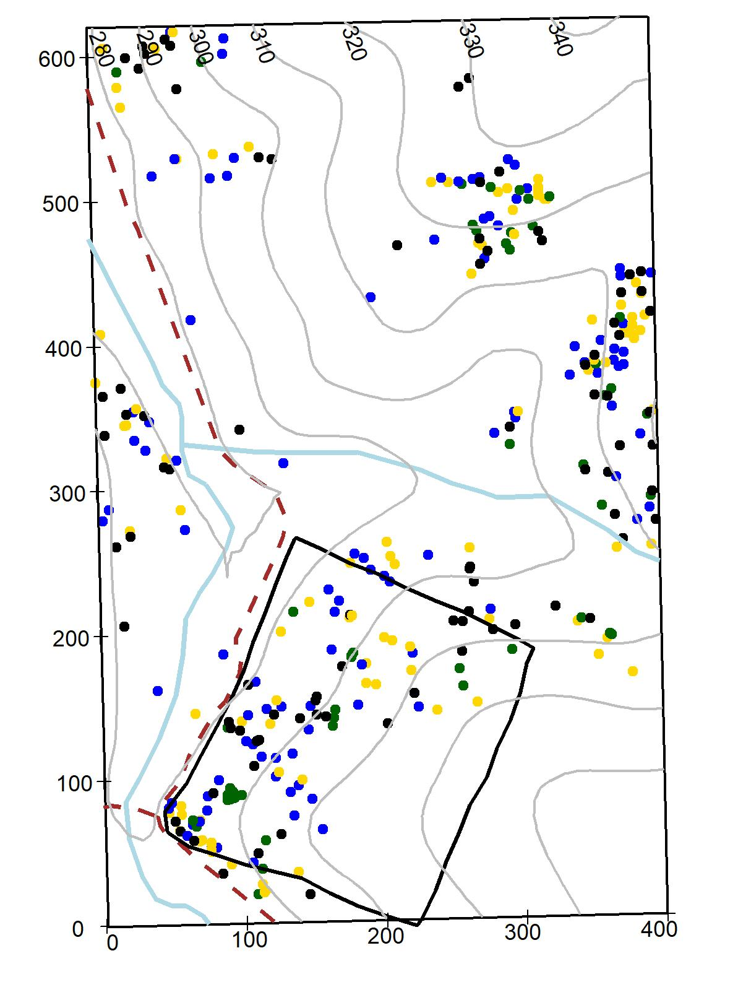{width=75%}{width=25%}

### *Quercus muehlenbergii* Engelm. {-#Quercus-muehlenbergii}

{width=75%}{width=25%}

### *Quercus rubra*	L. {-#Quercus-rubra}

{width=75%}{width=25%}

### *Quercus velutina* Lam. {-#Quercus-velutina}

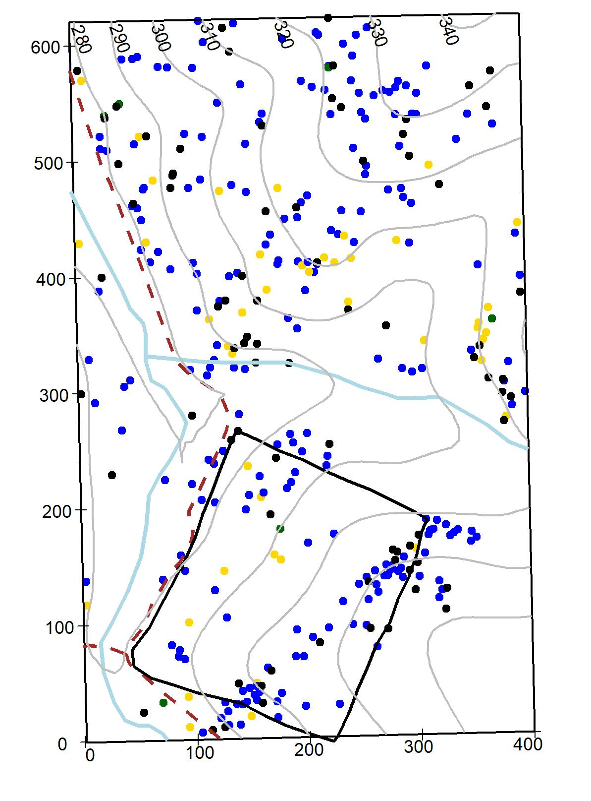{width=75%}{width=25%}

## Hamamelidaceae
### *Hamamelis virginiana* L. var. virginiana {-#Hamamelis-virginiana}

{width=75%}{width=25%}

## Juglandaceae
### *Carya cordiformis* (Wangenh.) K. Koch {-#Carya-cordiformis}

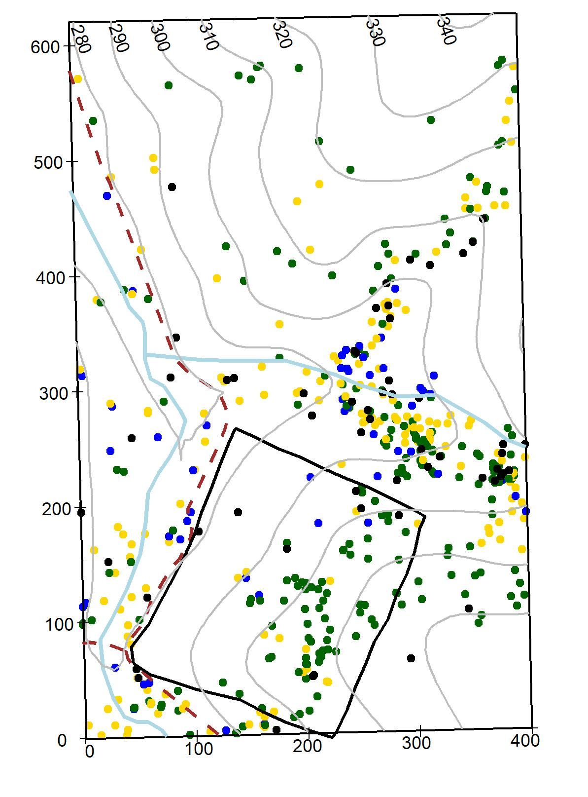{width=75%}{width=25%}

### *Carya glabra* (P. Mill.) {-#Carya-glabra}

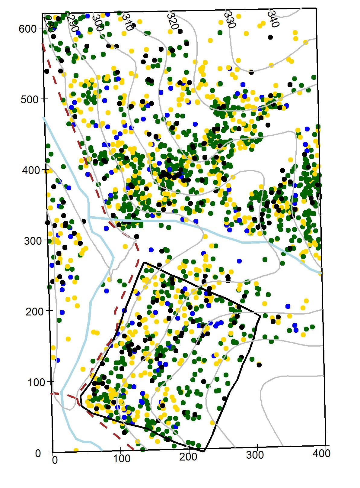{width=75%}{width=25%}

### *Carya ovalis* (Wangenh.) Sarg. {-#Carya-ovalis}

{width=75%}{width=25%}

### *Carya tomentosa* (Lam. ex Pior.) Nutt. {-#Carya-tomentosa}

{width=75%}{width=25%}

### *Juglans cinerea* L. {-#Juglans-cinerea}

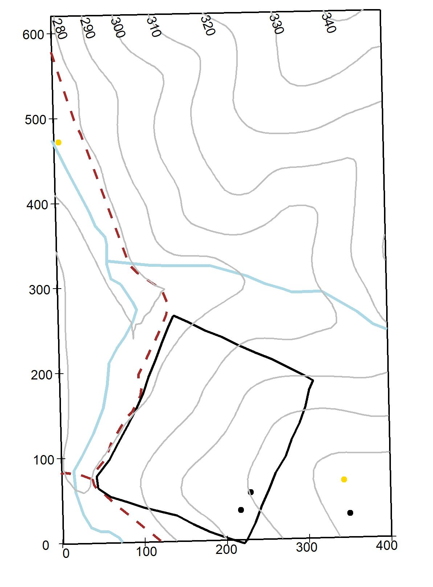{width=75%}{width=25%}

### *Juglans nigra*	L. {-#Juglans-nigra}

{width=75%}{width=25%}

## Lauraceae
### *Lindera benzoin* (L.) Blume {-#Lindera-benzoin}

{width=75%}{width=25%}

### *Sassafras albidum* (Nutt.) Nees {-#Sassafras-albidum}

{width=75%}{width=25%}

## Magnoliaceae
### *Liriodendron tulipifera*	L. {-#Liriodendron-tulipifera}

{width=75%}{width=25%}

## Malvaceae
### *Tilia americana* L. {-#Tilia-americana}

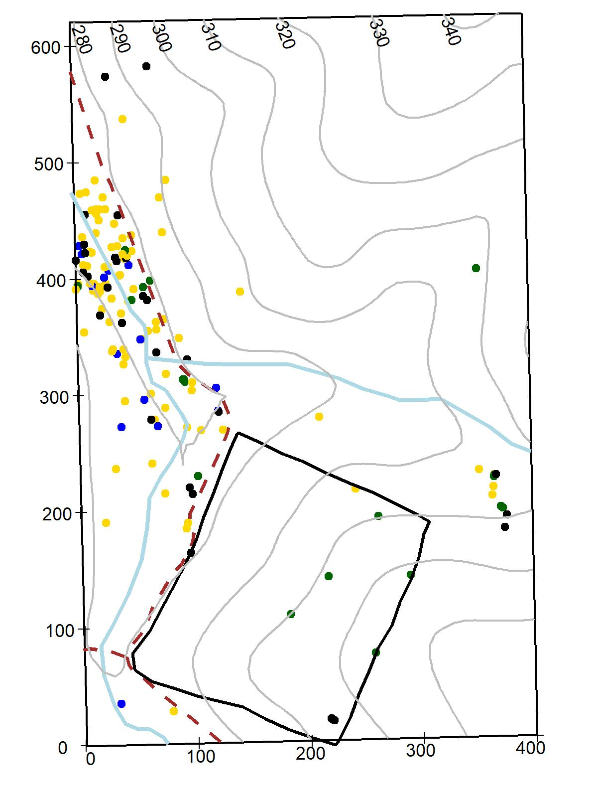{width=75%}{width=25%}

## Nyssaceae
### *Nyssa sylvatica* Marsh. {-#Nyssa-sylvatica}

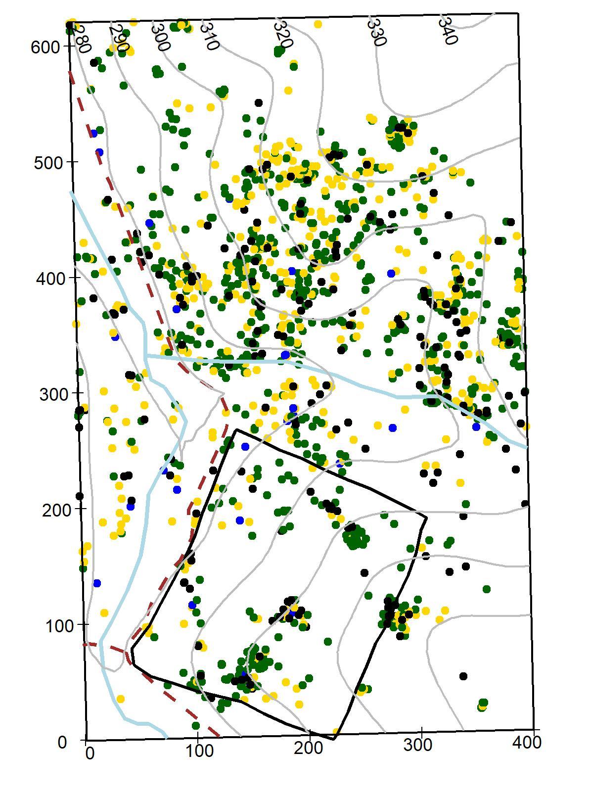{width=75%}{width=25%}

## Oleaceae
### *Chionanthus virginicus* L. {-#Chionanthus-virginicus}

{width=75%}{width=25%}

### *Fraxinus americana* L. {-#Fraxinus-americana}

{width=75%}{width=25%}

### *Fraxinus nigra* Marsh. {-#Fraxinus-nigra}

{width=75%}{width=25%}

### *Fraxinus pennsylvanica* Marsh. {-#Fraxinus-pennsylvanica}

{width=75%}{width=25%}

## Paulowniaceae
### *Paulownia tomentosa*	(Thunb.) Sieb. & Zucc. ex Steud. {-#Paulownia-tomentosa}

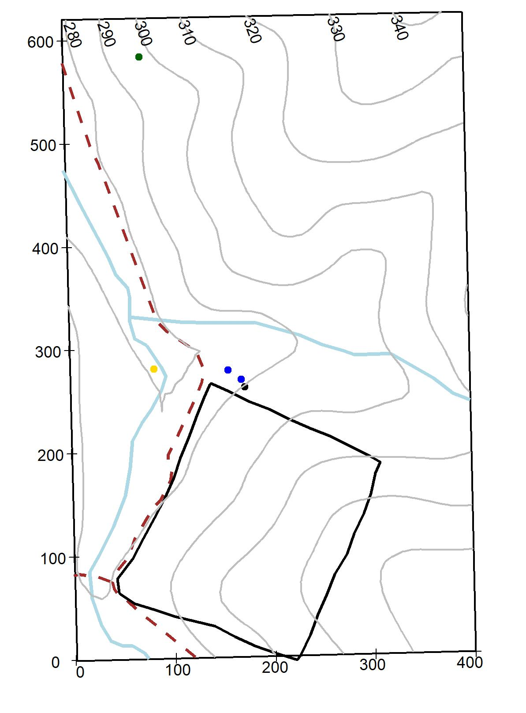{width=75%}{width=25%}

## Pinaceae
### *Pinus pungens*	Lamb. {-#Pinus-pungens}

{width=75%}{width=25%}

### *Pinus strobus* L. {-#Pinus-strobus}

{width=75%}{width=25%}

### *Pinus virginiana* P. Mill.	{-#Pinus-virginiana}

{width=75%}{width=25%}

## Platanaceae
### *Platanus occidentalis* L. {-#Platanus-occidentalis}

{width=75%}{width=25%}

## Rosaceae
### *Amelanchier arborea*	(Michx. f.) Fern. {-#Amelanchier-arborea}

{width=75%}{width=25%}

### *Crataegus pruinosa* (Wendl. f.) K. Koch var. pruinosa {-#Crataegus-pruinosa}

{width=75%}{width=25%}

### *Prunus avium* (L.) L. {-#Prunus-avium}

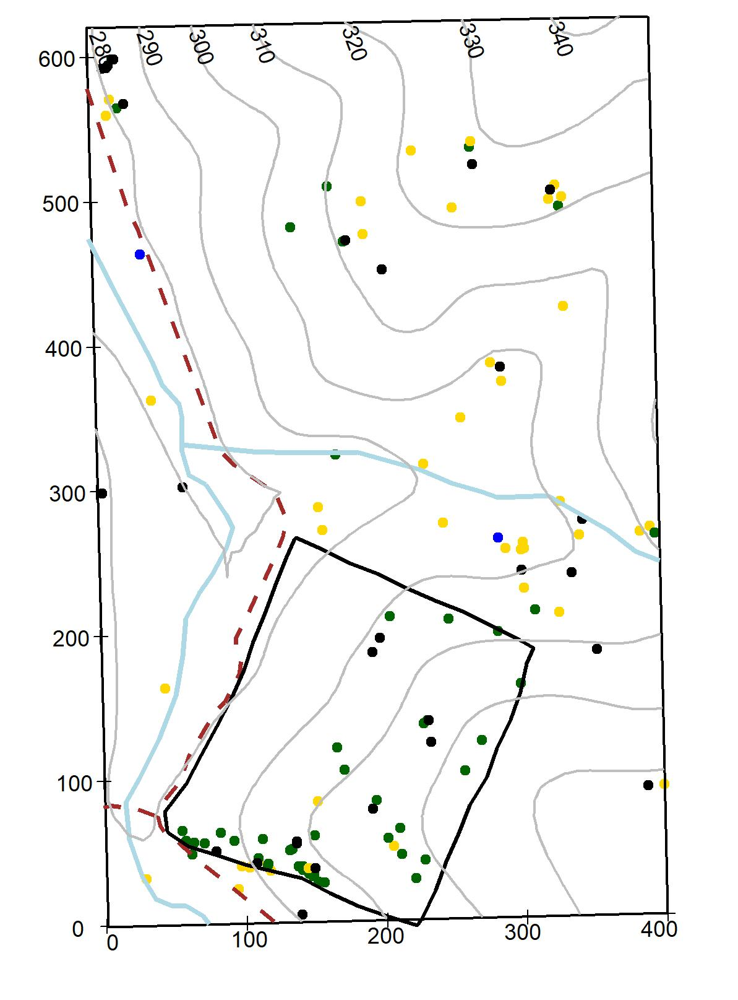{width=75%}{width=25%}

### *Prunus persica* (L.) Batsch {-#Prunus-persica}

{width=75%}{width=25%}

### *Prunus serotina* Ehrh. var serotina {-#Prunus-serotina}

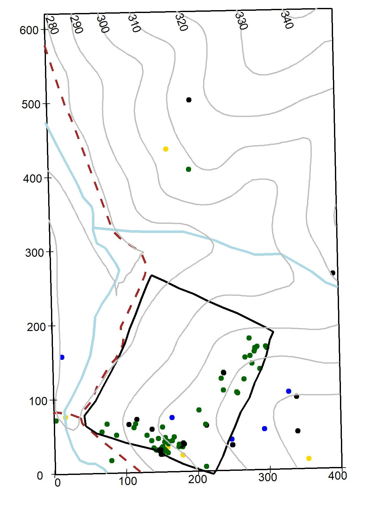{width=75%}{width=25%}

### *Rosa multiflora* Thunb. ex Murr. {-#Rose-multiflora}

{width=75%}{width=25%}

### *Rubus allegheniensis* Porter {-#Rubus-alleghiensis}

{width=75%}{width=25%}

### *Rubus pensilvanicus*	Poir. {-#Rubus-pensilvanicus}

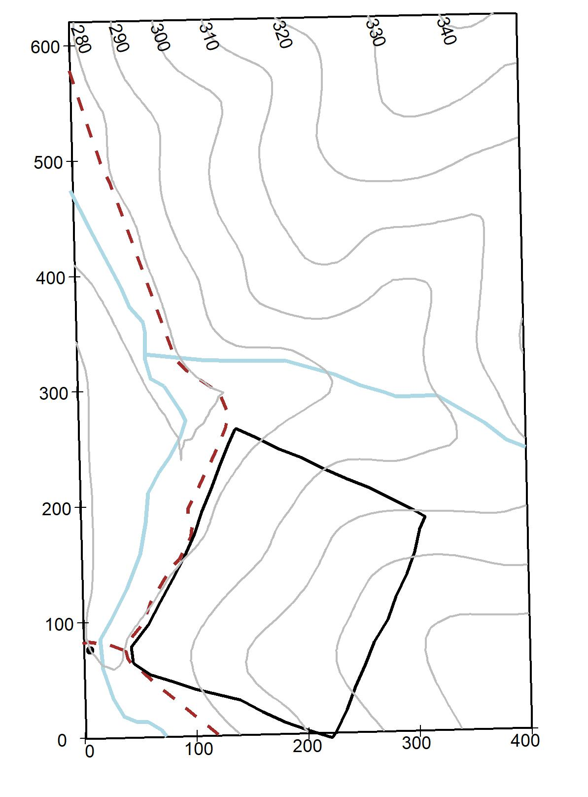{width=75%}{width=25%}

### *Rubus phoenicolasius* Maxim. {-#Rubus-phoenicolasius}

{width=75%}{width=25%}

## Sapindaceae
### *Acer negundo* L. var negundo {-#Acer-negundo}

{width=75%}{width=25%}

### *Acer platanoides* L. {-#Acer-platanoides}

{width=75%}{width=25%}

### *Acer rubrum*	L. {-#Acer-rubrum}

{width=75%}{width=25%}

## Simaroubaceae
### *Ailanthus altissima* (P. Miller) Swingle {-#Ailanthus-altissima}

{width=75%}{width=25%}

## Ulmaceae
### *Ulmus americana*	L. {-#Ulmus-americana}

{width=75%}{width=25%}

### *Ulmus rubra*	Muhl. {-#Ulmus-rubra}

{width=75%}{width=25%}
