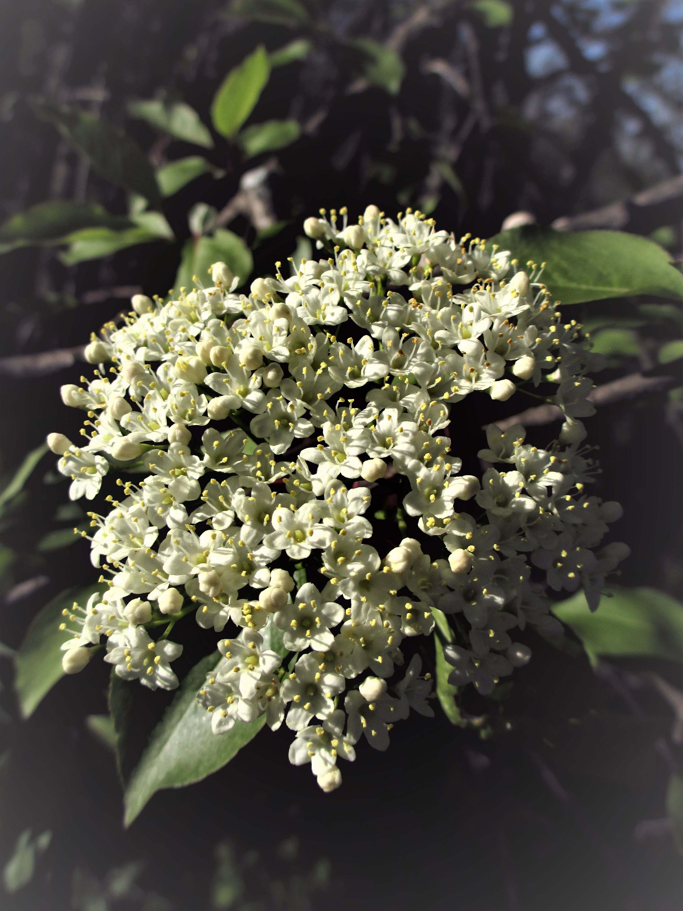

# Species Information

##Adoxaceae

### *Sambucus canadensis var. canadensis* (L.) R. Bolli
#### Common Elderberry
Shrub with white flowers, green opposite compound leaves, and deep violet to blackish fruit. Leaflets are serrate, with 1cm petiolule and 3-10cm petioles. These shrubs live in damp soils located along roadsides and 

```Leaf traits (written about or scanned and labeled)```


```Picture of tree cores (with a small blurb)```

### *Viburnum acerifolium* L. ```Mapleleaf Viburnum```
1-2m shrub with off-white flowers, green leaves, and purplish-black fruit. Leaves are dentate with 1-4cm petioles.
```Leaf traits (written about or scanned and labeled)```


```Picture of tree cores (with a small blurb)```

###	*Viburnum prunifolium* L. ```Black Haw```



```Leaf traits (written about or scanned and labeled)```


```Picture of tree cores (with a small blurb)```

###	*Viburnum recognitum* Fernald ```Southern Arrow-wood```
Viburnum recognitum, also known as *Viburnum dentatum* L., is a multi-stemmed shrub with white flowers, green leaves, and fruits resembling that of a blueberry (however, one of the relating species actually fruits cranberries.).

```Leaf traits (written about or scanned and labeled)```


```Picture of tree cores (with a small blurb)```

## Annonaceae
### *Asimina triloba*	(L.) Dunal ```Pawpaw```

```Leaf traits (written about or scanned and labeled)```

```Graph of recruiment and mortality```


```Picture of tree cores (with a small blurb)```

##Aquifoliaceae
### *Ilex verticillata* (L.) A. Gray ```Common Winterberry```

```Leaf traits (written about or scanned and labeled)```

```Graph of recruiment and mortality```


```Picture of tree cores (with a small blurb)```