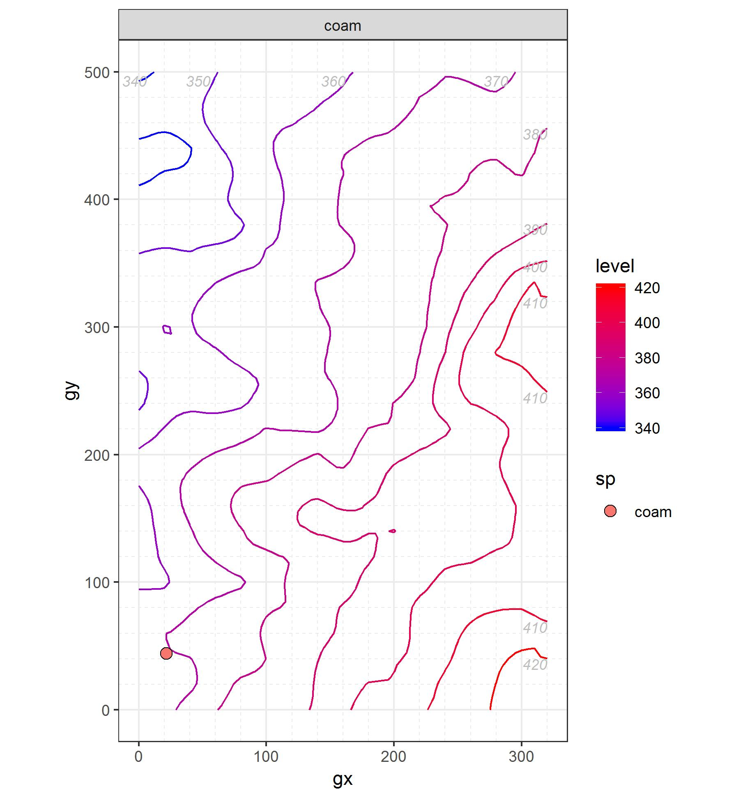

##Berberidaceae
### *Berberis thunbergii* DC. ```Japanese Barberry```

```Leaf traits (written about or scanned and labeled)```

```Graph of recruiment and mortality```


```Picture of tree cores (with a small blurb)```

## Betulaceae
### *Carpinus caroliniana* Walt. ```American Hornbeam```

```Leaf traits (written about or scanned and labeled)```

```Graph of recruiment and mortality```


```Picture of tree cores (with a small blurb)```

###	*Corylus americana*	Walt. ```American Hazelnut```

```Leaf traits (written about or scanned and labeled)```

```Graph of recruiment and mortality```




```Picture of tree cores (with a small blurb)```

## Cannabaceae
### *Celtis occidentalis*	L. ```Hackberry```

```Leaf traits (written about or scanned and labeled)```

```Graph of recruiment and mortality```


```Picture of tree cores (with a small blurb)```

## Caprifoliaceae
### *Lonicera maackii* (Rupr.) Maxim ```Bush Honeysuckle```

```Leaf traits (written about or scanned and labeled)```

```Graph of recruiment and mortality```


```Picture of tree cores (with a small blurb)```

## Celastracea
### *Euonymus alatus* (Thunb.) Sieb. ```Burning Bush```
**Species is also known as Winged Euonymus.**```

```Leaf traits (written about or scanned and labeled)```

```Graph of recruiment and mortality```


```Picture of tree cores (with a small blurb)```

## Cornaceae
### *Cornus alternifolia*	L. f. ```Alternate Leaf Dogwood```

```Leaf traits (written about or scanned and labeled)```

```Graph of recruiment and mortality```


```Picture of tree cores (with a small blurb)```

### *Cornus florida* L. ```Flowering Dogwood```

```Leaf traits (written about or scanned and labeled)```

```Graph of recruiment and mortality```


```Picture of tree cores (with a small blurb)```