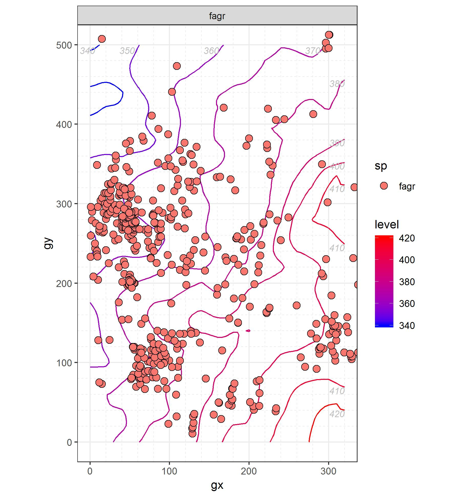
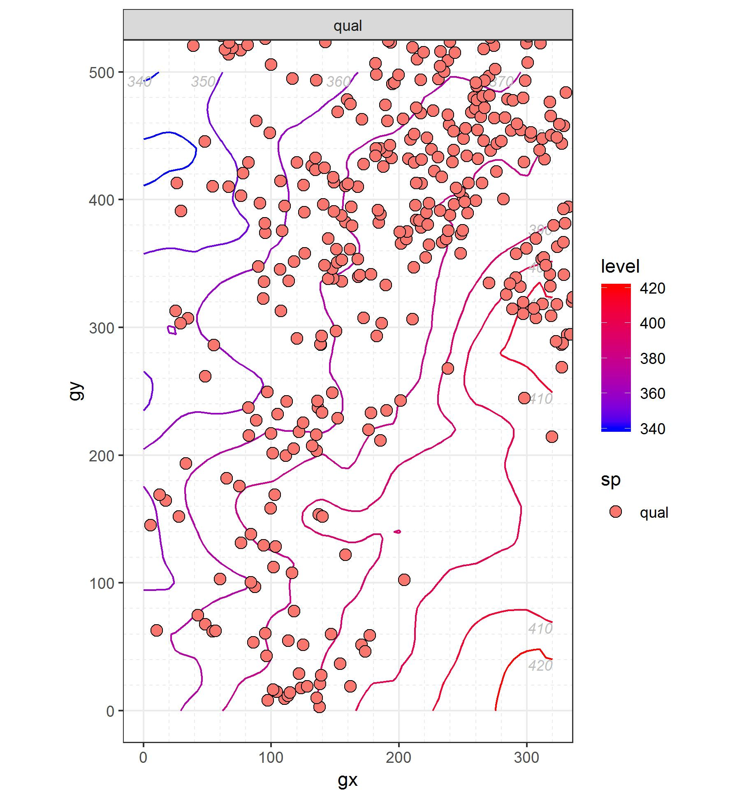
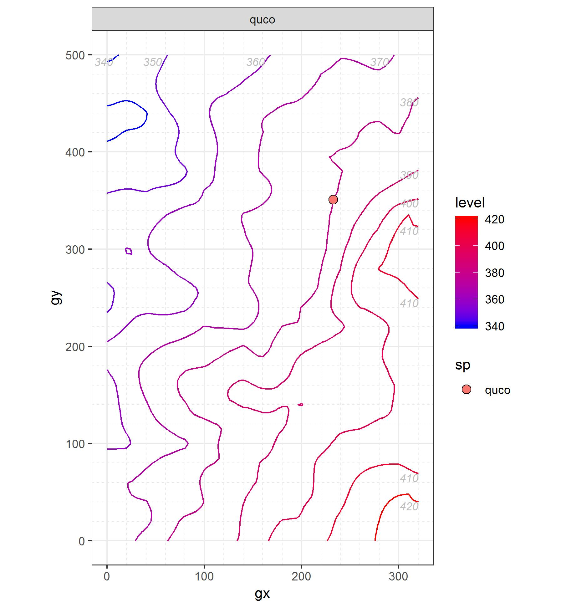
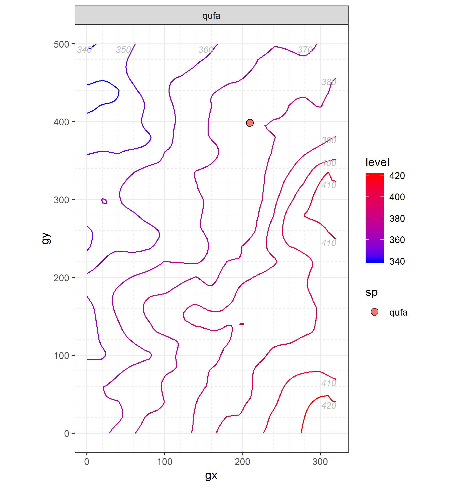
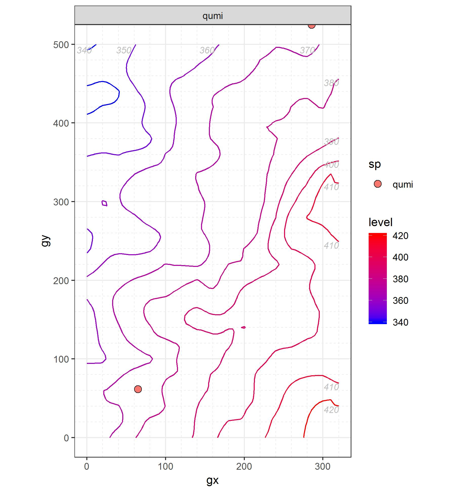
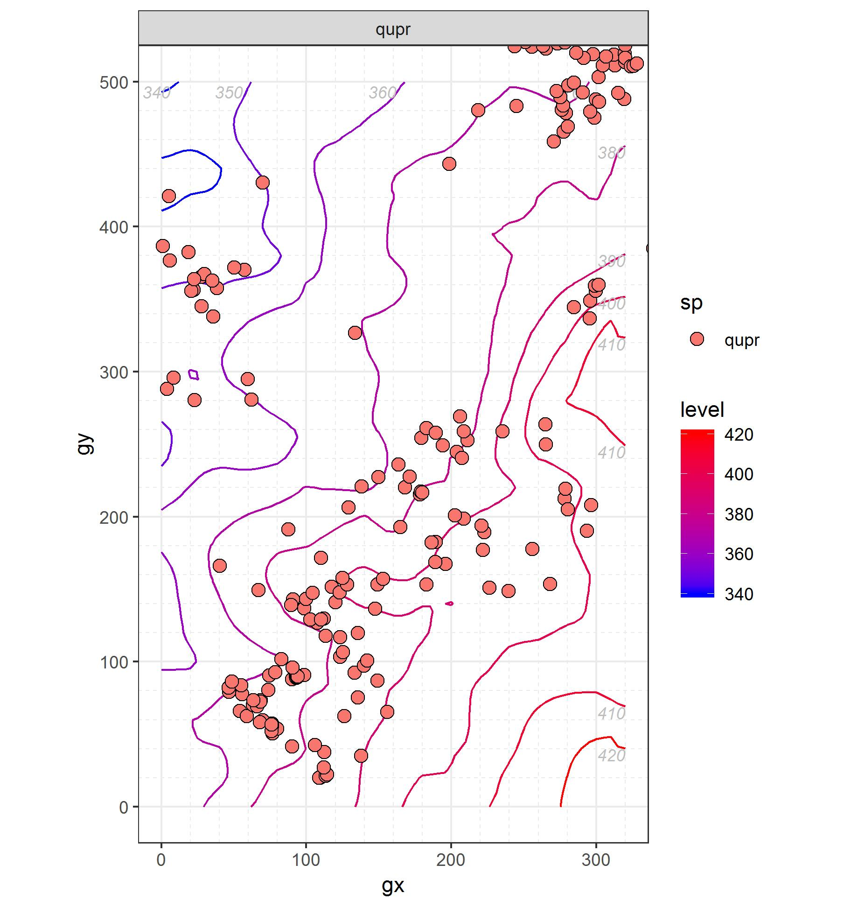
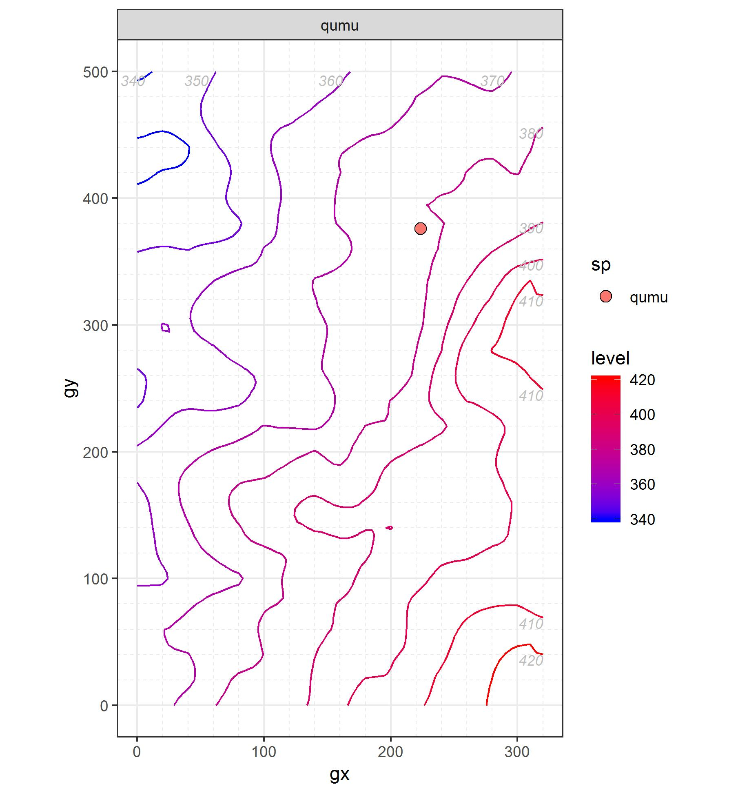
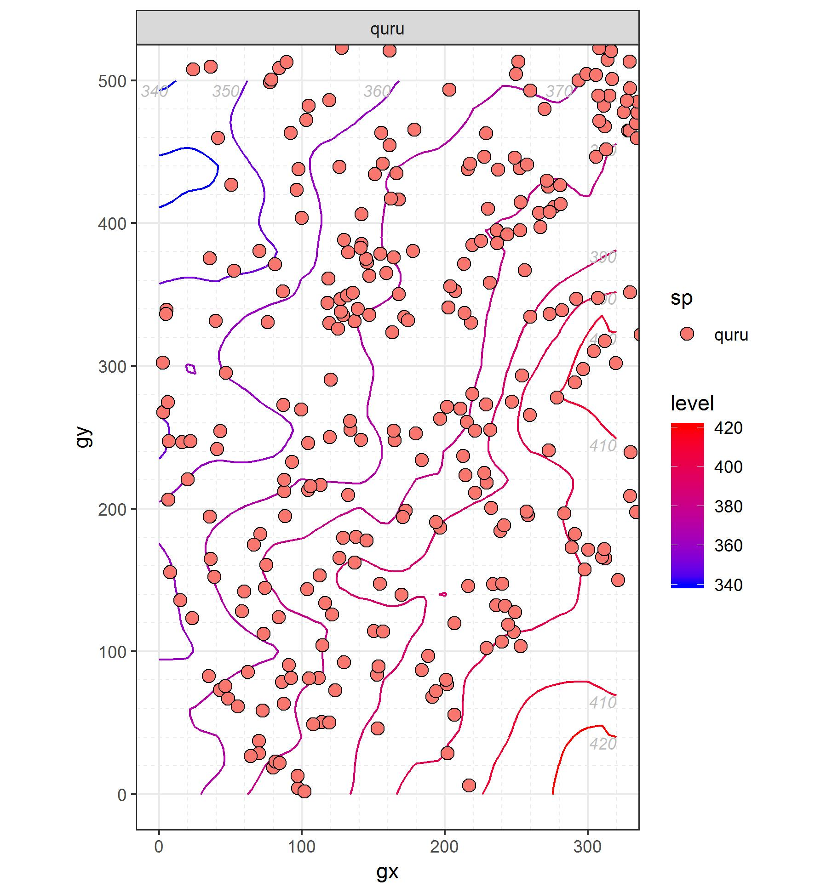
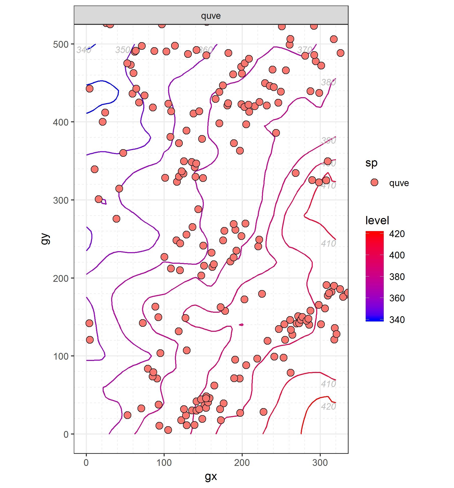

## Ebenaceae
### *Diospyros virginiana* L. ```Persimmon```

```Leaf traits (written about or scanned and labeled)```

```Graph of recruiment and mortality```


```Picture of tree cores (with a small blurb)```

## Elaeagnaceae
### *Elaeagnus umbellata*	Thunb. ```Autumn Olive```


```Leaf traits (written about or scanned and labeled)```

```Graph of recruiment and mortality```


```Picture of tree cores (with a small blurb)```

## Fabaceae
### *Cercis canadensis* L. ```Eastern Redbud```


```Leaf traits (written about or scanned and labeled)```

```Graph of recruiment and mortality```


```Picture of tree cores (with a small blurb)```

### *Robinia pseudoacacia* L. ```Black Locust```

```Leaf traits (written about or scanned and labeled)```

```Graph of recruiment and mortality```


```Picture of tree cores (with a small blurb)```

## Fagaceae
### *Castanea dentata* (Marsh.) Borkh. ```American Chestnut```

```Leaf traits (written about or scanned and labeled)```

```Graph of recruiment and mortality```


```Picture of tree cores (with a small blurb)```

### *Fagus grandifolia*	Ehrh. ```American Beech```

```Leaf traits (written about or scanned and labeled)```

```Graph of recruiment and mortality```




```Picture of tree cores (with a small blurb)```

### **It is important to note that most *Quercus* species grow to be part of the dominant canopy.**

### *Quercus alba* L. ```White Oak```


```Leaf traits (written about or scanned and labeled)```

```Graph of recruiment and mortality```




```Picture of tree cores (with a small blurb)```

### *Quercus coccinea* Muenchh. ```Scarlet Oak```

```Leaf traits (written about or scanned and labeled)```

```Graph of recruiment and mortality```




```Picture of tree cores (with a small blurb)```

### *Quercus falcata* Michx. ```Southern Red Oak```

```Leaf traits (written about or scanned and labeled)```

```Graph of recruiment and mortality```




Picture of tree cores (with a small blurb)

### *Quercus michauxii* Nutt. ```Swamp Chestnut Oak```

```Leaf traits (written about or scanned and labeled)```

```Graph of recruiment and mortality```




```Picture of tree cores (with a small blurb)```

### *Quercus montana* Willd. ```Chestnut Oak```
**Formally known as *Quercus prinus* L.**

```Leaf traits (written about or scanned and labeled)```

```Graph of recruiment and mortality```




```Picture of tree cores (with a small blurb)```

### *Quercus muehlenbergii* Engelm. ```Chinkapin Oak```

```Leaf traits (written about or scanned and labeled)```

```Graph of recruiment and mortality```




```Picture of tree cores (with a small blurb)```

### *Quercus rubra*	L. ```Northern Red Oak```

```Leaf traits (written about or scanned and labeled)```

```Graph of recruiment and mortality```




```Picture of tree cores (with a small blurb)```

### *Quercus velutina* Lam.	```Black Oak```

```Leaf traits (written about or scanned and labeled)```

```Graph of recruiment and mortality```




```Picture of tree cores (with a small blurb)```