## Hamamelidaceae
### *Hamamelis virginiana* L. var. virginiana	```Witch Hazel```

```Leaf traits (written about or scanned and labeled)```

```Graph of recruiment and mortality```

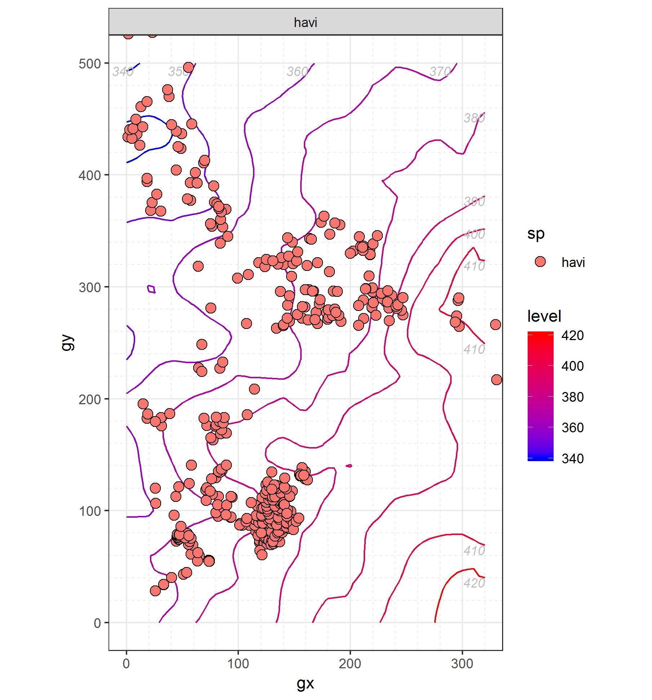


```Picture of tree cores (with a small blurb)```

## Juglandaceae
### *Carya cordiformis* (Wangenh.) K. Koch	```Bitternut Hickory```

```Leaf traits (written about or scanned and labeled)```

```Graph of recruiment and mortality```

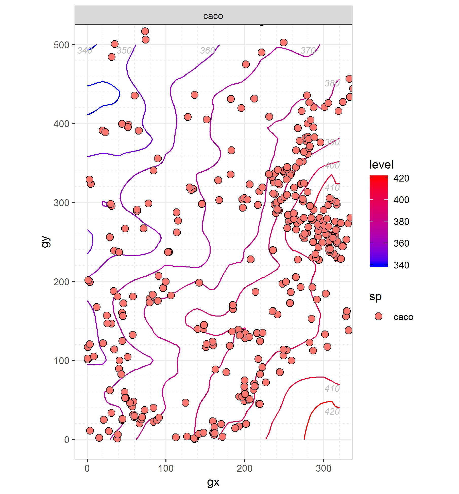


```Picture of tree cores (with a small blurb)```

### *Carya glabra* (P. Mill.) ```Pignut Hickory```

```Leaf traits (written about or scanned and labeled)```

```Graph of recruiment and mortality```

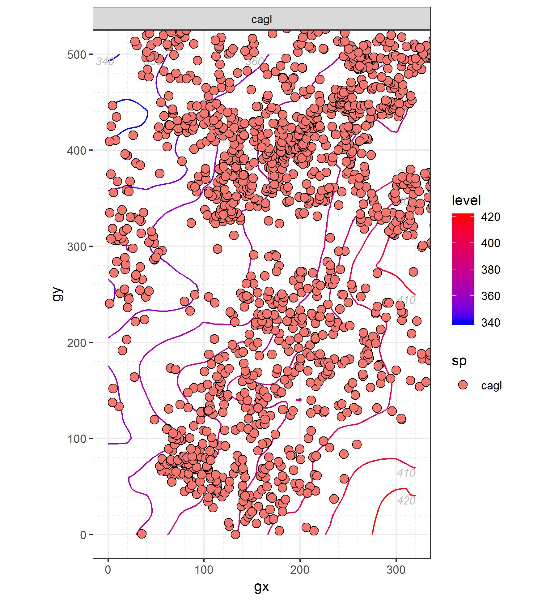


```Picture of tree cores (with a small blurb)```

### *Carya ovalis* (Wangenh.) Sarg.	```Red Hickory```

```Leaf traits (written about or scanned and labeled)```

```Graph of recruiment and mortality```

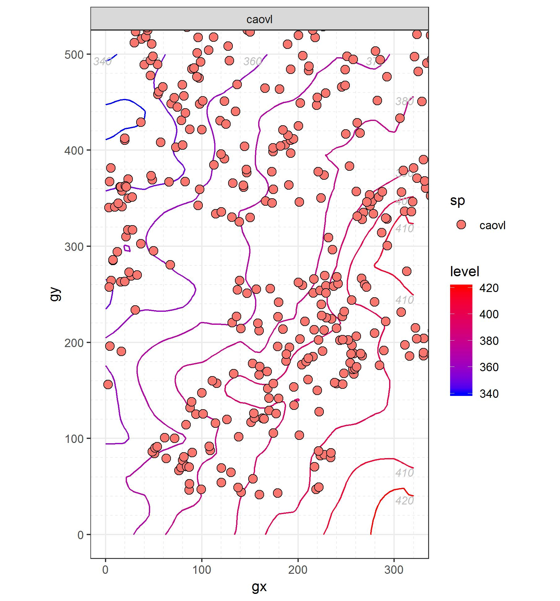


```Picture of tree cores (with a small blurb)```

### *Carya tomentosa* (Lam. ex Pior.) Nutt.	```Mockernut Hickory```

```Leaf traits (written about or scanned and labeled)```

```Graph of recruiment and mortality```

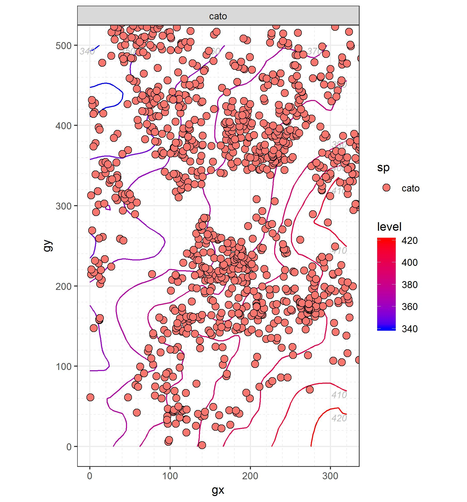


```Picture of tree cores (with a small blurb)```

### *Juglans cinerea* L. ```Butternut```

```Leaf traits (written about or scanned and labeled)```

```Graph of recruiment and mortality```

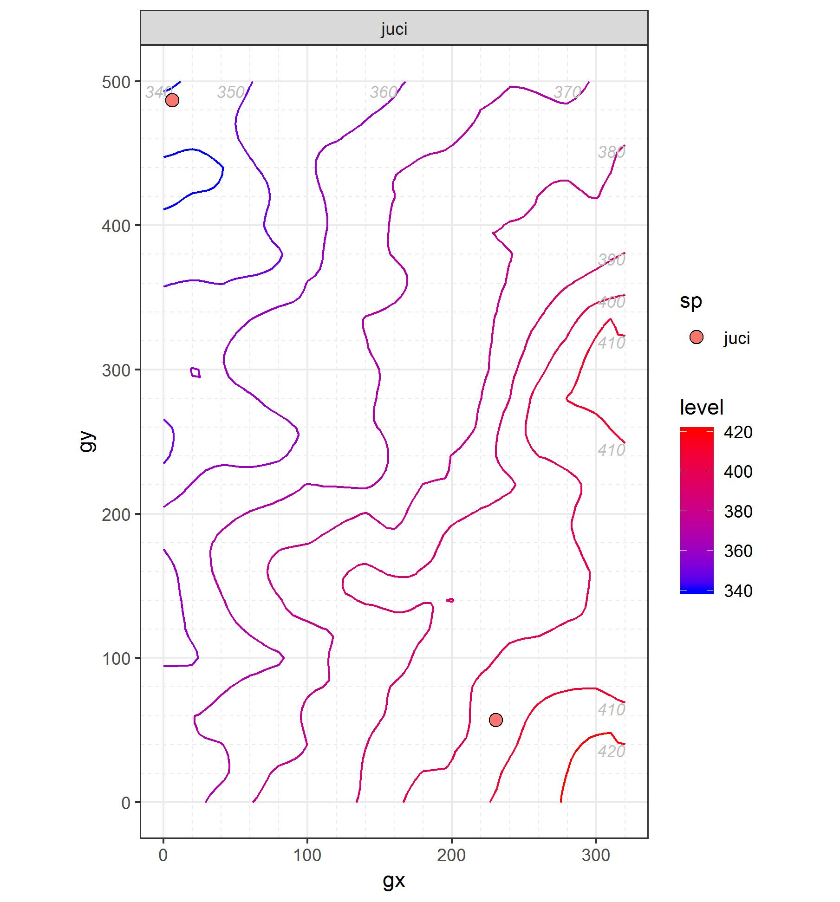


```Picture of tree cores (with a small blurb)```

### *Juglans nigra*	L. ```Black Walnut```

```Leaf traits (written about or scanned and labeled)```

```Graph of recruiment and mortality```

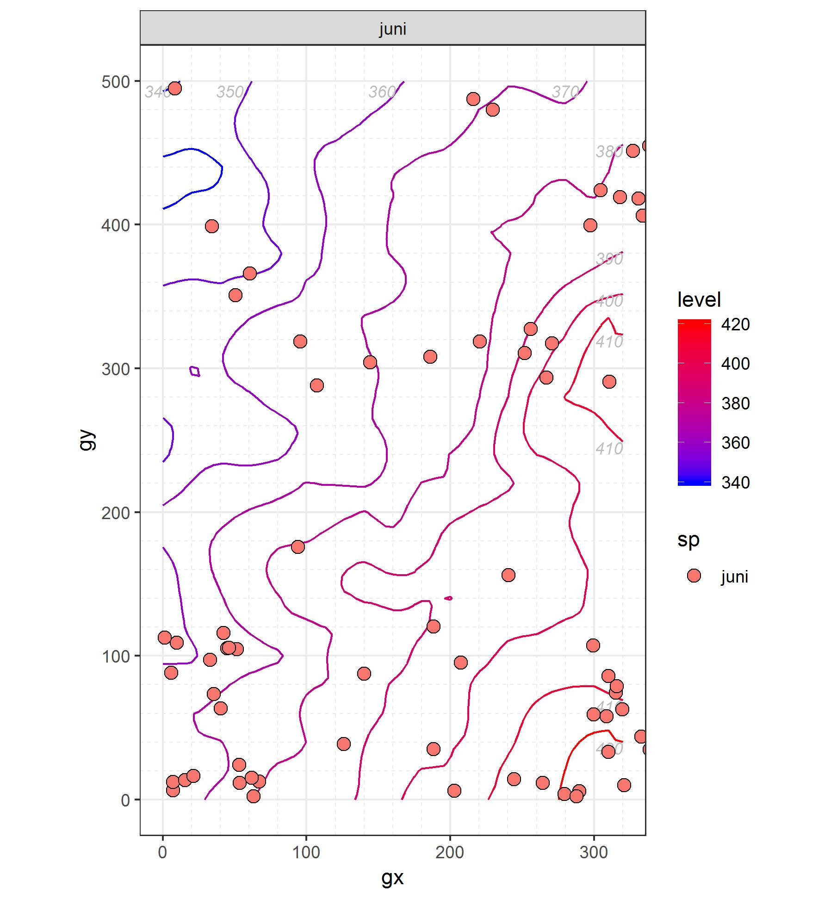


```Picture of tree cores (with a small blurb)```

## Lauraceae
### *Lindera benzoin* (L.) Blume	```Spicebush```

```Leaf traits (written about or scanned and labeled)```

```Graph of recruiment and mortality```

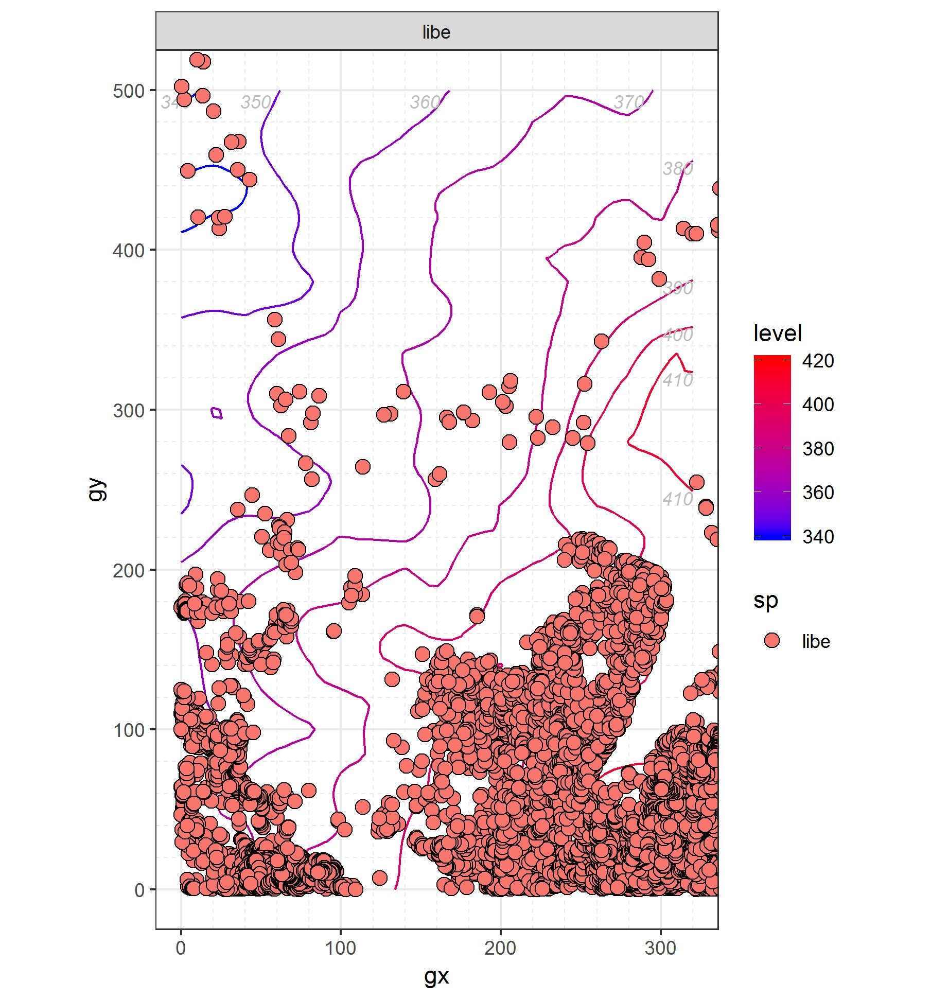


```Picture of tree cores (with a small blurb)```

### *Sassafras albidum* (Nutt.) Nees ```Sassafras```

```Leaf traits (written about or scanned and labeled)```

```Graph of recruiment and mortality```

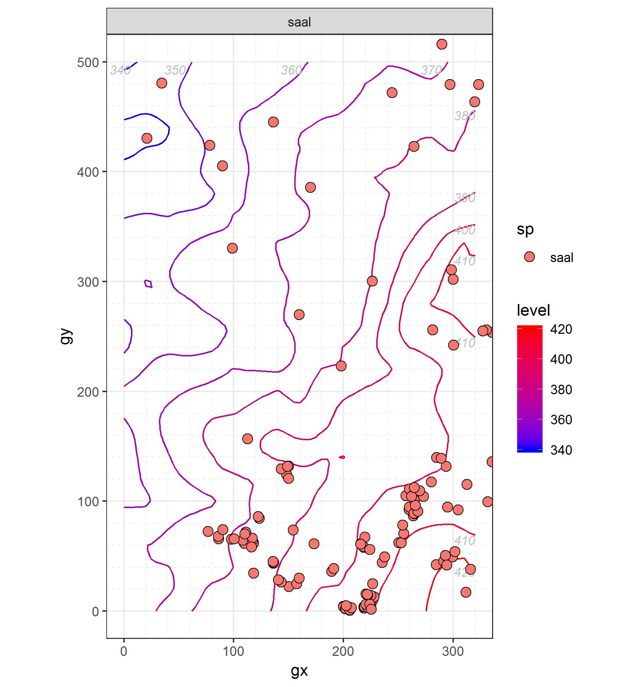


```Picture of tree cores (with a small blurb)```

## Magnoliaceae
### *Liriodendron tulipifera*	L. ```Tulip Poplar```
dominant canopy

```Leaf traits (written about or scanned and labeled)```

```Graph of recruiment and mortality```

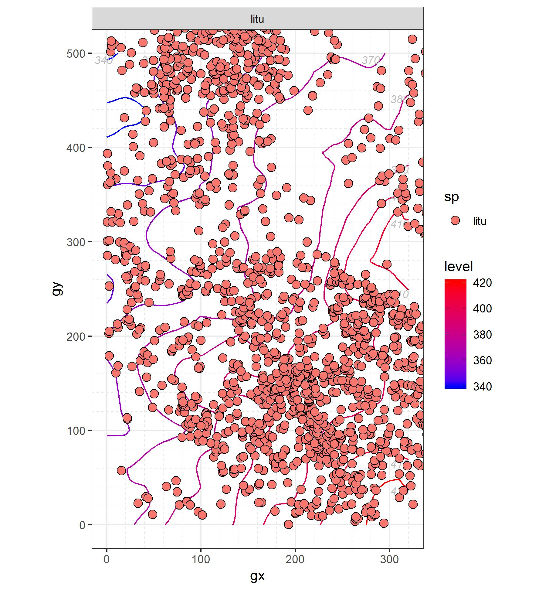


```Picture of tree cores (with a small blurb)```

## Malvaceae
### *Tilia americana* L. ```Basswood```

```Leaf traits (written about or scanned and labeled)```

```Graph of recruiment and mortality```

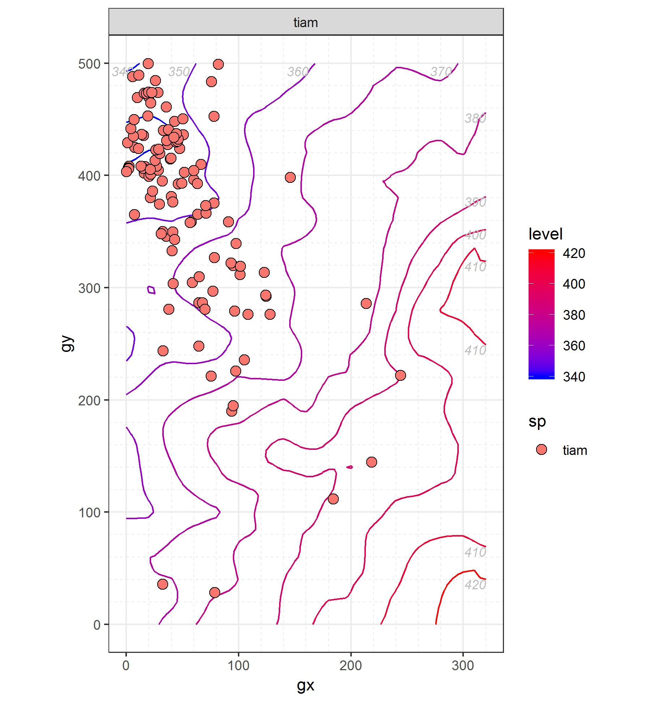


```Picture of tree cores (with a small blurb)```