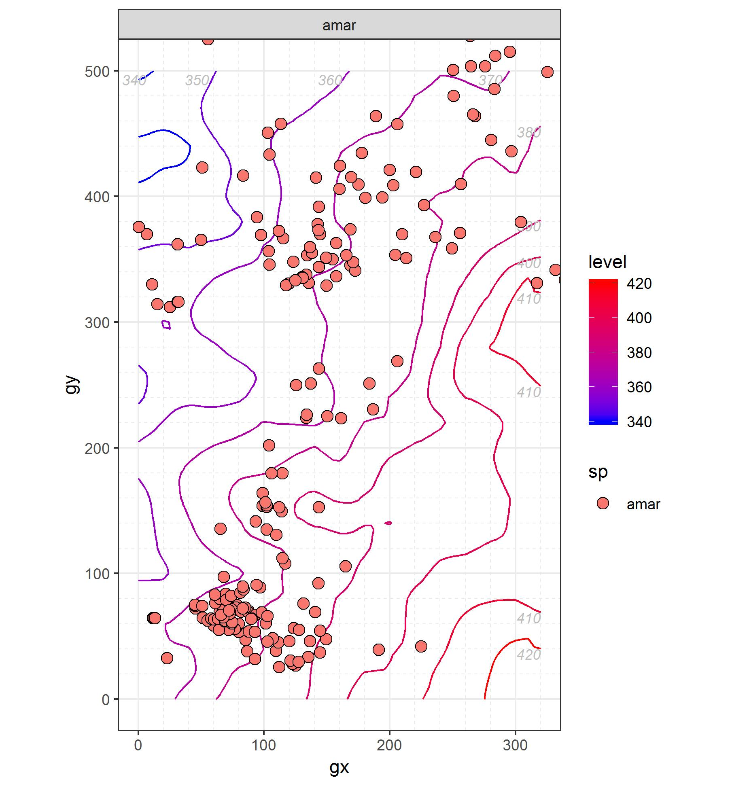
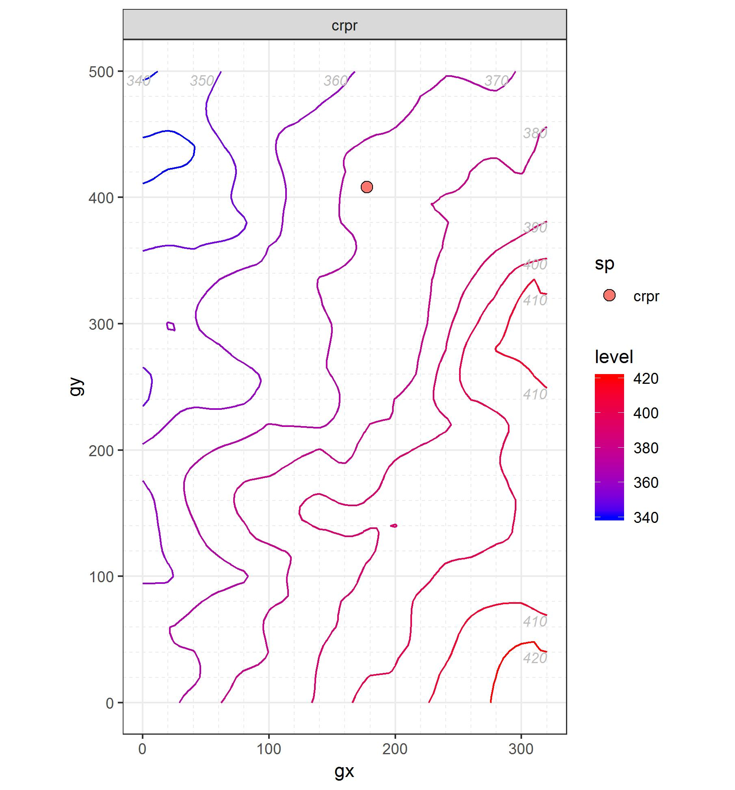
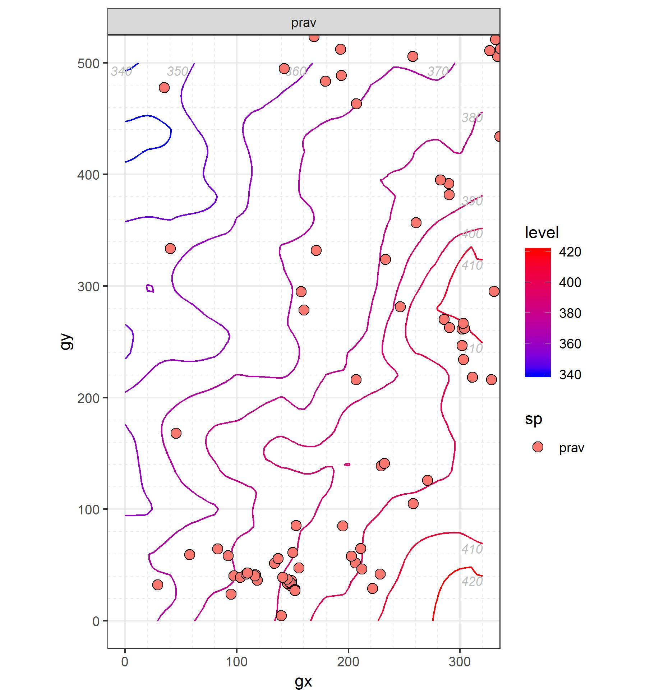

## Rosaceae
### *Amelanchier arborea*	(Michx. f.) Fern. ```Downy Serviceberry```

```Leaf traits (written about or scanned and labeled)```

```Graph of recruiment and mortality```




```Picture of tree cores (with a small blurb)```

### *Crataegus pruinosa* (Wendl. f.) K. Koch var. pruinosa	```Waxyfruit hawthorn```
**Second common name is Frosted Hawthorn.**```

```Leaf traits (written about or scanned and labeled)```

```Graph of recruiment and mortality```




```Picture of tree cores (with a small blurb)```

### *Prunus avium* (L.) L. ```Sweet cherry```
**Also known by common name Bird Cherry**```

```Leaf traits (written about or scanned and labeled)```

```Graph of recruiment and mortality```




```Picture of tree cores (with a small blurb)```

### *Prunus persica* (L.) Batsch ```Peach```

```Leaf traits (written about or scanned and labeled)```

```Graph of recruiment and mortality```


```Picture of tree cores (with a small blurb)```

### *Prunus serotina* Ehrh. var serotina	```Black Cherry```
**Common name is also Wild Black Cherry.**```

```Leaf traits (written about or scanned and labeled)```

```Graph of recruiment and mortality```


```Picture of tree cores (with a small blurb)```

### *Rosa multiflora* Thunb. ex Murr.	```Multiflora Rose```

```Leaf traits (written about or scanned and labeled)```

```Graph of recruiment and mortality```


```Picture of tree cores (with a small blurb)```

### *Rubus allegheniensis* Porter ```Allegheny Blackberry```

```Leaf traits (written about or scanned and labeled)```

```Graph of recruiment and mortality```


```Picture of tree cores (with a small blurb)```

### *Rubus pensilvanicus*	Poir. ```Pennsylvania Blackberry```
**This plant is also affectionally known as Prickly Blackberry.**```

```Leaf traits (written about or scanned and labeled)```

```Graph of recruiment and mortality```


```Picture of tree cores (with a small blurb)```

*Rubus phoenicolasius* Maxim.	```Wineberry```

```Leaf traits (written about or scanned and labeled)```

```Graph of recruiment and mortality```


```Picture of tree cores (with a small blurb)```