# Woody Plants
For life history, mention common canopy positions
  - information from Ramage et al. 2017
    - dominant canopy are *Liriondendron tulipifera* (tulip poplar), *Carya* spp., *Quercus* spp., *Fraxinus americana* (white ash), *Nyssa sylvatica* (black gum)

##Adoxaceae
### *Sambucus canadensis var. canadensis* (L.) R. Bolli ```Common Elderberry```

```Life history (information will be added by Michael)```

```Leaf traits (written about or scanned and labeled)```

```Graph of recruiment and mortality```

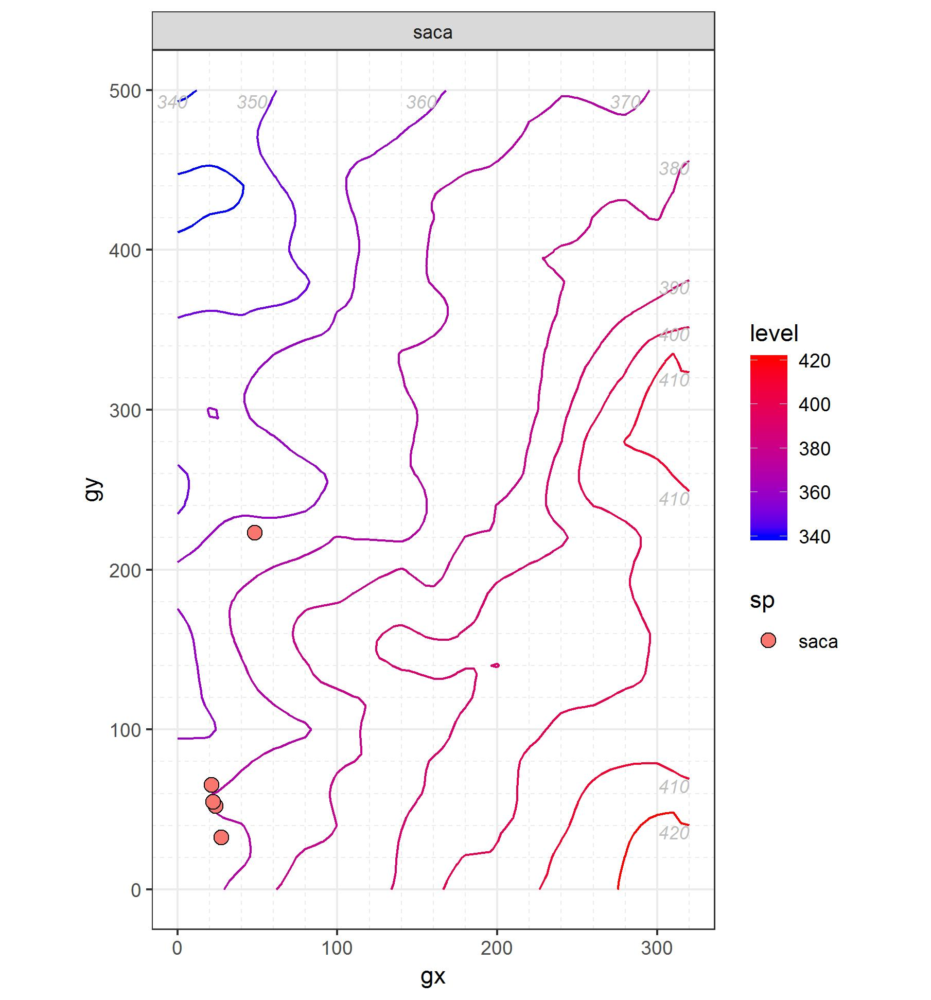


```Picture of tree cores (with a small blurb)```

### *Viburnum acerifolium* L. ```Mapleleaf Viburnum```
```Life history (information will be added by Michael)```

```Leaf traits (written about or scanned and labeled)```

|                                            | 2013 | 2018 |
|:------------------------------------------:|------|------|
| # of Stems in Total                        |      |      |
| # of Individuals, Including Multiple Stems |   1  |      |
| # of New Recruitment                       |      |      |
| Min DBH in Sample (cm)                     | 1.01 |      |
| Mean DBH Is Sample (cm)                    | 1.01 |      |
| Max DBH in Sample (cm)                     | 1.01 |      |

```Graph of recruiment and mortality```


```Picture of tree cores (with a small blurb)```

###	*Viburnum prunifolium* L. ```Black Haw```

```Life history (information will be added by Michael)```

```Leaf traits (written about or scanned and labeled)```

|                                            | 2013 | 2018 |
|:------------------------------------------:|------|------|
| # of Stems in Total                        |      |      |
| # of Individuals, Including Multiple Stems | 244  |      |
| # of New Recruitment                       |      |      |
| Min DBH in Sample (cm)                     | 1.01 |      |
| Mean DBH Is Sample (cm)                    | 4.85 |      |
| Max DBH in Sample (cm)                     |13.29 |      |

```Graph of recruiment and mortality```

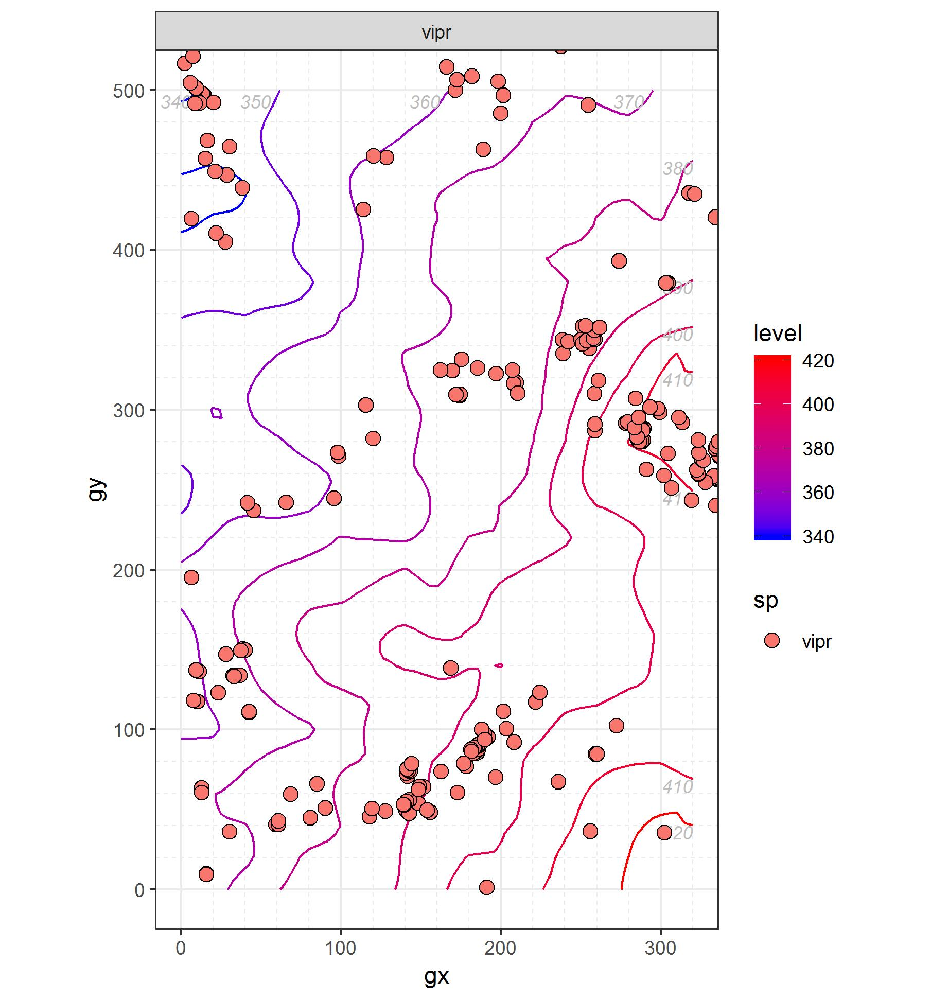


```Picture of tree cores (with a small blurb)```

###	*Viburnum recognitum* Fernald ```Southern Arrow-wood```
```Life history (information will be added by Michael)
***also known as *Virburnum dentatum* L.**```

```Leaf traits (written about or scanned and labeled)```

|                                            | 2013 | 2018 |
|:------------------------------------------:|------|------|
| # of Stems in Total                        |      |      |
| # of Individuals, Including Multiple Stems |  1   |      |
| # of New Recruitment                       |      |      |
| Min DBH in Sample (cm)                     | 1.88 |      |
| Mean DBH Is Sample (cm)                    | 1.88 |      |
| Max DBH in Sample (cm)                     | 1.88 |      |

```Graph of recruiment and mortality```

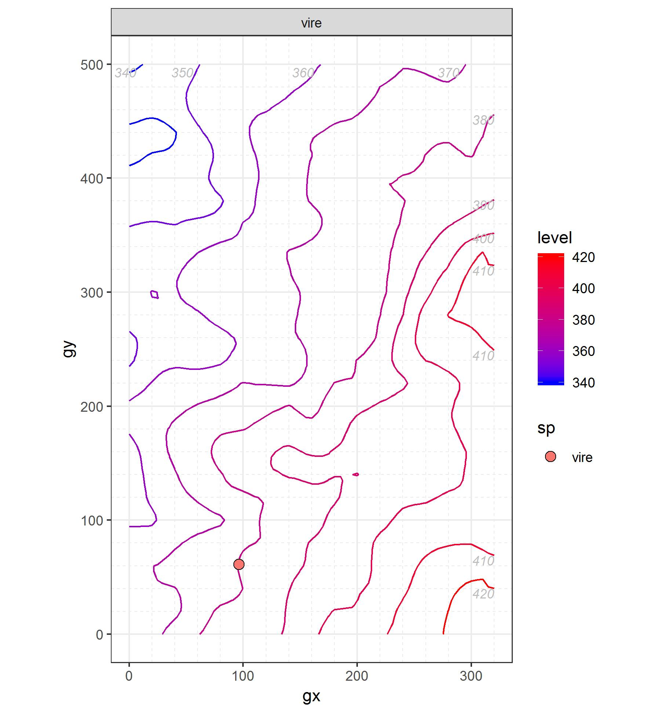


```Picture of tree cores (with a small blurb)```

## Annonaceae
### *Asimina triloba*	(L.) Dunal ```Pawpaw```

```Life history (information will be added by Michael)```

```Leaf traits (written about or scanned and labeled)```

|                                            | 2013 | 2018 |
|:------------------------------------------:|------|------|
| # of Stems in Total                        |      |      |
| # of Individuals, Including Multiple Stems | 4281 |      |
| # of New Recruitment                       |      |      |
| Min DBH in Sample (cm)                     | 1.00 |      |
| Mean DBH Is Sample (cm)                    | 2.43 |      |
| Max DBH in Sample (cm)                     |13.28 |      |

```Graph of recruiment and mortality```

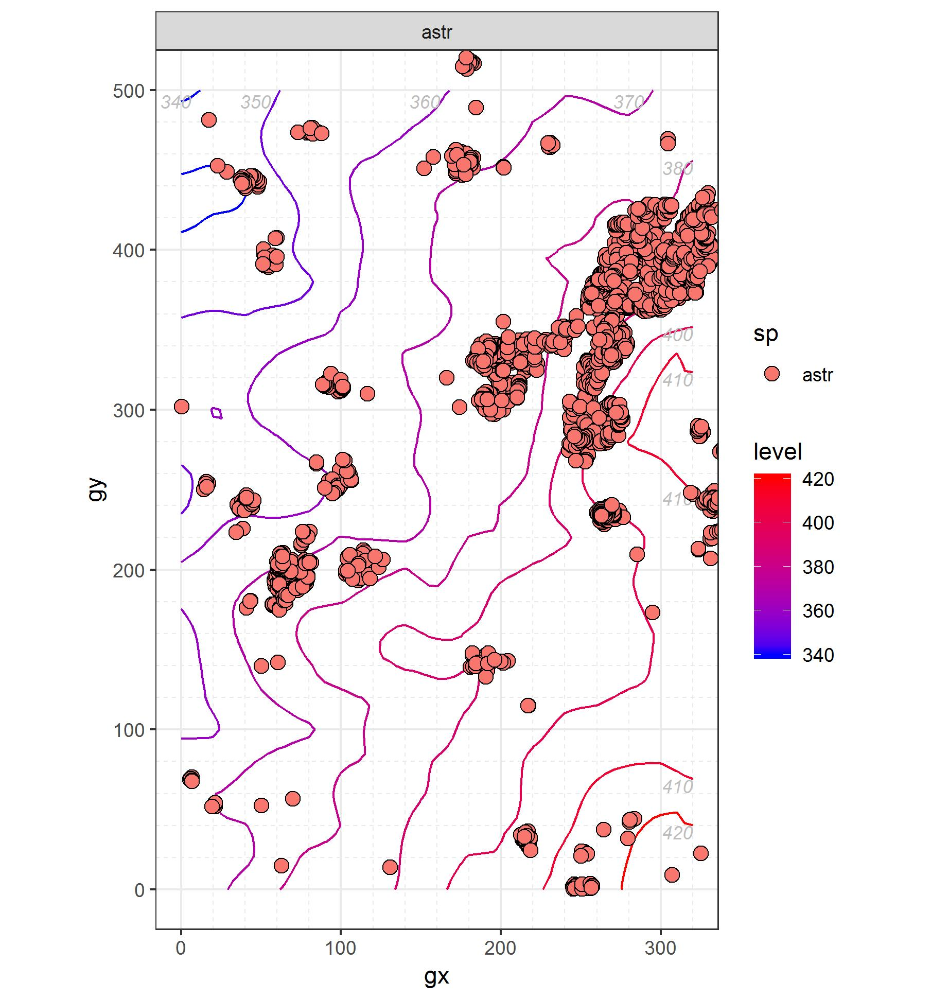


```Picture of tree cores (with a small blurb)```

##Aquifoliaceae
### *Ilex verticillata* (L.) A. Gray ```Common Winterberry```

```Life history (information will be added by Michael)```

```Leaf traits (written about or scanned and labeled)```

|                                            | 2013 | 2018 |
|:------------------------------------------:|------|------|
| # of Stems in Total                        |      |      |
| # of Individuals, Including Multiple Stems |  13  |      |
| # of New Recruitment                       |      |      |
| Min DBH in Sample (cm)                     | 1.04 |      |
| Mean DBH Is Sample (cm)                    | 2.47 |      |
| Max DBH in Sample (cm)                     | 5.95 |      |

```Graph of recruiment and mortality```


```Picture of tree cores (with a small blurb)```

##Berberidaceae
### *Berberis thunbergii* DC. ```Japanese Barberry```

```Life history (information will be added by Michael)```

```Leaf traits (written about or scanned and labeled)```

|                                            | 2013 | 2018 |
|:------------------------------------------:|------|------|
| # of Stems in Total                        |      |      |
| # of Individuals, Including Multiple Stems |  4   |      |
| # of New Recruitment                       |      |      |
| Min DBH in Sample (cm)                     | 1.12 |      |
| Mean DBH Is Sample (cm)                    | 1.34 |      |
| Max DBH in Sample (cm)                     | 1.58 |      |

```Graph of recruiment and mortality```

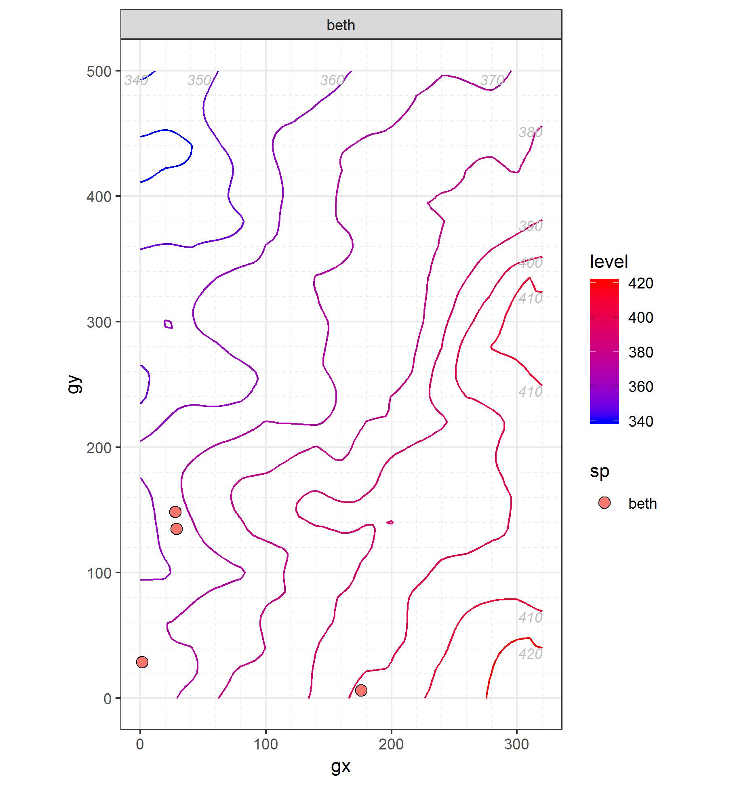


```Picture of tree cores (with a small blurb)```

## Betulaceae
### *Carpinus caroliniana* Walt. ```American Hornbeam```

```Life history (information will be added by Michael)```

```Leaf traits (written about or scanned and labeled)```

|                                            | 2013 | 2018 |
|:------------------------------------------:|------|------|
| # of Stems in Total                        |      |      |
| # of Individuals, Including Multiple Stems | 2854 |      |
| # of New Recruitment                       |      |      |
| Min DBH in Sample (cm)                     | 1.00 |      |
| Mean DBH Is Sample (cm)                    | 4.28 |      |
| Max DBH in Sample (cm)                     |47.20 |      |

```Graph of recruiment and mortality```

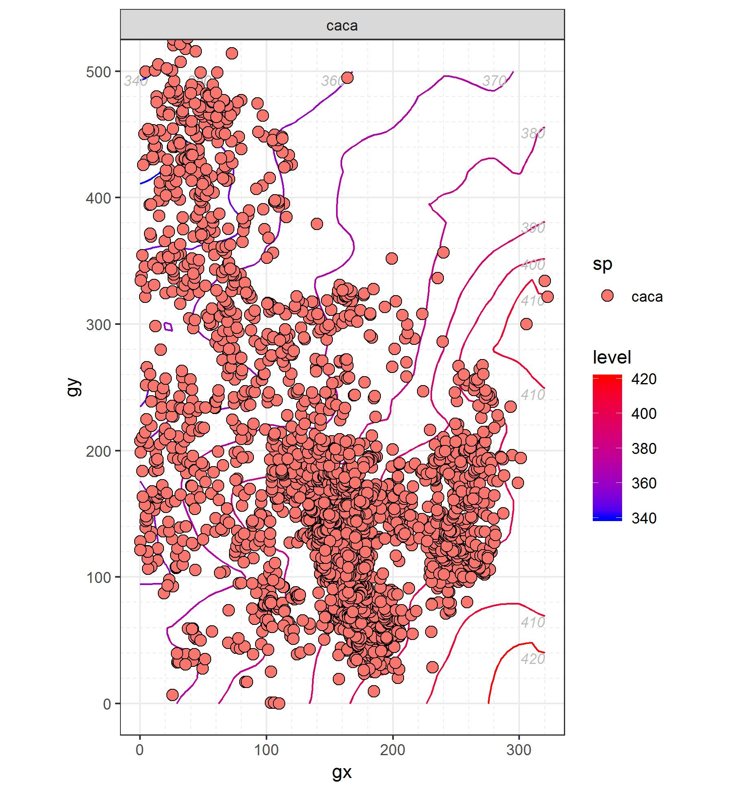


```Picture of tree cores (with a small blurb)```

###	*Corylus americana*	Walt. ```American Hazelnut```

```Life history (information will be added by Michael)```

```Leaf traits (written about or scanned and labeled)```

|                                            | 2013 | 2018 |
|:------------------------------------------:|------|------|
| # of Stems in Total                        |      |      |
| # of Individuals, Including Multiple Stems |  1   |      |
| # of New Recruitment                       |      |      |
| Min DBH in Sample (cm)                     | 2.58 |      |
| Mean DBH Is Sample (cm)                    | 2.58 |      |
| Max DBH in Sample (cm)                     | 2.58 |      |

```Graph of recruiment and mortality```


```Picture of tree cores (with a small blurb)```

## Cannabaceae
### *Celtis occidentalis*	L. ```Hackberry```

```Life history (information will be added by Michael)```

```Leaf traits (written about or scanned and labeled)```

|                                            | 2013 | 2018 |
|:------------------------------------------:|------|------|
| # of Stems in Total                        |      |      |
| # of Individuals, Including Multiple Stems | 100  |      |
| # of New Recruitment                       |      |      |
| Min DBH in Sample (cm)                     | 2.25 |      |
| Mean DBH Is Sample (cm)                    |10.19 |      |
| Max DBH in Sample (cm)                     |44.50 |      |

```Graph of recruiment and mortality```


```Picture of tree cores (with a small blurb)```

## Caprifoliaceae
### *Lonicera maackii* (Rupr.) Maxim ```Bush Honeysuckle```

```Life history (information will be added by Michael)```

```Leaf traits (written about or scanned and labeled)```

|                                            | 2013 | 2018 |
|:------------------------------------------:|------|------|
| # of Stems in Total                        |      |      |
| # of Individuals, Including Multiple Stems |  13  |      |
| # of New Recruitment                       |      |      |
| Min DBH in Sample (cm)                     | 1.65 |      |
| Mean DBH Is Sample (cm)                    | 4.18 |      |
| Max DBH in Sample (cm)                     |26.20 |      |

```Graph of recruiment and mortality```


```Picture of tree cores (with a small blurb)```

## Celastracea
### *Euonymus alatus* (Thunb.) Sieb. ```Burning Bush```

```Life history (information will be added by Michael)
**Species is also known as Winged Euonymus.**```

```Leaf traits (written about or scanned and labeled)```

|                                            | 2013 | 2018 |
|:------------------------------------------:|------|------|
| # of Stems in Total                        |      |      |
| # of Individuals, Including Multiple Stems |  1   |      |
| # of New Recruitment                       |      |      |
| Min DBH in Sample (cm)                     | 1.39 |      |
| Mean DBH Is Sample (cm)                    | 1.39 |      |
| Max DBH in Sample (cm)                     | 1.39 |      |

```Graph of recruiment and mortality```


```Picture of tree cores (with a small blurb)```

## Cornaceae
### *Cornus alternifolia*	L. f. ```Alternate Leaf Dogwood```

```Life history (information will be added by Michael)```

```Leaf traits (written about or scanned and labeled)```

|                                            | 2013 | 2018 |
|:------------------------------------------:|------|------|
| # of Stems in Total                        |      |      |
| # of Individuals, Including Multiple Stems |  2   |      |
| # of New Recruitment                       |      |      |
| Min DBH in Sample (cm)                     | 1.47 |      |
| Mean DBH Is Sample (cm)                    | 7.46 |      |
| Max DBH in Sample (cm)                     |13.45 |      |

```Graph of recruiment and mortality```

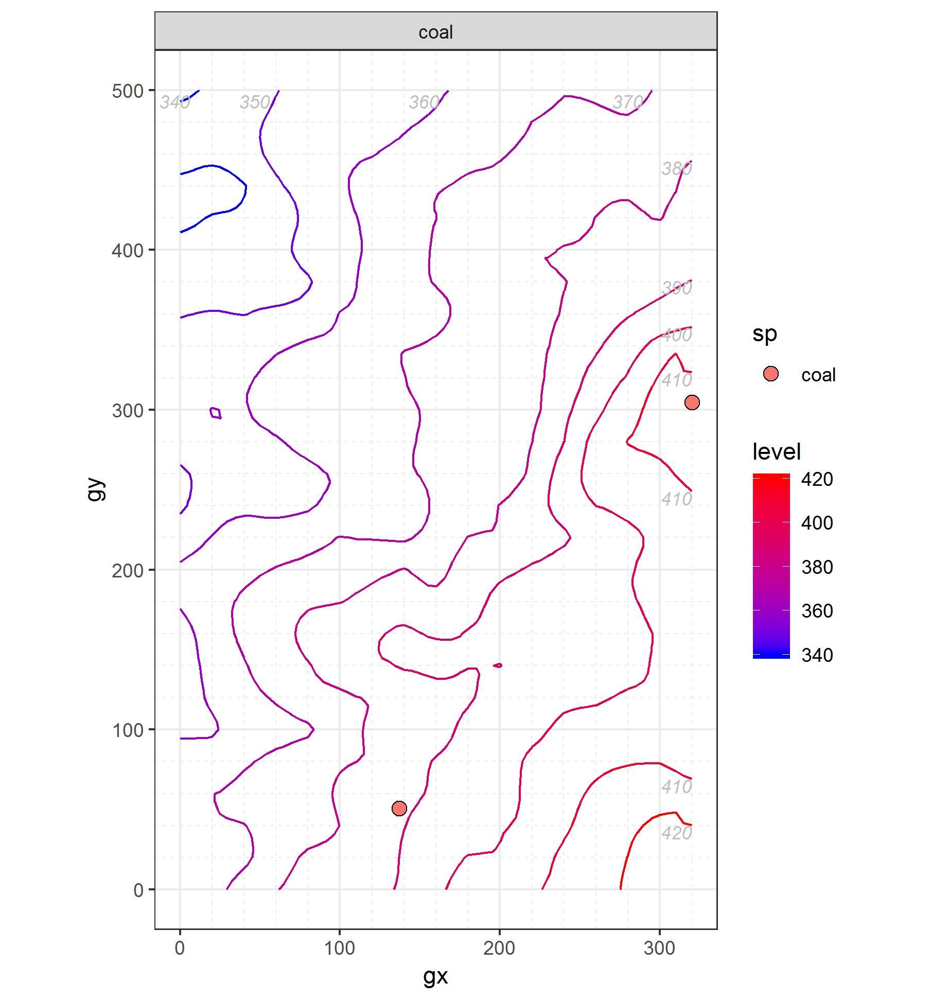


```Picture of tree cores (with a small blurb)```

### *Cornus florida* L. ```Flowering Dogwood```

```Life history (information will be added by Michael)```

```Leaf traits (written about or scanned and labeled)```

|                                            | 2013 | 2018 |
|:------------------------------------------:|------|------|
| # of Stems in Total                        |      |      |
| # of Individuals, Including Multiple Stems | 406  |      |
| # of New Recruitment                       |      |      |
| Min DBH in Sample (cm)                     | 1.32 |      |
| Mean DBH Is Sample (cm)                    | 5.92 |      |
| Max DBH in Sample (cm)                     |16.82 |      |

```Graph of recruiment and mortality```

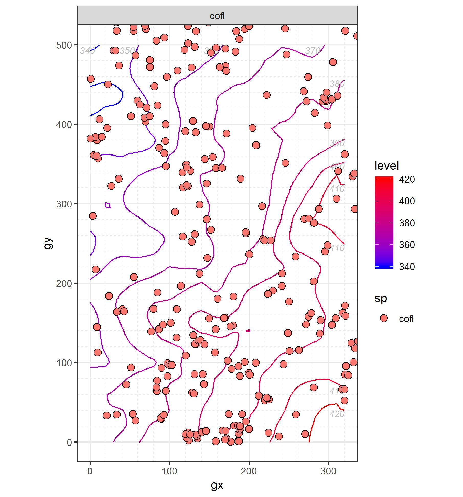


```Picture of tree cores (with a small blurb)```

## Ebenaceae
### *Diospyros virginiana* L. ```Persimmon```

```Life history (information will be added by Michael)```

```Leaf traits (written about or scanned and labeled)```

|                                            | 2013 | 2018 |
|:------------------------------------------:|------|------|
| # of Stems in Total                        |      |      |
| # of Individuals, Including Multiple Stems |  6   |      |
| # of New Recruitment                       |      |      |
| Min DBH in Sample (cm)                     | 4.40 |      |
| Mean DBH Is Sample (cm)                    |10.75 |      |
| Max DBH in Sample (cm)                     |24.99 |      |

```Graph of recruiment and mortality```

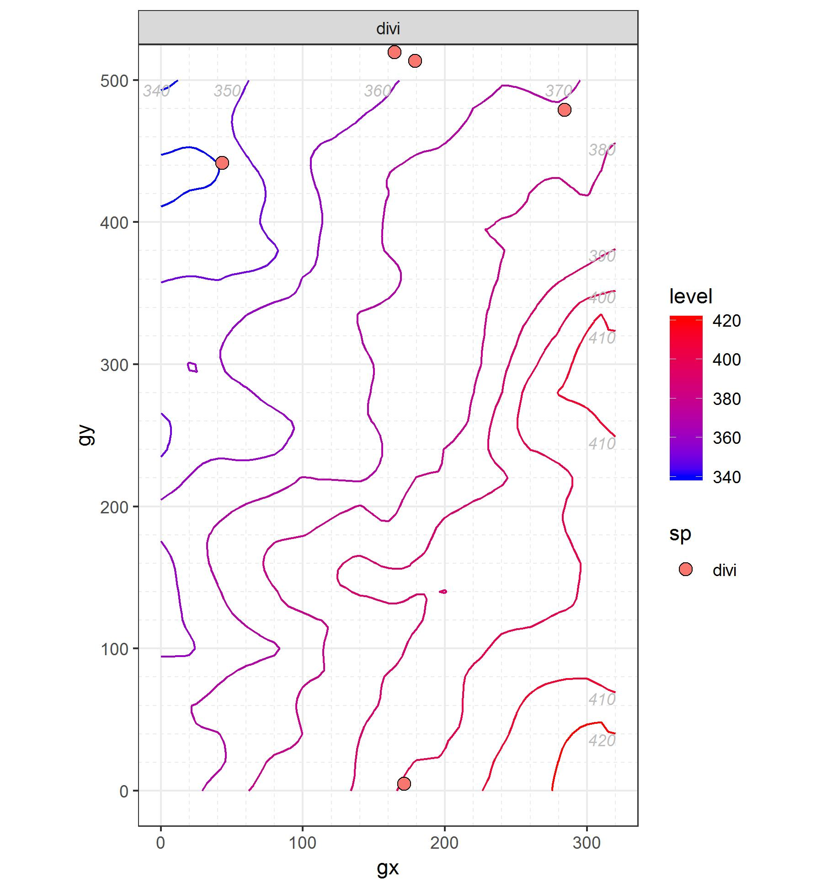


```Picture of tree cores (with a small blurb)```

## Elaeagnaceae
### *Elaeagnus umbellata*	Thunb. ```Autumn Olive```

```Life history (information will be added by Michael)```

```Leaf traits (written about or scanned and labeled)```

|                                            | 2013 | 2018 |
|:------------------------------------------:|------|------|
| # of Stems in Total                        |      |      |
| # of Individuals, Including Multiple Stems |  18  |      |
| # of New Recruitment                       |      |      |
| Min DBH in Sample (cm)                     | 1.01 |      |
| Mean DBH Is Sample (cm)                    | 2.04 |      |
| Max DBH in Sample (cm)                     | 4.47 |      |

```Graph of recruiment and mortality```


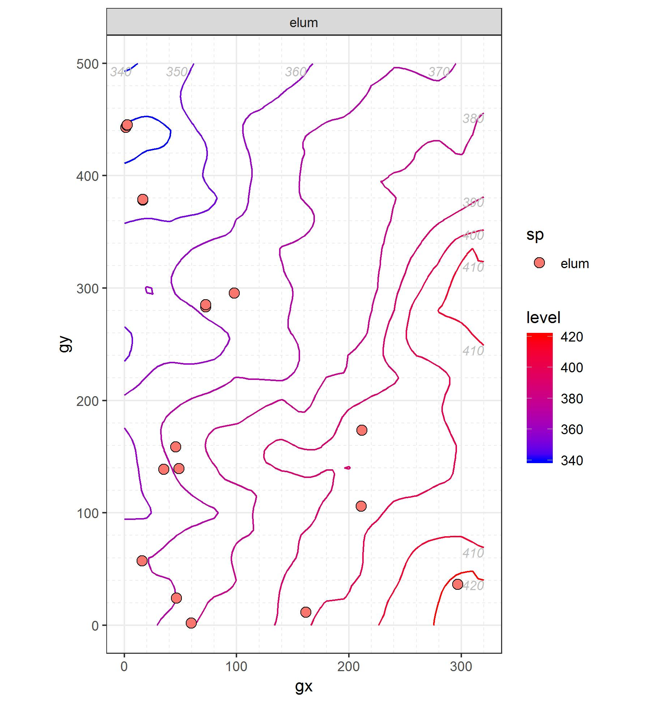

```Picture of tree cores (with a small blurb)```

## Fabaceae
### *Cercis canadensis* L. ```Eastern Redbud```

```Life history (information will be added by Michael)```

```Leaf traits (written about or scanned and labeled)```

|                                            | 2013 | 2018 |
|:------------------------------------------:|------|------|
| # of Stems in Total                        |      |      |
| # of Individuals, Including Multiple Stems | 769  |      |
| # of New Recruitment                       |      |      |
| Min DBH in Sample (cm)                     | 1.00 |      |
| Mean DBH Is Sample (cm)                    | 6.21 |      |
| Max DBH in Sample (cm)                     |32.70 |      |

```Graph of recruiment and mortality```

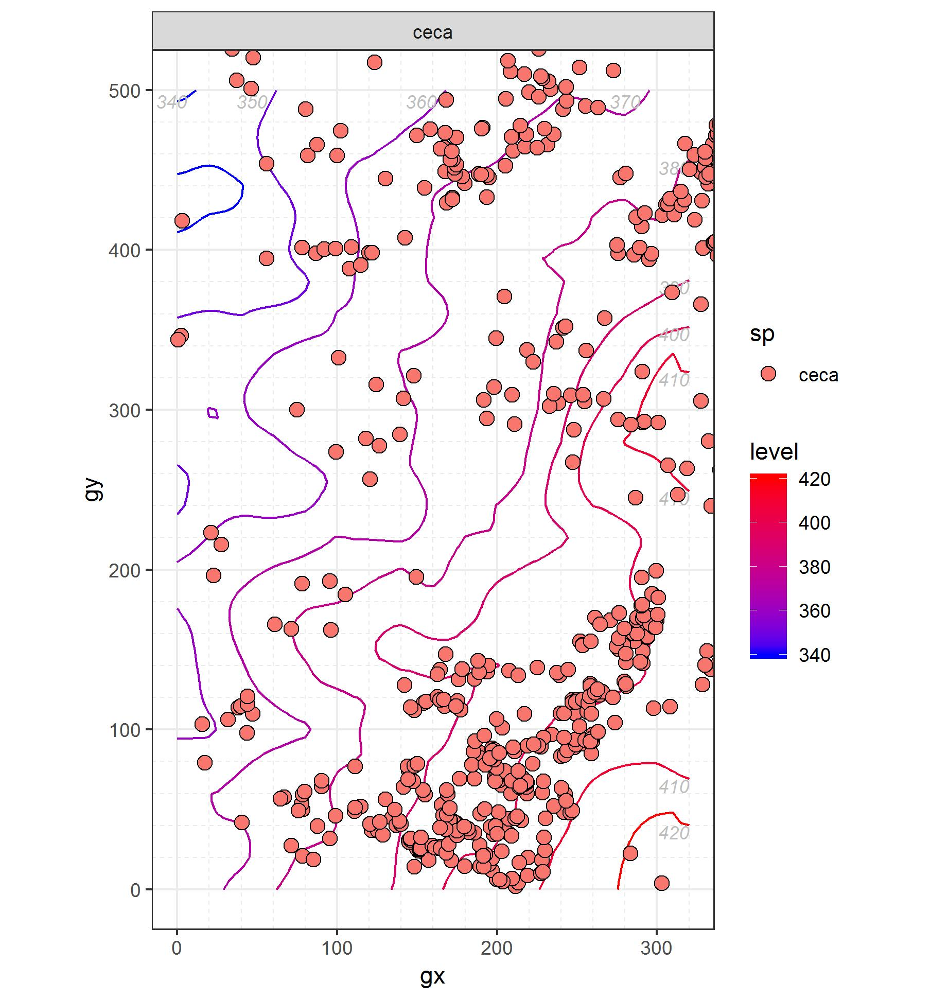


```Picture of tree cores (with a small blurb)```

### *Robinia pseudoacacia* L. ```Black Locust```

```Life history (information will be added by Michael)```

```Leaf traits (written about or scanned and labeled)```

|                                            | 2013 | 2018 |
|:------------------------------------------:|------|------|
| # of Stems in Total                        |      |      |
| # of Individuals, Including Multiple Stems |   8  |      |
| # of New Recruitment                       |      |      |
| Min DBH in Sample (cm)                     | 1.64 |      |
| Mean DBH Is Sample (cm)                    |22.98 |      |
| Max DBH in Sample (cm)                     |46.02 |      |

```Graph of recruiment and mortality```

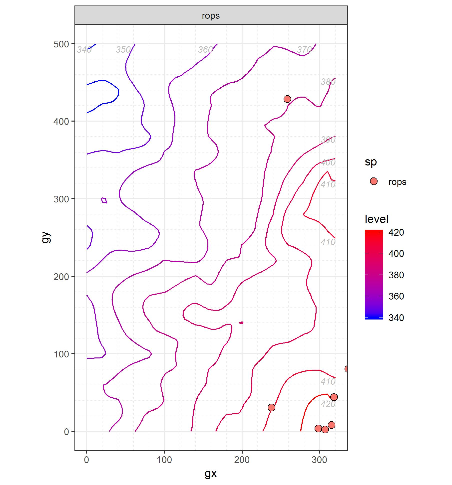


```Picture of tree cores (with a small blurb)```

## Fagaceae
### *Castanea dentata* (Marsh.) Borkh. ```American Chestnut```

```Life history (information will be added by Michael)```

```Leaf traits (written about or scanned and labeled)```

|                                            | 2013 | 2018 |
|:------------------------------------------:|------|------|
| # of Stems in Total                        |      |      |
| # of Individuals, Including Multiple Stems |  6   |      |
| # of New Recruitment                       |      |      |
| Min DBH in Sample (cm)                     | 1.82 |      |
| Mean DBH Is Sample (cm)                    | 6.25 |      |
| Max DBH in Sample (cm)                     |13.75 |      |

```Graph of recruiment and mortality```

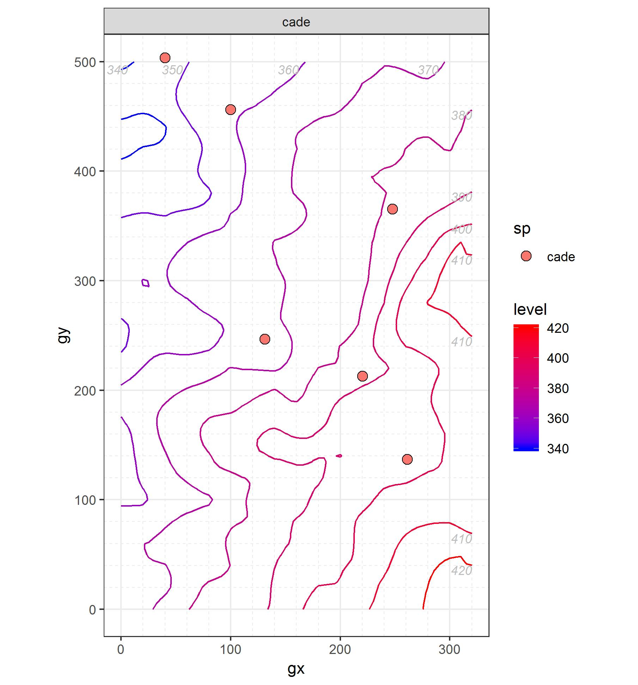


```Picture of tree cores (with a small blurb)```

### *Fagus grandifolia*	Ehrh. ```American Beech```

```Life history (information will be added by Michael)```

```Leaf traits (written about or scanned and labeled)```

|                                            | 2013 | 2018 |
|:------------------------------------------:|------|------|
| # of Stems in Total                        |      |      |
| # of Individuals, Including Multiple Stems | 512  |      |
| # of New Recruitment                       |      |      |
| Min DBH in Sample (cm)                     | 1.05 |      |
| Mean DBH Is Sample (cm)                    |13.31 |      |
| Max DBH in Sample (cm)                     |104.68|      |

```Graph of recruiment and mortality```


```Picture of tree cores (with a small blurb)```

### *Quercus alba* L. ```White Oak```

```Life history (information will be added by Michael)```

```Leaf traits (written about or scanned and labeled)```

|                                            | 2013 | 2018 |
|:------------------------------------------:|------|------|
| # of Stems in Total                        |      |      |
| # of Individuals, Including Multiple Stems | 411  |      |
| # of New Recruitment                       |      |      |
| Min DBH in Sample (cm)                     | 1.89 |      |
| Mean DBH Is Sample (cm)                    |44.63 |      |
| Max DBH in Sample (cm)                     |103.19|      |

```Graph of recruiment and mortality```


```Picture of tree cores (with a small blurb)```

### *Quercus coccinea* Muenchh. ```Scarlet Oak```

```Life history (information will be added by Michael)```

```Leaf traits (written about or scanned and labeled)```

|                                            | 2013 | 2018 |
|:------------------------------------------:|------|------|
| # of Stems in Total                        |      |      |
| # of Individuals, Including Multiple Stems |  1   |      |
| # of New Recruitment                       |      |      |
| Min DBH in Sample (cm)                     |64.47 |      |
| Mean DBH Is Sample (cm)                    |64.47 |      |
| Max DBH in Sample (cm)                     |64.47 |      |

```Graph of recruiment and mortality```


```Picture of tree cores (with a small blurb)```

### *Quercus falcata* Michx. ```Southern Red Oak```

```Life history (information will be added by Michael)```

```Leaf traits (written about or scanned and labeled)```

|                                            | 2013 | 2018 |
|:------------------------------------------:|------|------|
| # of Stems in Total                        |      |      |
| # of Individuals, Including Multiple Stems |  1   |      |
| # of New Recruitment                       |      |      |
| Min DBH in Sample (cm)                     |73.52 |      |
| Mean DBH Is Sample (cm)                    |73.52 |      |
| Max DBH in Sample (cm)                     |73.52 |      |

```Graph of recruiment and mortality```


Picture of tree cores (with a small blurb)

### *Quercus michauxii* Nutt. ```Swamp Chestnut Oak```

```Life history (information will be added by Michael)```

```Leaf traits (written about or scanned and labeled)```

|                                            | 2013 | 2018 |
|:------------------------------------------:|------|------|
| # of Stems in Total                        |      |      |
| # of Individuals, Including Multiple Stems |  2   |      |
| # of New Recruitment                       |      |      |
| Min DBH in Sample (cm)                     |44.11 |      |
| Mean DBH Is Sample (cm)                    |50.45 |      |
| Max DBH in Sample (cm)                     |56.78 |      |

```Graph of recruiment and mortality```


```Picture of tree cores (with a small blurb)```

### *Quercus montana* Willd. ```Chestnut Oak```
**Formally known as *Quercus prinus* L.**

```Life history (information will be added by Michael)```

```Leaf traits (written about or scanned and labeled)```

|                                            | 2013 | 2018 |
|:------------------------------------------:|------|------|
| # of Stems in Total                        |      |      |
| # of Individuals, Including Multiple Stems | 276  |      |
| # of New Recruitment                       |      |      |
| Min DBH in Sample (cm)                     | 1.01 |      |
| Mean DBH Is Sample (cm)                    |30.50 |      |
| Max DBH in Sample (cm)                     |99.34 |      |

```Graph of recruiment and mortality```


```Picture of tree cores (with a small blurb)```

### *Quercus muehlenbergii* Engelm. ```Chinkapin Oak```

```Life history (information will be added by Michael)```

```Leaf traits (written about or scanned and labeled)```

|                                            | 2013 | 2018 |
|:------------------------------------------:|------|------|
| # of Stems in Total                        |      |      |
| # of Individuals, Including Multiple Stems |  1   |      |
| # of New Recruitment                       |      |      |
| Min DBH in Sample (cm)                     |16.53 |      |
| Mean DBH Is Sample (cm)                    |16.53 |      |
| Max DBH in Sample (cm)                     |16.53 |      |

```Graph of recruiment and mortality```


```Picture of tree cores (with a small blurb)```

### *Quercus rubra*	L. ```Northern Red Oak```

```Life history (information will be added by Michael)```

```Leaf traits (written about or scanned and labeled)```

|                                            | 2013 | 2018 |
|:------------------------------------------:|------|------|
| # of Stems in Total                        |      |      |
| # of Individuals, Including Multiple Stems | 403  |      |
| # of New Recruitment                       |      |      |
| Min DBH in Sample (cm)                     | 1.00 |      |
| Mean DBH Is Sample (cm)                    |40.52 |      |
| Max DBH in Sample (cm)                     |148.30|      |

```Graph of recruiment and mortality```


```Picture of tree cores (with a small blurb)```

### *Quercus velutina* Lam.	```Black Oak```

```Life history (information will be added by Michael)```

```Leaf traits (written about or scanned and labeled)```

|                                            | 2013 | 2018 |
|:------------------------------------------:|------|------|
| # of Stems in Total                        |      |      |
| # of Individuals, Including Multiple Stems | 290  |      |
| # of New Recruitment                       |      |      |
| Min DBH in Sample (cm)                     | 4.10 |      |
| Mean DBH Is Sample (cm)                    |51.69 |      |
| Max DBH in Sample (cm)                     |152.00|      |

```Graph of recruiment and mortality```


```Picture of tree cores (with a small blurb)```

## Hamamelidaceae
### *Hamamelis virginiana* L. var. virginiana	```Witch Hazel```

```Life history (information will be added by Michael)```

```Leaf traits (written about or scanned and labeled)```

|                                            | 2013 | 2018 |
|:------------------------------------------:|------|------|
| # of Stems in Total                        |      |      |
| # of Individuals, Including Multiple Stems | 421  |      |
| # of New Recruitment                       |      |      |
| Min DBH in Sample (cm)                     | 1.03 |      |
| Mean DBH Is Sample (cm)                    | 4.56 |      |
| Max DBH in Sample (cm)                     |12.43 |      |

```Graph of recruiment and mortality```


```Picture of tree cores (with a small blurb)```

## Juglandaceae
### *Carya cordiformis* (Wangenh.) K. Koch	```Bitternut Hickory```

```Life history (information will be added by Michael)```

```Leaf traits (written about or scanned and labeled)```

|                                            | 2013 | 2018 |
|:------------------------------------------:|------|------|
| # of Stems in Total                        |      |      |
| # of Individuals, Including Multiple Stems | 448  |      |
| # of New Recruitment                       |      |      |
| Min DBH in Sample (cm)                     | 1.01 |      |
| Mean DBH Is Sample (cm)                    |15.22 |      |
| Max DBH in Sample (cm)                     |99.25 |      |

```Graph of recruiment and mortality```


```Picture of tree cores (with a small blurb)```

### *Carya glabra* (P. Mill.) ```Pignut Hickory```

```Life history (information will be added by Michael)```

```Leaf traits (written about or scanned and labeled)```

|                                            | 2013 | 2018 |
|:------------------------------------------:|------|------|
| # of Stems in Total                        |      |      |
| # of Individuals, Including Multiple Stems | 1728 |      |
| # of New Recruitment                       |      |      |
| Min DBH in Sample (cm)                     | 1.00 |      |
| Mean DBH Is Sample (cm)                    |12.99 |      |
| Max DBH in Sample (cm)                     |79.35 |      |

```Graph of recruiment and mortality```


```Picture of tree cores (with a small blurb)```

### *Carya ovalis* (Wangenh.) Sarg.	```Red Hickory```

```Life history (information will be added by Michael)```

```Leaf traits (written about or scanned and labeled)```

|                                            | 2013 | 2018 |
|:------------------------------------------:|------|------|
| # of Stems in Total                        |      |      |
| # of Individuals, Including Multiple Stems | 461  |      |
| # of New Recruitment                       |      |      |
| Min DBH in Sample (cm)                     | 1.00 |      |
| Mean DBH Is Sample (cm)                    |16.93 |      |
| Max DBH in Sample (cm)                     |66.22 |      |

```Graph of recruiment and mortality```


```Picture of tree cores (with a small blurb)```

### *Carya tomentosa* (Lam. ex Pior.) Nutt.	```Mockernut Hickory```

```Life history (information will be added by Michael)```

```Leaf traits (written about or scanned and labeled)```

|                                            | 2013 | 2018 |
|:------------------------------------------:|------|------|
| # of Stems in Total                        |      |      |
| # of Individuals, Including Multiple Stems | 1369 |      |
| # of New Recruitment                       |      |      |
| Min DBH in Sample (cm)                     | 1.04 |      |
| Mean DBH Is Sample (cm)                    |12.35 |      |
| Max DBH in Sample (cm)                     |69.38 |      |

```Graph of recruiment and mortality```


```Picture of tree cores (with a small blurb)```

### *Juglans cinerea* L. ```Butternut```

```Life history (information will be added by Michael)```

```Leaf traits (written about or scanned and labeled)```

|                                            | 2013 | 2018 |
|:------------------------------------------:|------|------|
| # of Stems in Total                        |      |      |
| # of Individuals, Including Multiple Stems |  3   |      |
| # of New Recruitment                       |      |      |
| Min DBH in Sample (cm)                     | 4.58 |      |
| Mean DBH Is Sample (cm)                    |18.87 |      |
| Max DBH in Sample (cm)                     |28.29 |      |

```Graph of recruiment and mortality```


```Picture of tree cores (with a small blurb)```

### *Juglans nigra*	L. ```Black Walnut```

```Life history (information will be added by Michael)```

```Leaf traits (written about or scanned and labeled)```

|                                            | 2013 | 2018 |
|:------------------------------------------:|------|------|
| # of Stems in Total                        |      |      |
| # of Individuals, Including Multiple Stems | 122  |      |
| # of New Recruitment                       |      |      |
| Min DBH in Sample (cm)                     | 1.11 |      |
| Mean DBH Is Sample (cm)                    |40.71 |      |
| Max DBH in Sample (cm)                     |90.30 |      |

```Graph of recruiment and mortality```


```Picture of tree cores (with a small blurb)```

## Lauraceae
### *Lindera benzoin* (L.) Blume	```Spicebush```

```Life history (information will be added by Michael)```

```Leaf traits (written about or scanned and labeled)```

|                                            | 2013 | 2018 |
|:------------------------------------------:|------|------|
| # of Stems in Total                        |      |      |
| # of Individuals, Including Multiple Stems |13466 |      |
| # of New Recruitment                       |      |      |
| Min DBH in Sample (cm)                     | 1.00 |      |
| Mean DBH Is Sample (cm)                    | 1.84 |      |
| Max DBH in Sample (cm)                     |11.43 |      |

```Graph of recruiment and mortality```


```Picture of tree cores (with a small blurb)```

### *Sassafras albidum* (Nutt.) Nees ```Sassafras```

```Life history (information will be added by Michael)```

```Leaf traits (written about or scanned and labeled)```

|                                            | 2013 | 2018 |
|:------------------------------------------:|------|------|
| # of Stems in Total                        |      |      |
| # of Individuals, Including Multiple Stems | 155  |      |
| # of New Recruitment                       |      |      |
| Min DBH in Sample (cm)                     | 1.11 |      |
| Mean DBH Is Sample (cm)                    |10.28 |      |
| Max DBH in Sample (cm)                     |45.61 |      |

```Graph of recruiment and mortality```


```Picture of tree cores (with a small blurb)```

## Magnoliaceae
### *Liriodendron tulipifera*	L. ```Tulip Poplar```

```Life history (information will be added by Michael)```

```Leaf traits (written about or scanned and labeled)```

|                                            | 2013 | 2018 |
|:------------------------------------------:|------|------|
| # of Stems in Total                        |      |      |
| # of Individuals, Including Multiple Stems | 2306 |      |
| # of New Recruitment                       |      |      |
| Min DBH in Sample (cm)                     | 1.07 |      |
| Mean DBH Is Sample (cm)                    |39.09 |      |
| Max DBH in Sample (cm)                     |142.23|      |

```Graph of recruiment and mortality```


```Picture of tree cores (with a small blurb)```

## Malvaceae
### *Tilia americana* L. ```Basswood```

```Life history (information will be added by Michael)```

```Leaf traits (written about or scanned and labeled)```

|                                            | 2013 | 2018 |
|:------------------------------------------:|------|------|
| # of Stems in Total                        |      |      |
| # of Individuals, Including Multiple Stems | 132  |      |
| # of New Recruitment                       |      |      |
| Min DBH in Sample (cm)                     | 3.15 |      |
| Mean DBH Is Sample (cm)                    |22.95 |      |
| Max DBH in Sample (cm)                     |69.05 |      |

```Graph of recruiment and mortality```


```Picture of tree cores (with a small blurb)```

## Nyssaceae
### *Nyssa sylvatica* Marsh. ```Black Gum```

```Life history (information will be added by Michael)```

```Leaf traits (written about or scanned and labeled)```

|                                            | 2013 | 2018 |
|:------------------------------------------:|------|------|
| # of Stems in Total                        |      |      |
| # of Individuals, Including Multiple Stems | 1309 |      |
| # of New Recruitment                       |      |      |
| Min DBH in Sample (cm)                     | 1.02 |      |
| Mean DBH Is Sample (cm)                    |10.43 |      |
| Max DBH in Sample (cm)                     |65.72 |      |

```Graph of recruiment and mortality```


```Picture of tree cores (with a small blurb)```

## Oleaceae
### *Chionanthus virginicus* L.	```Fringe Tree```

```Life history (information will be added by Michael)```

```Leaf traits (written about or scanned and labeled)```

|                                            | 2013 | 2018 |
|:------------------------------------------:|------|------|
| # of Stems in Total                        |      |      |
| # of Individuals, Including Multiple Stems |  8   |      |
| # of New Recruitment                       |      |      |
| Min DBH in Sample (cm)                     | 3.04 |      |
| Mean DBH Is Sample (cm)                    | 5.57 |      |
| Max DBH in Sample (cm)                     | 9.03 |      |

```Graph of recruiment and mortality```


Picture of tree cores (with a small blurb)

### *Fraxinus americana* L. ```White Ash```

```Life history (information will be added by Michael)```

```Leaf traits (written about or scanned and labeled)```

|                                            | 2013 | 2018 |
|:------------------------------------------:|------|------|
| # of Stems in Total                        |      |      |
| # of Individuals, Including Multiple Stems | 721  |      |
| # of New Recruitment                       |      |      |
| Min DBH in Sample (cm)                     | 1.00 |      |
| Mean DBH Is Sample (cm)                    |19.76 |      |
| Max DBH in Sample (cm)                     |107.21|      |

```Graph of recruiment and mortality```


```Picture of tree cores (with a small blurb)```

### *Fraxinus nigra* Marsh.	```Black Ash```

```Life history (information will be added by Michael)```

```Leaf traits (written about or scanned and labeled)```

|                                            | 2013 | 2018 |
|:------------------------------------------:|------|------|
| # of Stems in Total                        |      |      |
| # of Individuals, Including Multiple Stems |  60  |      |
| # of New Recruitment                       |      |      |
| Min DBH in Sample (cm)                     | 1.00 |      |
| Mean DBH Is Sample (cm)                    |16.58 |      |
| Max DBH in Sample (cm)                     |69.83 |      |

```Graph of recruiment and mortality```


Picture of tree cores (with a small blurb)

### *Fraxinus pennsylvanica* Marsh.	```Green Ash```

```Life history (information will be added by Michael)```

```Leaf traits (written about or scanned and labeled)```

|                                            | 2013 | 2018 |
|:------------------------------------------:|------|------|
| # of Stems in Total                        |      |      |
| # of Individuals, Including Multiple Stems |  51  |      |
| # of New Recruitment                       |      |      |
| Min DBH in Sample (cm)                     | 1.02 |      |
| Mean DBH Is Sample (cm)                    | 7.91 |      |
| Max DBH in Sample (cm)                     |35.13 |      |

```Graph of recruiment and mortality```


```Picture of tree cores (with a small blurb)```

## Paulowniaceae
### *Paulownia tomentosa*	(Thunb.) Sieb. & Zucc. ex Steud. ```Princess Tree```

```Life history (information will be added by Michael)```

```Leaf traits (written about or scanned and labeled)```

|                                            | 2013 | 2018 |
|:------------------------------------------:|------|------|
| # of Stems in Total                        |      |      |
| # of Individuals, Including Multiple Stems |  3   |      |
| # of New Recruitment                       |      |      |
| Min DBH in Sample (cm)                     | 5.47 |      |
| Mean DBH Is Sample (cm)                    |35.87 |      |
| Max DBH in Sample (cm)                     |54.49 |      |

```Graph of recruiment and mortality```


```Picture of tree cores (with a small blurb)```

## Pinaceae
### *Pinus pungens*	Lamb. ```Table Mountain Pine```

```Life history (information will be added by Michael)```

```Leaf traits (written about or scanned and labeled)```

|                                            | 2013 | 2018 |
|:------------------------------------------:|------|------|
| # of Stems in Total                        |      |      |
| # of Individuals, Including Multiple Stems |  1   |      |
| # of New Recruitment                       |      |      |
| Min DBH in Sample (cm)                     |41.61 |      |
| Mean DBH Is Sample (cm)                    |41.61 |      |
| Max DBH in Sample (cm)                     |41.61 |      |

```Graph of recruiment and mortality```


Picture of tree cores (with a small blurb)

### *Pinus strobus* L. ```Eastern White Pine```

```Life history (information will be added by Michael)```

```Leaf traits (written about or scanned and labeled)```

|                                            | 2013 | 2018 |
|:------------------------------------------:|------|------|
| # of Stems in Total                        |      |      |
| # of Individuals, Including Multiple Stems |  88  |      |
| # of New Recruitment                       |      |      |
| Min DBH in Sample (cm)                     | 7.34 |      |
| Mean DBH Is Sample (cm)                    |26.90 |      |
| Max DBH in Sample (cm)                     |68.29 |      |

```Graph of recruiment and mortality```


```Picture of tree cores (with a small blurb)```

### *Pinus virginiana* P. Mill.	```Virginia Pine```

```Life history (information will be added by Michael)```

```Leaf traits (written about or scanned and labeled)```

|                                            | 2013 | 2018 |
|:------------------------------------------:|------|------|
| # of Stems in Total                        |      |      |
| # of Individuals, Including Multiple Stems |  3   |      |
| # of New Recruitment                       |      |      |
| Min DBH in Sample (cm)                     |24.08 |      |
| Mean DBH Is Sample (cm)                    |31.89 |      |
| Max DBH in Sample (cm)                     |43.38 |      |

```Graph of recruiment and mortality```


Picture of tree cores (with a small blurb)

## Platanaceae
### *Platanus occidentalis* L. ```American Sycamore```

```Life history (information will be added by Michael)```

```Leaf traits (written about or scanned and labeled)```

|                                            | 2013 | 2018 |
|:------------------------------------------:|------|------|
| # of Stems in Total                        |      |      |
| # of Individuals, Including Multiple Stems |  27  |      |
| # of New Recruitment                       |      |      |
| Min DBH in Sample (cm)                     | 1.15 |      |
| Mean DBH Is Sample (cm)                    |41.89 |      |
| Max DBH in Sample (cm)                     |96.16 |      |

```Graph of recruiment and mortality```


```Picture of tree cores (with a small blurb)```

## Rosaceae
### *Amelanchier arborea*	(Michx. f.) Fern. ```Downy Serviceberry```

```Life history (information will be added by Michael)```

```Leaf traits (written about or scanned and labeled)```

|                                            | 2013 | 2018 |
|:------------------------------------------:|------|------|
| # of Stems in Total                        |      |      |
| # of Individuals, Including Multiple Stems | 212  |      |
| # of New Recruitment                       |      |      |
| Min DBH in Sample (cm)                     | 1.01 |      |
| Mean DBH Is Sample (cm)                    | 5.49 |      |
| Max DBH in Sample (cm)                     |22.79 |      |

```Graph of recruiment and mortality```


```Picture of tree cores (with a small blurb)```

### *Crataegus pruinosa* (Wendl. f.) K. Koch var. pruinosa	```Waxyfruit hawthorn```

```Life history (information will be added by Michael)
**Second common name is Frosted Hawthorn.**```

```Leaf traits (written about or scanned and labeled)```

|                                            | 2013 | 2018 |
|:------------------------------------------:|------|------|
| # of Stems in Total                        |      |      |
| # of Individuals, Including Multiple Stems |  1   |      |
| # of New Recruitment                       |      |      |
| Min DBH in Sample (cm)                     | 2.54 |      |
| Mean DBH Is Sample (cm)                    | 2.54 |      |
| Max DBH in Sample (cm)                     | 2.54 |      |

```Graph of recruiment and mortality```


```Picture of tree cores (with a small blurb)```

### *Prunus avium* (L.) L. ```Sweet cherry```

```Life history (information will be added by Michael)
**Also known by common name Bird Cherry**```

```Leaf traits (written about or scanned and labeled)```

|                                            | 2013 | 2018 |
|:------------------------------------------:|------|------|
| # of Stems in Total                        |      |      |
| # of Individuals, Including Multiple Stems |  88  |      |
| # of New Recruitment                       |      |      |
| Min DBH in Sample (cm)                     | 1.05 |      |
| Mean DBH Is Sample (cm)                    |12.48 |      |
| Max DBH in Sample (cm)                     |41.42 |      |

```Graph of recruiment and mortality```


```Picture of tree cores (with a small blurb)```

### *Prunus persica* (L.) Batsch ```Peach```

```Life history (information will be added by Michael)```

```Leaf traits (written about or scanned and labeled)```

|                                            | 2013 | 2018 |
|:------------------------------------------:|------|------|
| # of Stems in Total                        |      |      |
| # of Individuals, Including Multiple Stems |      |      |
| # of New Recruitment                       |      |      |
| Min DBH in Sample (cm)                     |      |      |
| Mean DBH Is Sample (cm)                    |      |      |
| Max DBH in Sample (cm)                     |      |      |

```Graph of recruiment and mortality```


```Picture of tree cores (with a small blurb)```

### *Prunus serotina* Ehrh. var serotina	```Black Cherry```

```Life history (information will be added by Michael)
**Common name is also Wild Black Cherry.**```

```Leaf traits (written about or scanned and labeled)```

|                                            | 2013 | 2018 |
|:------------------------------------------:|------|------|
| # of Stems in Total                        |      |      |
| # of Individuals, Including Multiple Stems |  62  |      |
| # of New Recruitment                       |      |      |
| Min DBH in Sample (cm)                     | 1.04 |      |
| Mean DBH Is Sample (cm)                    | 8.91 |      |
| Max DBH in Sample (cm)                     |93.91 |      |

```Graph of recruiment and mortality```


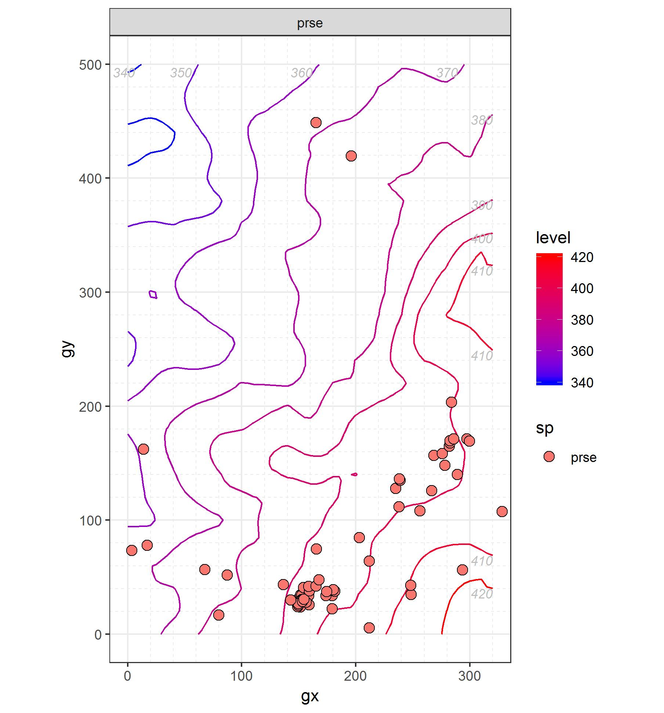

```Picture of tree cores (with a small blurb)```

### *Rosa multiflora* Thunb. ex Murr.	```Multiflora Rose```

```Life history (information will be added by Michael)```

```Leaf traits (written about or scanned and labeled)```

|                                            | 2013 | 2018 |
|:------------------------------------------:|------|------|
| # of Stems in Total                        |      |      |
| # of Individuals, Including Multiple Stems |  31  |      |
| # of New Recruitment                       |      |      |
| Min DBH in Sample (cm)                     | 1.04 |      |
| Mean DBH Is Sample (cm)                    | 1.57 |      |
| Max DBH in Sample (cm)                     | 2.71 |      |

```Graph of recruiment and mortality```


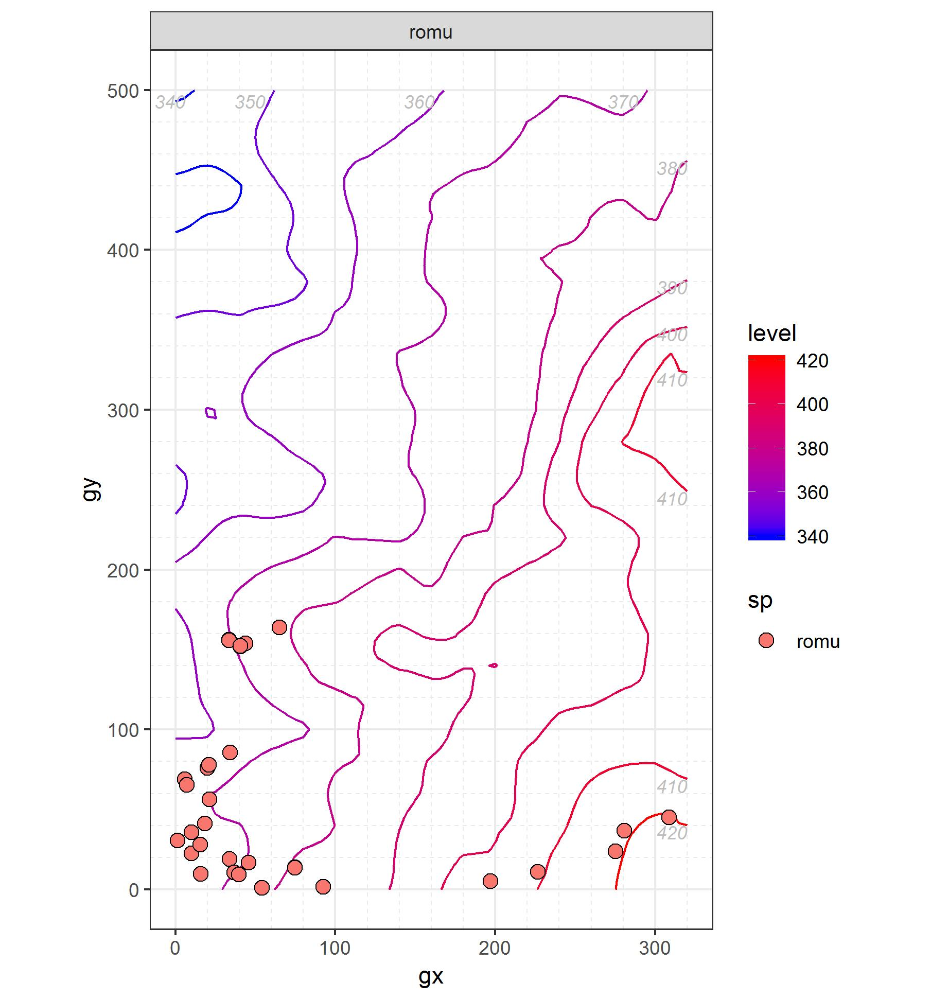

```Picture of tree cores (with a small blurb)```

### *Rubus allegheniensis* Porter ```Allegheny Blackberry```

```Life history (information will be added by Michael)```

```Leaf traits (written about or scanned and labeled)```

|                                            | 2013 | 2018 |
|:------------------------------------------:|------|------|
| # of Stems in Total                        |      |      |
| # of Individuals, Including Multiple Stems |      |      |
| # of New Recruitment                       |      |      |
| Min DBH in Sample (cm)                     |      |      |
| Mean DBH Is Sample (cm)                    |      |      |
| Max DBH in Sample (cm)                     |      |      |

```Graph of recruiment and mortality```


```Picture of tree cores (with a small blurb)```

### *Rubus pensilvanicus*	Poir. ```Pennsylvania Blackberry```

```Life history (information will be added by Michael)
**This plant is also affectionally known as Prickly Blackberry.**```

```Leaf traits (written about or scanned and labeled)```

|                                            | 2013 | 2018 |
|:------------------------------------------:|------|------|
| # of Stems in Total                        |      |      |
| # of Individuals, Including Multiple Stems |      |      |
| # of New Recruitment                       |      |      |
| Min DBH in Sample (cm)                     |      |      |
| Mean DBH Is Sample (cm)                    |      |      |
| Max DBH in Sample (cm)                     |      |      |

```Graph of recruiment and mortality```


```Picture of tree cores (with a small blurb)```

*Rubus phoenicolasius* Maxim.	```Wineberry```

```Life history (information will be added by Michael)```

```Leaf traits (written about or scanned and labeled)```

|                                            | 2013 | 2018 |
|:------------------------------------------:|------|------|
| # of Stems in Total                        |      |      |
| # of Individuals, Including Multiple Stems |      |      |
| # of New Recruitment                       |      |      |
| Min DBH in Sample (cm)                     |      |      |
| Mean DBH Is Sample (cm)                    |      |      |
| Max DBH in Sample (cm)                     |      |      |

```Graph of recruiment and mortality```


```Picture of tree cores (with a small blurb)```

## Sapindaceae
### *Acer negundo* L. var negundo ```Boxelder```

```Life history (information will be added by Michael)
**Second common name is Eastern Boxelder.**```

```Leaf traits (written about or scanned and labeled)```

|                                            | 2013 | 2018 |
|:------------------------------------------:|------|------|
| # of Stems in Total                        |      |      |
| # of Individuals, Including Multiple Stems |  43  |      |
| # of New Recruitment                       |      |      |
| Min DBH in Sample (cm)                     | 1.00 |      |
| Mean DBH Is Sample (cm)                    | 4.83 |      |
| Max DBH in Sample (cm)                     |23.80 |      |

```Graph of recruiment and mortality```


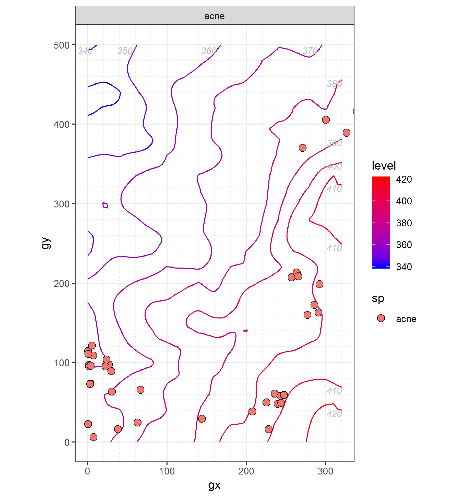

```Picture of tree cores (with a small blurb)```

### *Acer platanoides* L.	```Norway Maple```

```Life history (information will be added by Michael)```

```Leaf traits (written about or scanned and labeled)```

|                                            | 2013 | 2018 |
|:------------------------------------------:|------|------|
| # of Stems in Total                        |      |      |
| # of Individuals, Including Multiple Stems |  12  |      |
| # of New Recruitment                       |      |      |
| Min DBH in Sample (cm)                     | 1.81 |      |
| Mean DBH Is Sample (cm)                    |13.46 |      |
| Max DBH in Sample (cm)                     |32.91 |      |

```Graph of recruiment and mortality```


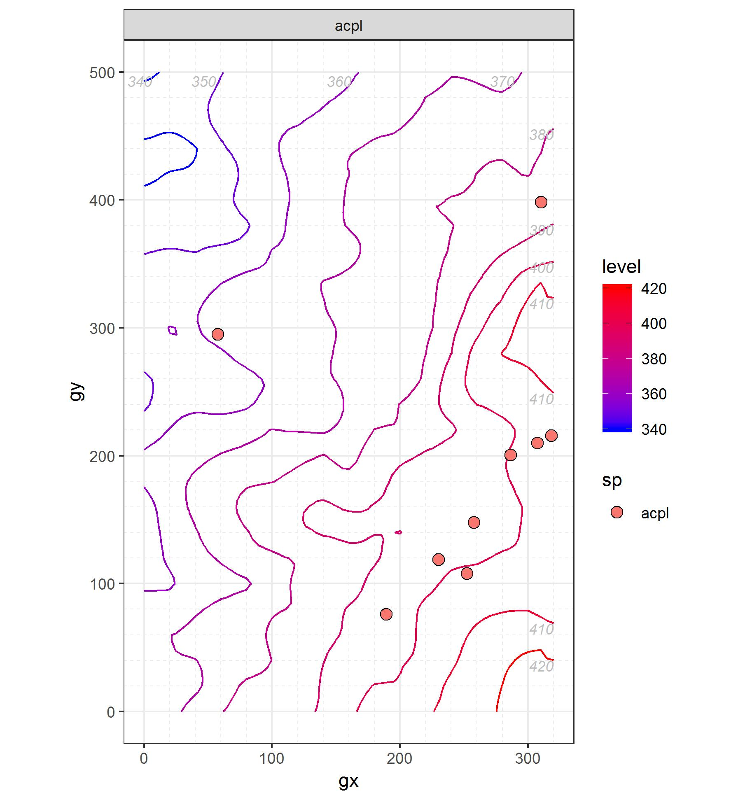

```Picture of tree cores (with a small blurb)```

### *Acer rubrum*	L. ```Red Maple```

```Life history (information will be added by Michael)```

```Leaf traits (written about or scanned and labeled)```

|                                            | 2013 | 2018 |
|:------------------------------------------:|------|------|
| # of Stems in Total                        |      |      |
| # of Individuals, Including Multiple Stems | 314  |      |
| # of New Recruitment                       |      |      |
| Min DBH in Sample (cm)                     | 1.16 |      |
| Mean DBH Is Sample (cm)                    |11.24 |      |
| Max DBH in Sample (cm)                     |71.50 |      |

```Graph of recruiment and mortality```


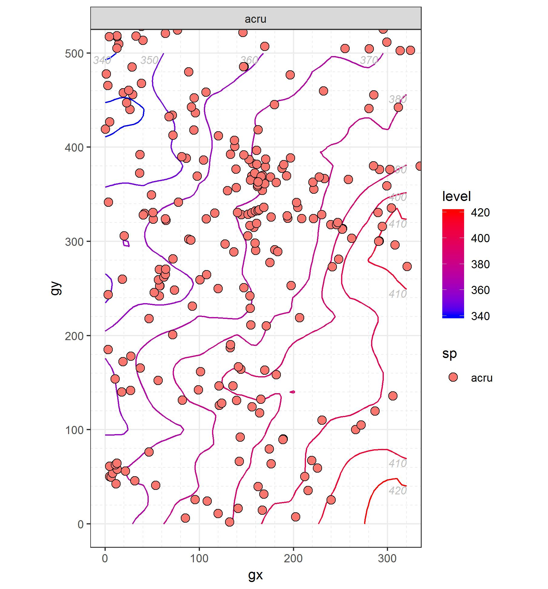

```Picture of tree cores (with a small blurb)```

## Simaroubaceae
### *Ailanthus altissima* (P. Miller) Swingle ```Tree of Heaven```

```Life history (information will be added by Michael)```

```Leaf traits (written about or scanned and labeled)```

|                                            | 2013 | 2018 |
|:------------------------------------------:|------|------|
| # of Stems in Total                        |      |      |
| # of Individuals, Including Multiple Stems |  32  |      |
| # of New Recruitment                       |      |      |
| Min DBH in Sample (cm)                     | 1.43 |      |
| Mean DBH Is Sample (cm)                    | 4.12 |      |
| Max DBH in Sample (cm)                     |34.10 |      |

```Graph of recruiment and mortality```


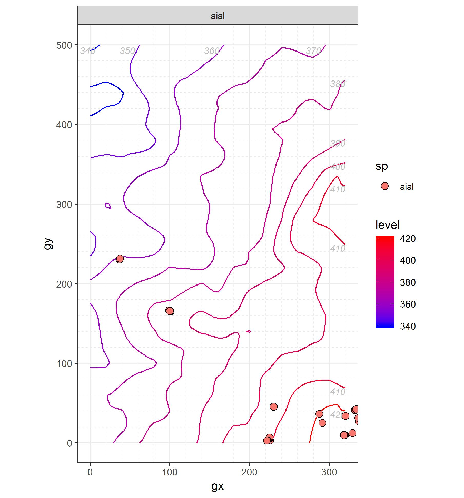

```Picture of tree cores (with a small blurb)```

## Ulmaceae
### *Ulmus americana*	L. ```American Elm```

```Life history (information will be added by Michael)```

```Leaf traits (written about or scanned and labeled)```

|                                            | 2013 | 2018 |
|:------------------------------------------:|------|------|
| # of Stems in Total                        |      |      |
| # of Individuals, Including Multiple Stems |  25  |      |
| # of New Recruitment                       |      |      |
| Min DBH in Sample (cm)                     | 1.25 |      |
| Mean DBH Is Sample (cm)                    |11.14 |      |
| Max DBH in Sample (cm)                     |24.12 |      |

```Graph of recruiment and mortality```


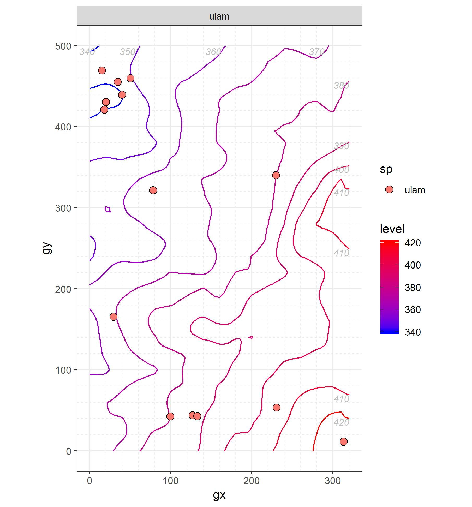

```Picture of tree cores (with a small blurb)```

### *Ulmus rubra*	Muhl. ```Slippery Elm```

```Life history (information will be added by Michael)
**Species is also commonly known as Red Elm.**```

```Leaf traits (written about or scanned and labeled)```

|                                            | 2013 | 2018 |
|:------------------------------------------:|------|------|
| # of Stems in Total                        |      |      |
| # of Individuals, Including Multiple Stems | 378  |      |
| # of New Recruitment                       |      |      |
| Min DBH in Sample (cm)                     | 1.04 |      |
| Mean DBH Is Sample (cm)                    | 8.60 |      |
| Max DBH in Sample (cm)                     |37.90 |      |

```Graph of recruiment and mortality```


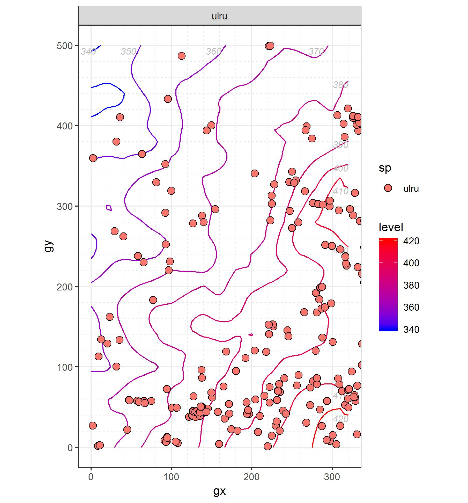

```Picture of tree cores (with a small blurb)```
