---
output:
  html_document: default
  pdf_document: default
fontsize: 12pt
---
# Species Descriptions

This chapter consist of botanical descriptions and ecological information on the 65 woody species measured within the 25.6-ha SCBI-ForstGEO plot. Species names are arranged alphabetically by family and species; species scientific name, authorship, and common names follow the Flora of Virginia conventions [@weakley_flora_2012]. If a synonym for a species name is given, then it is written after the symbol "=" below the species name used in the plot. The following are the main descriptors used for each species.

*Botanical descriptions*: All species in the plot were given a brief technical plant description summarized from the Flora of Virginia [@weakley_flora_2012] and the “Common Native Trees of Virginia” guide [@powell_common_2007]. Ecological aspects were subtracted from various sources [@weakley_flora_2012; @noauthor_missouri_nodate]. Local habitat and species distribution refer to those within the plot.

*Stratum*: Indicates the main canopy position of the species based on the diameter of the species measured at the SCBI plot and by qualitative observations within the forest.

*Native status*: Indicates if the plant species is native or introduced to Virginia [@weakley_flora_2012].

*Conservation status*: Conservation status follows the standards from the IUCN Red List categories [@noauthor_standards_2016]: Least Concern: populations stable or taxon that do not qualify as threatened. Near threatened: taxon close to qualifying as threatened category in the near future). Vulnerable:  A taxon considered to be facing a high risk of extinction in the wild. Endangered: A taxon considered to be facing a very high risk of extinction in the wild. Critically endangered: A taxon considered to be facing an extremely high risk of extinction in the wild.

*Field code*: Species code used in the field and data sets (first two letters of genus and first two letters of species).

*Summary statistics*: A table summarizing basic statistics per species per census within the plot, include:  number of individual (stems), new stems (total stems recruited and recruitment rate), stems dead and annual mortality rates, minimum and maximum DBH, mean growth rate for stems < and > 10 cm.

*Species distribution maps within plot*: Distribution of each species within the 25.6 ha plot is illustrated in an individual topographic map (10-m contour lines). The blue lines represent 2 streams running North-South and East-West within the plot, the dotted red line represents a gravel road, and the black thick line represents a 4-ha deer exclusion established in 1990 [@bourg_initial_2013]. Diameter for alive and dead stems stems are symbolized as follow: by a gradient color scale 1-10 cm DBH, green dot; 10.1-50 cm DBH, yellow dot; 50.1 cm DBH and above, blue dot; dead stems of any size, are represented by a black dot. The maps illustrate the species as surveyed in 2018. 

*Species regional range*: In the online version of this book, we present species range map for all species within the plot. Maps were sourced from the Botanical Information and Ecology Network [@noauthor_botanical_nodate] and depicts the distribution of the species globally.

*Pictures and graphs*: A leaf or group of leaves images are shown for each species. Leaves were collected fresh, scanned flat and images enhanced using the software GIMP 2.10.8. A 2-cm scale is given in the lower right corner. Pictures of tree cores are shown when available. Those pictures were produced using an Epson Expression 12000XL Photo Scanner. Climate sensitivity graphs built from tree cores show the relationship between multiple climate variables and tree growth, those graphs are only shown for 12 species (see @helcoski_growing_2019 for methods to build graphs).

## Adoxaceae
### *Sambucus canadensis* L. {-#Sambucus-canadensis}
Common name: Common Elderberry. Species code: saca. Stratum: understory. Native. Conservation status: Least concern.

Deciduous shrubs 1-4 m bark smooth with abundant lenticels, hairless; leaves compound, opposite, 15-30 cm, leaflets elliptic to lanceolate, 5-11 cm long, acuminate, margin sharply serrate, dark green above and much paler below; flat-topped cluster of flowers (cymes) 5-20 cm wide, flowers white, 3-4 mm, fragant; fruits drupes, 3-6 mm, deep purple or black, borne in flat-topped clusters. Infrequent through the plot, mostly occurring in damp soils.

{width=50%}{width=50%}
<table class="table table table-striped" style="font-size: 10px; margin-left: auto; margin-right: auto; margin-left: auto; margin-right: auto;">
 <thead>
  <tr>
   <th style="text-align:left;"> X </th>
   <th style="text-align:right;"> X2008 </th>
   <th style="text-align:right;"> X2013 </th>
   <th style="text-align:right;"> X2018 </th>
  </tr>
 </thead>
<tbody>
  <tr>
   <td style="text-align:left;"> Total Stems </td>
   <td style="text-align:right;"> 29 </td>
   <td style="text-align:right;"> 25.0 </td>
   <td style="text-align:right;"> 7 </td>
  </tr>
  <tr>
   <td style="text-align:left;"> New Stems (recruit rate) </td>
   <td style="text-align:right;"> NA </td>
   <td style="text-align:right;"> NA </td>
   <td style="text-align:right;"> NA </td>
  </tr>
  <tr>
   <td style="text-align:left;"> Dead Stems </td>
   <td style="text-align:right;"> 13 </td>
   <td style="text-align:right;"> 17.0 </td>
   <td style="text-align:right;"> 35 </td>
  </tr>
  <tr>
   <td style="text-align:left;"> Min DBH </td>
   <td style="text-align:right;"> 10 </td>
   <td style="text-align:right;"> 10.2 </td>
   <td style="text-align:right;"> 11 </td>
  </tr>
  <tr>
   <td style="text-align:left;"> Max DBH </td>
   <td style="text-align:right;"> 18 </td>
   <td style="text-align:right;"> 23.3 </td>
   <td style="text-align:right;"> 21 </td>
  </tr>
</tbody>
</table>

### *Viburnum acerifolium* L. {-#Viburnum-acerifolium}
Common name: Mapleleaf Viburnum. Species code: viac. Stratum: understory. Native. Conservation status: Least concern. 

Deciduous shrubs, stems 1-2 m, bark smooth, twigs pubescent when young; leaves simple, opposite, 5-10 cm long, ovate or orbicular, rounded or hart-shape basally, palmately veined, three lobed, margin coarsely dentate, pubescent; flowers small, white, appearing in flat topped clusters 2-9 cm wide; drupes globose, 6-9 mm, black or purplish black, occurring in flat topped clusters. Infrequent through the plot, growing in dry areas. 

{width=50%}{width=50%}
<table class="table table table-striped" style="font-size: 10px; margin-left: auto; margin-right: auto; margin-left: auto; margin-right: auto;">
 <thead>
  <tr>
   <th style="text-align:left;"> X </th>
   <th style="text-align:right;"> X2008 </th>
   <th style="text-align:right;"> X2013 </th>
   <th style="text-align:right;"> X2018 </th>
  </tr>
 </thead>
<tbody>
  <tr>
   <td style="text-align:left;"> Total Stems </td>
   <td style="text-align:right;"> 0 </td>
   <td style="text-align:right;"> 1.0 </td>
   <td style="text-align:right;"> 4 </td>
  </tr>
  <tr>
   <td style="text-align:left;"> New Stems (recruit rate) </td>
   <td style="text-align:right;"> NA </td>
   <td style="text-align:right;"> NA </td>
   <td style="text-align:right;"> NA </td>
  </tr>
  <tr>
   <td style="text-align:left;"> Dead Stems </td>
   <td style="text-align:right;"> 4 </td>
   <td style="text-align:right;"> 3.0 </td>
   <td style="text-align:right;"> 0 </td>
  </tr>
  <tr>
   <td style="text-align:left;"> Min DBH </td>
   <td style="text-align:right;"> Inf </td>
   <td style="text-align:right;"> 10.1 </td>
   <td style="text-align:right;"> 11 </td>
  </tr>
  <tr>
   <td style="text-align:left;"> Max DBH </td>
   <td style="text-align:right;"> -Inf </td>
   <td style="text-align:right;"> 10.1 </td>
   <td style="text-align:right;"> 13 </td>
  </tr>
</tbody>
</table>

###	*Viburnum prunifolium* L. {-#Viburnum-prunifolium}
Common name: Black Haw. Species code: vipr. Stratum: understory. Native. Conservation status: Least concern.

Deciduous shrubs up to 8 m bark gray-brown breaking up into small square plates; leaves simple, opposite, 3-8 cm long, oval or oblong to elliptic, margin finely serrate,  dark green above and paler below.; flowers very small, white appearing in dense slightly rounded clusters 5-10 cm wide; drupes ellipsoid to subglobose, 8-15 mm, blue-black, hanging in clusters. Common through the plot, in wet to dry areas.  

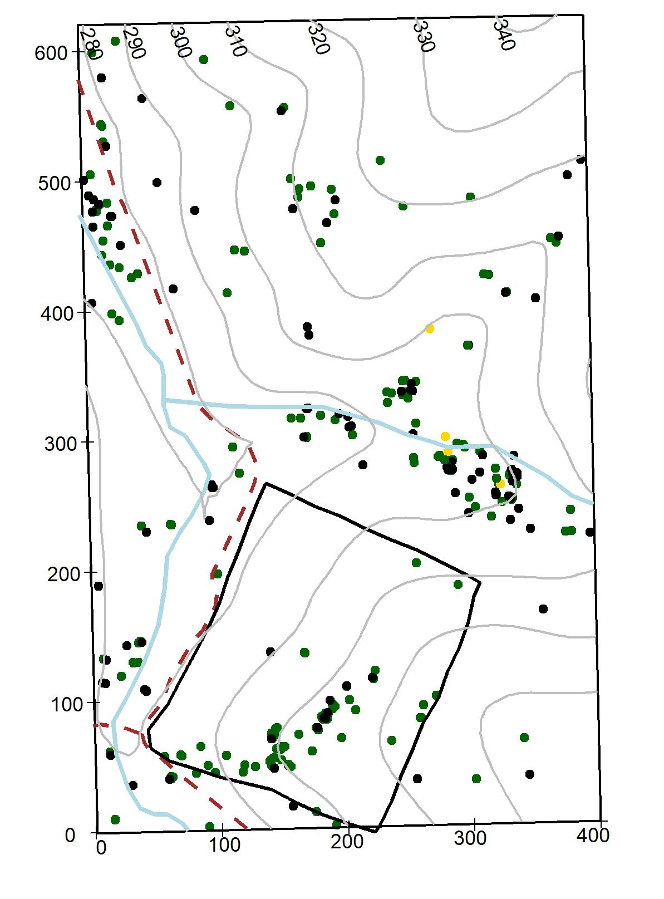{width=50%}50%}
<table class="table table table-striped" style="font-size: 10px; margin-left: auto; margin-right: auto; margin-left: auto; margin-right: auto;">
 <thead>
  <tr>
   <th style="text-align:left;"> X </th>
   <th style="text-align:right;"> X2008 </th>
   <th style="text-align:right;"> X2013 </th>
   <th style="text-align:right;"> X2018 </th>
  </tr>
 </thead>
<tbody>
  <tr>
   <td style="text-align:left;"> Total Stems </td>
   <td style="text-align:right;"> 426.0 </td>
   <td style="text-align:right;"> 427.0 </td>
   <td style="text-align:right;"> 456 </td>
  </tr>
  <tr>
   <td style="text-align:left;"> New Stems (recruit rate) </td>
   <td style="text-align:right;"> NA </td>
   <td style="text-align:right;"> NA </td>
   <td style="text-align:right;"> NA </td>
  </tr>
  <tr>
   <td style="text-align:left;"> Dead Stems </td>
   <td style="text-align:right;"> 190.0 </td>
   <td style="text-align:right;"> 189.0 </td>
   <td style="text-align:right;"> 160 </td>
  </tr>
  <tr>
   <td style="text-align:left;"> Min DBH </td>
   <td style="text-align:right;"> 10.0 </td>
   <td style="text-align:right;"> 10.0 </td>
   <td style="text-align:right;"> 10 </td>
  </tr>
  <tr>
   <td style="text-align:left;"> Max DBH </td>
   <td style="text-align:right;"> 122.8 </td>
   <td style="text-align:right;"> 132.8 </td>
   <td style="text-align:right;"> 146 </td>
  </tr>
</tbody>
</table>

###	*Viburnum recognitum* Fernald {-#Viburnum-recognitum}
  **= *Virbunum dentatum L. var. lucidum***

Common name: Smooth Arrow-wood. Species code: vire. Stratum: understory. Native. Conservation status: Least concern. 

Deciduous shrubs up to 4 m, bark reddish to grayish brown, twigs slender, hairless or slightly pubescent; leaves simple, opposite, 3-8 cm long, ovate to elliptic margin coarsely serrate, shiny dark green above, finely pubescent underside, hair confined to veins axils; flowers small, white appearing in flat topped clusters 3-11 cm wide; drupes subglobose to ellipsoid, 6-8 mm, blue-black, occurring in clusters. Rare through the plot, growing in dry areas.

{width=50%}{width=50%}
<table class="table table table-striped" style="font-size: 10px; margin-left: auto; margin-right: auto; margin-left: auto; margin-right: auto;">
 <thead>
  <tr>
   <th style="text-align:left;"> X </th>
   <th style="text-align:right;"> X2008 </th>
   <th style="text-align:right;"> X2013 </th>
   <th style="text-align:right;"> X2018 </th>
  </tr>
 </thead>
<tbody>
  <tr>
   <td style="text-align:left;"> Total Stems </td>
   <td style="text-align:right;"> 2.0 </td>
   <td style="text-align:right;"> 3.0 </td>
   <td style="text-align:right;"> 3 </td>
  </tr>
  <tr>
   <td style="text-align:left;"> New Stems (recruit rate) </td>
   <td style="text-align:right;"> NA </td>
   <td style="text-align:right;"> NA </td>
   <td style="text-align:right;"> NA </td>
  </tr>
  <tr>
   <td style="text-align:left;"> Dead Stems </td>
   <td style="text-align:right;"> 1.0 </td>
   <td style="text-align:right;"> 0.0 </td>
   <td style="text-align:right;"> 0 </td>
  </tr>
  <tr>
   <td style="text-align:left;"> Min DBH </td>
   <td style="text-align:right;"> 12.6 </td>
   <td style="text-align:right;"> 13.7 </td>
   <td style="text-align:right;"> 14 </td>
  </tr>
  <tr>
   <td style="text-align:left;"> Max DBH </td>
   <td style="text-align:right;"> 17.5 </td>
   <td style="text-align:right;"> 18.8 </td>
   <td style="text-align:right;"> 21 </td>
  </tr>
</tbody>
</table>

## Annonaceae
### *Asimina triloba*	(L.) Dunal {-#Asimina-triloba}
Common name: Pawpaw, Common Pawpaw. Species code: astr. Stratum: understory. Native. Conservation status: Least concern.

Shrubs or trees up to 15 m, bark brown, smooth; leaves simple, alternate, 10-35 cm long, obovate-oblong to lanceolate, acute tip, glabrous above, pubescent below; flowers 2-4 cm wide, dark purple to brown; fruit green berries 3-5 cm large, pulpy, edible, resembling a green mango. Growing in semi-wet areas in the plot, evident clonal patch distribution.

{width=50%}{width=50%}
<table class="table table table-striped" style="font-size: 10px; margin-left: auto; margin-right: auto; margin-left: auto; margin-right: auto;">
 <thead>
  <tr>
   <th style="text-align:left;"> X </th>
   <th style="text-align:right;"> X2008 </th>
   <th style="text-align:right;"> X2013 </th>
   <th style="text-align:right;"> X2018 </th>
  </tr>
 </thead>
<tbody>
  <tr>
   <td style="text-align:left;"> Total Stems </td>
   <td style="text-align:right;"> 3876.0 </td>
   <td style="text-align:right;"> 5089.0 </td>
   <td style="text-align:right;"> 5655 </td>
  </tr>
  <tr>
   <td style="text-align:left;"> New Stems (recruit rate) </td>
   <td style="text-align:right;"> NA </td>
   <td style="text-align:right;"> NA </td>
   <td style="text-align:right;"> NA </td>
  </tr>
  <tr>
   <td style="text-align:left;"> Dead Stems </td>
   <td style="text-align:right;"> 3877.0 </td>
   <td style="text-align:right;"> 2664.0 </td>
   <td style="text-align:right;"> 2098 </td>
  </tr>
  <tr>
   <td style="text-align:left;"> Min DBH </td>
   <td style="text-align:right;"> 10.0 </td>
   <td style="text-align:right;"> 10.0 </td>
   <td style="text-align:right;"> 10 </td>
  </tr>
  <tr>
   <td style="text-align:left;"> Max DBH </td>
   <td style="text-align:right;"> 134.4 </td>
   <td style="text-align:right;"> 118.4 </td>
   <td style="text-align:right;"> 124 </td>
  </tr>
</tbody>
</table>

## Aquifoliaceae
### *Ilex verticillata* (L.) A. Gray {-#Ilex-verticillata}
Common name: Winterberry. Species code: ilve. Stratum: understory. Native. Conservation status: Least concern.

Shrubs up to 8 m, rarely resembling a tree, stems glabrous or pubescent; leaves simple, alternate, 2-10 cm long, lanceolate to round-ovate to elliptic, lustrous above, pubescent below, margin serrate; very small flowers growing as clusters at the branch base, flowers white; drupes globose, small 5-7 mm, bright red to yellow. Rare through the plot.

{width=50%}{width=50%}
<table class="table table table-striped" style="font-size: 10px; margin-left: auto; margin-right: auto; margin-left: auto; margin-right: auto;">
 <thead>
  <tr>
   <th style="text-align:left;"> X </th>
   <th style="text-align:right;"> X2008 </th>
   <th style="text-align:right;"> X2013 </th>
   <th style="text-align:right;"> X2018 </th>
  </tr>
 </thead>
<tbody>
  <tr>
   <td style="text-align:left;"> Total Stems </td>
   <td style="text-align:right;"> 48.0 </td>
   <td style="text-align:right;"> 47.0 </td>
   <td style="text-align:right;"> 47 </td>
  </tr>
  <tr>
   <td style="text-align:left;"> New Stems (recruit rate) </td>
   <td style="text-align:right;"> NA </td>
   <td style="text-align:right;"> NA </td>
   <td style="text-align:right;"> NA </td>
  </tr>
  <tr>
   <td style="text-align:left;"> Dead Stems </td>
   <td style="text-align:right;"> 20.0 </td>
   <td style="text-align:right;"> 21.0 </td>
   <td style="text-align:right;"> 21 </td>
  </tr>
  <tr>
   <td style="text-align:left;"> Min DBH </td>
   <td style="text-align:right;"> 10.1 </td>
   <td style="text-align:right;"> 10.4 </td>
   <td style="text-align:right;"> 10 </td>
  </tr>
  <tr>
   <td style="text-align:left;"> Max DBH </td>
   <td style="text-align:right;"> 57.3 </td>
   <td style="text-align:right;"> 59.5 </td>
   <td style="text-align:right;"> 45 </td>
  </tr>
</tbody>
</table>

## Berberidaceae
### *Berberis thunbergii* DC. {-#Berberis-thunbergii}
Common name: Japanese Barberry. Species code: beth. Stratum: understory. Introduced (exotic, highly invasive). Conservation status: Least concern.

Shrubs up to 2 m, compact, densely branched with thorny stems, bark gray-brown, finely shredded, twigs slender, angled and zigzagged; leaves simple, alternate, 5-30 mm long, spatulate to obovate; flowers solitary or in small clusters, pale yellow, berries ellipsoid to globose, 6-8 mm, showy red. Rare through the plot.

{width=50%}{width=50%}
<table class="table table table-striped" style="font-size: 10px; margin-left: auto; margin-right: auto; margin-left: auto; margin-right: auto;">
 <thead>
  <tr>
   <th style="text-align:left;"> X </th>
   <th style="text-align:right;"> X2008 </th>
   <th style="text-align:right;"> X2013 </th>
   <th style="text-align:right;"> X2018 </th>
  </tr>
 </thead>
<tbody>
  <tr>
   <td style="text-align:left;"> Total Stems </td>
   <td style="text-align:right;"> 3.0 </td>
   <td style="text-align:right;"> 15.0 </td>
   <td style="text-align:right;"> 27 </td>
  </tr>
  <tr>
   <td style="text-align:left;"> New Stems (recruit rate) </td>
   <td style="text-align:right;"> NA </td>
   <td style="text-align:right;"> NA </td>
   <td style="text-align:right;"> NA </td>
  </tr>
  <tr>
   <td style="text-align:left;"> Dead Stems </td>
   <td style="text-align:right;"> 26.0 </td>
   <td style="text-align:right;"> 14.0 </td>
   <td style="text-align:right;"> 2 </td>
  </tr>
  <tr>
   <td style="text-align:left;"> Min DBH </td>
   <td style="text-align:right;"> 10.3 </td>
   <td style="text-align:right;"> 10.3 </td>
   <td style="text-align:right;"> 10 </td>
  </tr>
  <tr>
   <td style="text-align:left;"> Max DBH </td>
   <td style="text-align:right;"> 13.1 </td>
   <td style="text-align:right;"> 15.8 </td>
   <td style="text-align:right;"> 23 </td>
  </tr>
</tbody>
</table>

## Betulaceae
### *Carpinus caroliniana* Walt. {-#Carpinus-caroliniana}
Common name: American Hornbeam, Ironwood, Musclewood. Species code: caca. Stratum: understory. Native. Conservation status: Least concern.

Small tree or shrub up to 12 m, trunks with irregular, longitudinal ridges, bark smooth and tight; leaves simple, alternate, 3-12 cm long, ovate to elliptic, margin double serrated; flowers small, solitary or in clusters, occurring in long pendulous catkins 2-5 cm long, petals light yellow-green; fruit small nutlet covered by a 3-lobed leafy bract. Abundant in wet areas and inside the deer exclosure.

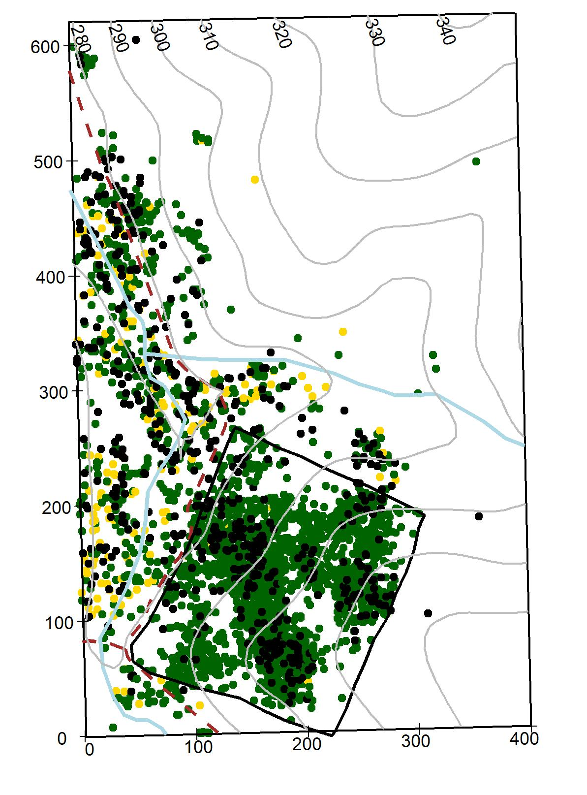{width=50%}{width=50%}
<table class="table table table-striped" style="font-size: 10px; margin-left: auto; margin-right: auto; margin-left: auto; margin-right: auto;">
 <thead>
  <tr>
   <th style="text-align:left;"> X </th>
   <th style="text-align:right;"> X2008 </th>
   <th style="text-align:right;"> X2013 </th>
   <th style="text-align:right;"> X2018 </th>
  </tr>
 </thead>
<tbody>
  <tr>
   <td style="text-align:left;"> Total Stems </td>
   <td style="text-align:right;"> 2927.0 </td>
   <td style="text-align:right;"> 4029 </td>
   <td style="text-align:right;"> 5332 </td>
  </tr>
  <tr>
   <td style="text-align:left;"> New Stems (recruit rate) </td>
   <td style="text-align:right;"> NA </td>
   <td style="text-align:right;"> NA </td>
   <td style="text-align:right;"> NA </td>
  </tr>
  <tr>
   <td style="text-align:left;"> Dead Stems </td>
   <td style="text-align:right;"> 3187.0 </td>
   <td style="text-align:right;"> 2085 </td>
   <td style="text-align:right;"> 782 </td>
  </tr>
  <tr>
   <td style="text-align:left;"> Min DBH </td>
   <td style="text-align:right;"> 10.0 </td>
   <td style="text-align:right;"> 0 </td>
   <td style="text-align:right;"> 10 </td>
  </tr>
  <tr>
   <td style="text-align:left;"> Max DBH </td>
   <td style="text-align:right;"> 452.7 </td>
   <td style="text-align:right;"> 472 </td>
   <td style="text-align:right;"> 495 </td>
  </tr>
</tbody>
</table>

###	*Corylus americana*	Walt. {-#Corylus-americana}
Common name: American Hazelnut, American Filbert. Species code: coam. Stratum: understory. Native. Conservation status: Least concern.

Shrubs up to 3.5 m, growing in colonies, twigs pubescent with small glands –lenticels- on bark; leaves simple, alternate, 7-15 cm long, broadly ovate to oval, margins finely double serrate; male flowers green-yellow catkins or female flowers inconspicuous with red styles of the pistils protruding, solitary or in clusters; fruits a small brown, globose nut, covered by leafy bracts, edible. Very rare through the plot.

{width=50%}{width=50%}
<table class="table table table-striped" style="font-size: 10px; margin-left: auto; margin-right: auto; margin-left: auto; margin-right: auto;">
 <thead>
  <tr>
   <th style="text-align:left;"> X </th>
   <th style="text-align:right;"> X2008 </th>
   <th style="text-align:right;"> X2013 </th>
   <th style="text-align:right;"> X2018 </th>
  </tr>
 </thead>
<tbody>
  <tr>
   <td style="text-align:left;"> Total Stems </td>
   <td style="text-align:right;"> 3.0 </td>
   <td style="text-align:right;"> 1.0 </td>
   <td style="text-align:right;"> 2 </td>
  </tr>
  <tr>
   <td style="text-align:left;"> New Stems (recruit rate) </td>
   <td style="text-align:right;"> NA </td>
   <td style="text-align:right;"> NA </td>
   <td style="text-align:right;"> NA </td>
  </tr>
  <tr>
   <td style="text-align:left;"> Dead Stems </td>
   <td style="text-align:right;"> 1.0 </td>
   <td style="text-align:right;"> 3.0 </td>
   <td style="text-align:right;"> 2 </td>
  </tr>
  <tr>
   <td style="text-align:left;"> Min DBH </td>
   <td style="text-align:right;"> 12.5 </td>
   <td style="text-align:right;"> 25.8 </td>
   <td style="text-align:right;"> 25 </td>
  </tr>
  <tr>
   <td style="text-align:left;"> Max DBH </td>
   <td style="text-align:right;"> 20.3 </td>
   <td style="text-align:right;"> 25.8 </td>
   <td style="text-align:right;"> 56 </td>
  </tr>
</tbody>
</table>

## Cannabaceae
### *Celtis occidentalis*	L. {-#Celtis-occidentalis}
Common name: Common Hackberry, Northern Hackberry. Species code: ceoc. Stratum: understory. Native. Conservation status: Least concern.

Tree or thick shrubs up to 25 m bark smooth and gray-brown when young, soon developing corky, irregular ridges at maturity, twigs slender, in zigzag, with numerous lenticels; leaves simple, alternate, 5-12 cm long, rounded or truncate 3-nerved, sometimes pubescent, margins serrate; flowers very small, 2-4 mm, light green; fruit rounded drupes, 7-14 mm in diameter, ellipsoid to globose, dark red to black. Infrequent through the plot.

{width=50%}{width=50%}
<table class="table table table-striped" style="font-size: 10px; margin-left: auto; margin-right: auto; margin-left: auto; margin-right: auto;">
 <thead>
  <tr>
   <th style="text-align:left;"> X </th>
   <th style="text-align:right;"> X2008 </th>
   <th style="text-align:right;"> X2013 </th>
   <th style="text-align:right;"> X2018 </th>
  </tr>
 </thead>
<tbody>
  <tr>
   <td style="text-align:left;"> Total Stems </td>
   <td style="text-align:right;"> 116.0 </td>
   <td style="text-align:right;"> 104.0 </td>
   <td style="text-align:right;"> 82 </td>
  </tr>
  <tr>
   <td style="text-align:left;"> New Stems (recruit rate) </td>
   <td style="text-align:right;"> NA </td>
   <td style="text-align:right;"> NA </td>
   <td style="text-align:right;"> NA </td>
  </tr>
  <tr>
   <td style="text-align:left;"> Dead Stems </td>
   <td style="text-align:right;"> 5.0 </td>
   <td style="text-align:right;"> 17.0 </td>
   <td style="text-align:right;"> 39 </td>
  </tr>
  <tr>
   <td style="text-align:left;"> Min DBH </td>
   <td style="text-align:right;"> 10.1 </td>
   <td style="text-align:right;"> 10.7 </td>
   <td style="text-align:right;"> 14 </td>
  </tr>
  <tr>
   <td style="text-align:left;"> Max DBH </td>
   <td style="text-align:right;"> 411.9 </td>
   <td style="text-align:right;"> 445.0 </td>
   <td style="text-align:right;"> 476 </td>
  </tr>
</tbody>
</table>

## Caprifoliaceae
### *Lonicera maackii* (Rupr.) Maxim {-#Lonicera-maackii}
Common name: Amur Honeysuckle. Species code: loma. Stratum: understory. Introduced, highly invasive. Conservation status: Least concern.

Shrubs up to 5 m, multi-stemmed, bark with long, deep fissures, grayish brown, twigs hairless or slightly pubescent; leaves simple, opposite, 3.5-8.5 cm long, ovate to lance-ovate, 5-7 cm, slightly pubescent on veins underneath: flowers1.5-2.5 cm long, occurring in pairs, very fragrant, petals white becoming yellow; fruit a globose berry, 4-7 mm in diameter, dark red. Infrequent through the plot.

{width=50%}{width=50%}
<table class="table table table-striped" style="font-size: 10px; margin-left: auto; margin-right: auto; margin-left: auto; margin-right: auto;">
 <thead>
  <tr>
   <th style="text-align:left;"> X </th>
   <th style="text-align:right;"> X2008 </th>
   <th style="text-align:right;"> X2013 </th>
   <th style="text-align:right;"> X2018 </th>
  </tr>
 </thead>
<tbody>
  <tr>
   <td style="text-align:left;"> Total Stems </td>
   <td style="text-align:right;"> 28.0 </td>
   <td style="text-align:right;"> 39.0 </td>
   <td style="text-align:right;"> 48 </td>
  </tr>
  <tr>
   <td style="text-align:left;"> New Stems (recruit rate) </td>
   <td style="text-align:right;"> NA </td>
   <td style="text-align:right;"> NA </td>
   <td style="text-align:right;"> NA </td>
  </tr>
  <tr>
   <td style="text-align:left;"> Dead Stems </td>
   <td style="text-align:right;"> 30.0 </td>
   <td style="text-align:right;"> 19.0 </td>
   <td style="text-align:right;"> 10 </td>
  </tr>
  <tr>
   <td style="text-align:left;"> Min DBH </td>
   <td style="text-align:right;"> 10.0 </td>
   <td style="text-align:right;"> 10.2 </td>
   <td style="text-align:right;"> 10 </td>
  </tr>
  <tr>
   <td style="text-align:left;"> Max DBH </td>
   <td style="text-align:right;"> 33.1 </td>
   <td style="text-align:right;"> 41.8 </td>
   <td style="text-align:right;"> 74 </td>
  </tr>
</tbody>
</table>

## Celastracea
### *Euonymus alatus* (Thunb.) Sieb. {-#Euonymus-alatus}
Common name: Winged Euonymus, Burning Bush. Species code: eual. Stratum: understory. Introduced, highly invasive. Conservation status: Least concern.

Shrubs up to 2.5 m, bark gray to gray-brown, splitting revealing a lighter inner bark, twigs green, 4-angled with 2-4 conspicuous wings; leaves simple, opposite,6-8 cm long, elliptical to obovate, margin sharply serrate; flowers solitaries or in clusters of 3, very small, 6-8 mm wide, yellow-green; fruits a small 1-1.5 cm capsule, dark red. Rare through the plot.

{width=50%}{width=50%}
<table class="table table table-striped" style="font-size: 10px; margin-left: auto; margin-right: auto; margin-left: auto; margin-right: auto;">
 <thead>
  <tr>
   <th style="text-align:left;"> X </th>
   <th style="text-align:right;"> X2008 </th>
   <th style="text-align:right;"> X2013 </th>
   <th style="text-align:right;"> X2018 </th>
  </tr>
 </thead>
<tbody>
  <tr>
   <td style="text-align:left;"> Total Stems </td>
   <td style="text-align:right;"> 0 </td>
   <td style="text-align:right;"> 3.0 </td>
   <td style="text-align:right;"> 17 </td>
  </tr>
  <tr>
   <td style="text-align:left;"> New Stems (recruit rate) </td>
   <td style="text-align:right;"> NA </td>
   <td style="text-align:right;"> NA </td>
   <td style="text-align:right;"> NA </td>
  </tr>
  <tr>
   <td style="text-align:left;"> Dead Stems </td>
   <td style="text-align:right;"> 17 </td>
   <td style="text-align:right;"> 14.0 </td>
   <td style="text-align:right;"> 0 </td>
  </tr>
  <tr>
   <td style="text-align:left;"> Min DBH </td>
   <td style="text-align:right;"> Inf </td>
   <td style="text-align:right;"> 10.6 </td>
   <td style="text-align:right;"> 10 </td>
  </tr>
  <tr>
   <td style="text-align:left;"> Max DBH </td>
   <td style="text-align:right;"> -Inf </td>
   <td style="text-align:right;"> 13.9 </td>
   <td style="text-align:right;"> 24 </td>
  </tr>
</tbody>
</table>

## Cornaceae
### *Cornus alternifolia*	L. f. {-#Cornus-alternifolia}
Common name: Alternate-leaf Dogwood, Pagoda Cornel, Pagoda Dogwood. Species code: coal. Stratum: understory. Native. Conservation status: Least concern.

Shrub or small tree up to 8 m, branches spreading young bark smooth, dark-green; leaves simple, alternate, 4-10 cm long, ovate to oblong to elliptic, pubescent and whitish below, crowded at the end of branchlets; flowers small, in cymes, flat topped, white petals flowers appearing before the leaves; fruits 4-7 mm, drupes, globose, blue. Rare through the plot (only 2 living individuals).

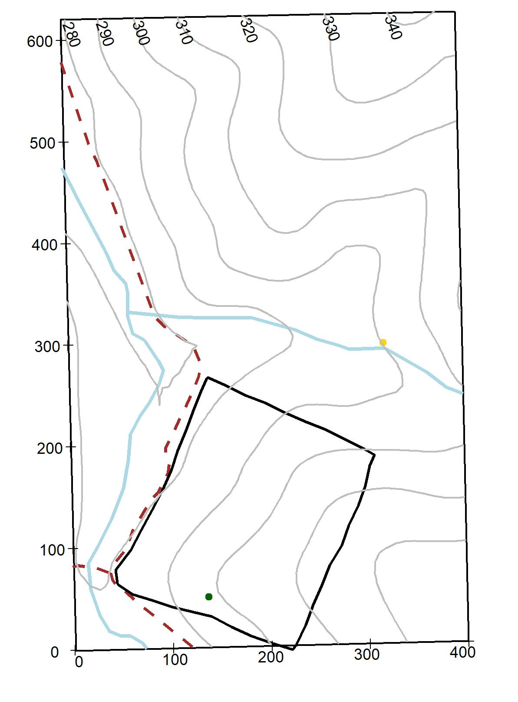{width=50%}{width=50%}
<table class="table table table-striped" style="font-size: 10px; margin-left: auto; margin-right: auto; margin-left: auto; margin-right: auto;">
 <thead>
  <tr>
   <th style="text-align:left;"> X </th>
   <th style="text-align:right;"> X2008 </th>
   <th style="text-align:right;"> X2013 </th>
   <th style="text-align:right;"> X2018 </th>
  </tr>
 </thead>
<tbody>
  <tr>
   <td style="text-align:left;"> Total Stems </td>
   <td style="text-align:right;"> 1.0 </td>
   <td style="text-align:right;"> 2.0 </td>
   <td style="text-align:right;"> 2 </td>
  </tr>
  <tr>
   <td style="text-align:left;"> New Stems (recruit rate) </td>
   <td style="text-align:right;"> NA </td>
   <td style="text-align:right;"> NA </td>
   <td style="text-align:right;"> NA </td>
  </tr>
  <tr>
   <td style="text-align:left;"> Dead Stems </td>
   <td style="text-align:right;"> 1.0 </td>
   <td style="text-align:right;"> 0.0 </td>
   <td style="text-align:right;"> 0 </td>
  </tr>
  <tr>
   <td style="text-align:left;"> Min DBH </td>
   <td style="text-align:right;"> 126.5 </td>
   <td style="text-align:right;"> 14.7 </td>
   <td style="text-align:right;"> 19 </td>
  </tr>
  <tr>
   <td style="text-align:left;"> Max DBH </td>
   <td style="text-align:right;"> 126.5 </td>
   <td style="text-align:right;"> 134.5 </td>
   <td style="text-align:right;"> 139 </td>
  </tr>
</tbody>
</table>

### *Cornus florida* L. {-#Cornus-florida}
Common name: Flowering Dogwood. Species code: cofl. Stratum: understory. Native. Conservation status: Least concern.

Large shrub or small tree up to 10 m, bark reddish brown to black, branches wide; leaves simple, alternate, 6-13 cm long, ovate or elliptic to obovate, slightly pubescent and whitish below; flowers small, in cymes, flat topped, petals white, creamy or rarely pink subtended by bracts, flowers appearing before the leaves; fruits drupes 8-18 mm, subglobose, dark to bright red, in clusters of 5-6 drupes. Common through the plot although evidence of Anthracnose fungus is evident.

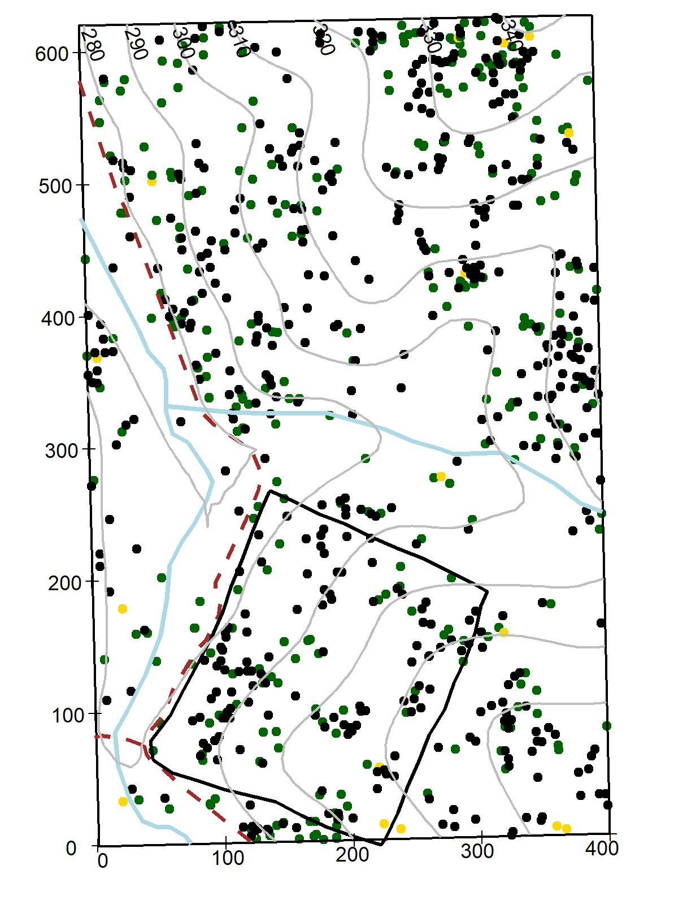{width=50%}{width=50%}
<table class="table table table-striped" style="font-size: 10px; margin-left: auto; margin-right: auto; margin-left: auto; margin-right: auto;">
 <thead>
  <tr>
   <th style="text-align:left;"> X </th>
   <th style="text-align:right;"> X2008 </th>
   <th style="text-align:right;"> X2013 </th>
   <th style="text-align:right;"> X2018 </th>
  </tr>
 </thead>
<tbody>
  <tr>
   <td style="text-align:left;"> Total Stems </td>
   <td style="text-align:right;"> 756.0 </td>
   <td style="text-align:right;"> 414.0 </td>
   <td style="text-align:right;"> 326 </td>
  </tr>
  <tr>
   <td style="text-align:left;"> New Stems (recruit rate) </td>
   <td style="text-align:right;"> NA </td>
   <td style="text-align:right;"> NA </td>
   <td style="text-align:right;"> NA </td>
  </tr>
  <tr>
   <td style="text-align:left;"> Dead Stems </td>
   <td style="text-align:right;"> 74.0 </td>
   <td style="text-align:right;"> 416.0 </td>
   <td style="text-align:right;"> 504 </td>
  </tr>
  <tr>
   <td style="text-align:left;"> Min DBH </td>
   <td style="text-align:right;"> 11.6 </td>
   <td style="text-align:right;"> 10.4 </td>
   <td style="text-align:right;"> 11 </td>
  </tr>
  <tr>
   <td style="text-align:left;"> Max DBH </td>
   <td style="text-align:right;"> 171.1 </td>
   <td style="text-align:right;"> 168.2 </td>
   <td style="text-align:right;"> 169 </td>
  </tr>
</tbody>
</table>

## Ebenaceae
### *Diospyros virginiana* L. {-#Diospyros-virginiana}
Common name: Common Persimmon, American Persimmon. Species code: divi. Stratum: sub-canopy. Native. Conservation status: Least concern.

Trees up to 10 m, bark distinctive dark grey, deeply furrowed forming semi-square blocks; leaves simple, alternate, 5-15 cm long, ovate to oblong, slightly thick; flowers usually solitary and dioecious (separate male and female trees), yellow to greenish-yellow flowers, fragrant; fruits a globose berry 2-4 cm, green and astringent while ripening then pulpy and sweet when ripe, edible. Uncommon through the plot.

{width=50%}{width=50%}
<table class="table table table-striped" style="font-size: 10px; margin-left: auto; margin-right: auto; margin-left: auto; margin-right: auto;">
 <thead>
  <tr>
   <th style="text-align:left;"> X </th>
   <th style="text-align:right;"> X2008 </th>
   <th style="text-align:right;"> X2013 </th>
   <th style="text-align:right;"> X2018 </th>
  </tr>
 </thead>
<tbody>
  <tr>
   <td style="text-align:left;"> Total Stems </td>
   <td style="text-align:right;"> 6.0 </td>
   <td style="text-align:right;"> 4.0 </td>
   <td style="text-align:right;"> 3 </td>
  </tr>
  <tr>
   <td style="text-align:left;"> New Stems (recruit rate) </td>
   <td style="text-align:right;"> NA </td>
   <td style="text-align:right;"> NA </td>
   <td style="text-align:right;"> NA </td>
  </tr>
  <tr>
   <td style="text-align:left;"> Dead Stems </td>
   <td style="text-align:right;"> 1.0 </td>
   <td style="text-align:right;"> 3.0 </td>
   <td style="text-align:right;"> 4 </td>
  </tr>
  <tr>
   <td style="text-align:left;"> Min DBH </td>
   <td style="text-align:right;"> 45.4 </td>
   <td style="text-align:right;"> 44.0 </td>
   <td style="text-align:right;"> 46 </td>
  </tr>
  <tr>
   <td style="text-align:left;"> Max DBH </td>
   <td style="text-align:right;"> 248.1 </td>
   <td style="text-align:right;"> 249.9 </td>
   <td style="text-align:right;"> 258 </td>
  </tr>
</tbody>
</table>

## Elaeagnaceae
### *Elaeagnus umbellata*	Thunb. {-#Elaeagnus-umbellata}
Common name: Autumn Olive. Species code: elum. Stratum: understory. Introduced, highly invasive. Conservation status: Least concern.

Shrubby trees up to 5 m; leaves simple, alternate, 3-8 cm long, elliptic to ovate, slightly undulate, shiny, silvery on undersides of leaves, pale green on top; flowers in clusters of 5-10, pale white to yellow and heavily fragrant; fruits a small berry 8-10 mm, bright red. Rare through the plot.

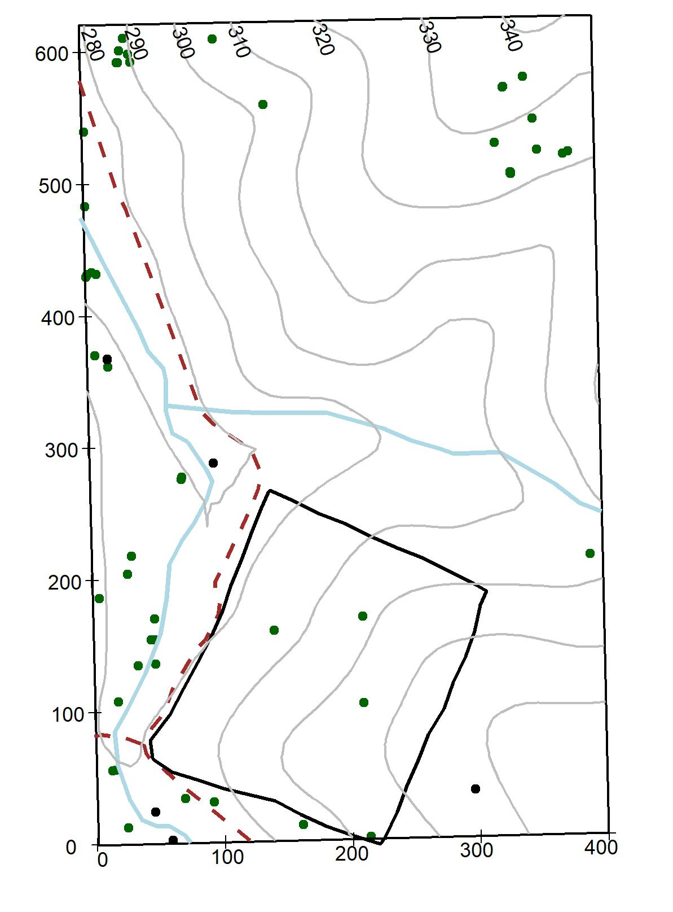{width=50%}{width=50%}
<table class="table table table-striped" style="font-size: 10px; margin-left: auto; margin-right: auto; margin-left: auto; margin-right: auto;">
 <thead>
  <tr>
   <th style="text-align:left;"> X </th>
   <th style="text-align:right;"> X2008 </th>
   <th style="text-align:right;"> X2013 </th>
   <th style="text-align:right;"> X2018 </th>
  </tr>
 </thead>
<tbody>
  <tr>
   <td style="text-align:left;"> Total Stems </td>
   <td style="text-align:right;"> 4.0 </td>
   <td style="text-align:right;"> 33.0 </td>
   <td style="text-align:right;"> 143 </td>
  </tr>
  <tr>
   <td style="text-align:left;"> New Stems (recruit rate) </td>
   <td style="text-align:right;"> NA </td>
   <td style="text-align:right;"> NA </td>
   <td style="text-align:right;"> NA </td>
  </tr>
  <tr>
   <td style="text-align:left;"> Dead Stems </td>
   <td style="text-align:right;"> 151.0 </td>
   <td style="text-align:right;"> 122.0 </td>
   <td style="text-align:right;"> 12 </td>
  </tr>
  <tr>
   <td style="text-align:left;"> Min DBH </td>
   <td style="text-align:right;"> 13.2 </td>
   <td style="text-align:right;"> 10.0 </td>
   <td style="text-align:right;"> 10 </td>
  </tr>
  <tr>
   <td style="text-align:left;"> Max DBH </td>
   <td style="text-align:right;"> 26.0 </td>
   <td style="text-align:right;"> 44.7 </td>
   <td style="text-align:right;"> 84 </td>
  </tr>
</tbody>
</table>

## Fabaceae
### *Cercis canadensis* L. {-#Cercis-canadensis}
Common name: Eastern Redbud. Species code: ceca. Stratum: understory. Native. Conservation status: Least concern.

Small trees up to 12 m, stem widely branched, bark with shallow grooves, twigs reddish-brown; leaves simple, alternate, 6-11 cm long, broad with heart shape base, pubescent below; flowers in clusters, growing on trunk, flowers 10-12 mm, reddish or pink; fruits a small legume (5-8 cm), conspicuously veined, flatten when dry. Common through the plot.

{width=50%}{width=50%}
<table class="table table table-striped" style="font-size: 10px; margin-left: auto; margin-right: auto; margin-left: auto; margin-right: auto;">
 <thead>
  <tr>
   <th style="text-align:left;"> X </th>
   <th style="text-align:right;"> X2008 </th>
   <th style="text-align:right;"> X2013 </th>
   <th style="text-align:right;"> X2018 </th>
  </tr>
 </thead>
<tbody>
  <tr>
   <td style="text-align:left;"> Total Stems </td>
   <td style="text-align:right;"> 920.0 </td>
   <td style="text-align:right;"> 844 </td>
   <td style="text-align:right;"> 794 </td>
  </tr>
  <tr>
   <td style="text-align:left;"> New Stems (recruit rate) </td>
   <td style="text-align:right;"> NA </td>
   <td style="text-align:right;"> NA </td>
   <td style="text-align:right;"> NA </td>
  </tr>
  <tr>
   <td style="text-align:left;"> Dead Stems </td>
   <td style="text-align:right;"> 434.0 </td>
   <td style="text-align:right;"> 510 </td>
   <td style="text-align:right;"> 560 </td>
  </tr>
  <tr>
   <td style="text-align:left;"> Min DBH </td>
   <td style="text-align:right;"> 10.0 </td>
   <td style="text-align:right;"> 10 </td>
   <td style="text-align:right;"> 10 </td>
  </tr>
  <tr>
   <td style="text-align:left;"> Max DBH </td>
   <td style="text-align:right;"> 214.7 </td>
   <td style="text-align:right;"> 230 </td>
   <td style="text-align:right;"> 255 </td>
  </tr>
</tbody>
</table>

### *Robinia pseudoacacia* L. {-#Robinia-pseudoacacia}
Common name: Black Locust. Species code: rops. Stratum: canopy. Native. Conservation status: Least concern.

Trees up to 30 m, trunk deeply furrowed, bark coarse, branches and twigs sometimes pubescent, thorns on stems and twigs, rugged bark; leaves compound, alternate, 15-30 cm long, leaflet elliptic to oblong, 1.5-6 cm long, with or without minute hair; flowers on drooping racemes with 3-20 flowers of 8-10 mm, white with yellow patches, fragrant; fruits a legume, flat purple-brown seed pods (to 13-15 cm long). Common through the plot.

{width=50%}{width=50%}
<table class="table table table-striped" style="font-size: 10px; margin-left: auto; margin-right: auto; margin-left: auto; margin-right: auto;">
 <thead>
  <tr>
   <th style="text-align:left;"> X </th>
   <th style="text-align:right;"> X2008 </th>
   <th style="text-align:right;"> X2013 </th>
   <th style="text-align:right;"> X2018 </th>
  </tr>
 </thead>
<tbody>
  <tr>
   <td style="text-align:left;"> Total Stems </td>
   <td style="text-align:right;"> 36.0 </td>
   <td style="text-align:right;"> 8.0 </td>
   <td style="text-align:right;"> 12 </td>
  </tr>
  <tr>
   <td style="text-align:left;"> New Stems (recruit rate) </td>
   <td style="text-align:right;"> NA </td>
   <td style="text-align:right;"> NA </td>
   <td style="text-align:right;"> NA </td>
  </tr>
  <tr>
   <td style="text-align:left;"> Dead Stems </td>
   <td style="text-align:right;"> 30.0 </td>
   <td style="text-align:right;"> 58.0 </td>
   <td style="text-align:right;"> 54 </td>
  </tr>
  <tr>
   <td style="text-align:left;"> Min DBH </td>
   <td style="text-align:right;"> 11.1 </td>
   <td style="text-align:right;"> 16.4 </td>
   <td style="text-align:right;"> 10 </td>
  </tr>
  <tr>
   <td style="text-align:left;"> Max DBH </td>
   <td style="text-align:right;"> 536.8 </td>
   <td style="text-align:right;"> 460.2 </td>
   <td style="text-align:right;"> 460 </td>
  </tr>
</tbody>
</table>

## Fagaceae
### *Castanea dentata* (Marsh.) Borkh. {-#Castanea-dentata}
Common name: American Chestnut. Species code: cade. Stratum: canopy and sub-canopy. Native. Conservation status: Critically endangered.

Trees up to 30 m, bark dark, mostly smooth, shallowly fissured into broad in flat ridges in mature individuals, twigs chestnut brown, puberulent or glabrous; leaves simple, alternate, 10-30 cm long, elliptic to oblanceolate, coarsely serrate with forward pointing incurved teeth, glabrate to glabrous; inflorescences unisexual, flowers many, very small, pale green to cream colored, male flowers found tightly occurring along 10-15 cm catkins; females found near base of catkins (near twig); fruits a spiny covered husk splitting into 4-sections enclosing 2-5 nuts; nuts 18-25 mm diameter. Rare through the plot.

{width=50%}{width=50%}
<table class="table table table-striped" style="font-size: 10px; margin-left: auto; margin-right: auto; margin-left: auto; margin-right: auto;">
 <thead>
  <tr>
   <th style="text-align:left;"> X </th>
   <th style="text-align:right;"> X2008 </th>
   <th style="text-align:right;"> X2013 </th>
   <th style="text-align:right;"> X2018 </th>
  </tr>
 </thead>
<tbody>
  <tr>
   <td style="text-align:left;"> Total Stems </td>
   <td style="text-align:right;"> 11.0 </td>
   <td style="text-align:right;"> 6.0 </td>
   <td style="text-align:right;"> 8 </td>
  </tr>
  <tr>
   <td style="text-align:left;"> New Stems (recruit rate) </td>
   <td style="text-align:right;"> NA </td>
   <td style="text-align:right;"> NA </td>
   <td style="text-align:right;"> NA </td>
  </tr>
  <tr>
   <td style="text-align:left;"> Dead Stems </td>
   <td style="text-align:right;"> 4.0 </td>
   <td style="text-align:right;"> 9.0 </td>
   <td style="text-align:right;"> 7 </td>
  </tr>
  <tr>
   <td style="text-align:left;"> Min DBH </td>
   <td style="text-align:right;"> 11.6 </td>
   <td style="text-align:right;"> 18.2 </td>
   <td style="text-align:right;"> 11 </td>
  </tr>
  <tr>
   <td style="text-align:left;"> Max DBH </td>
   <td style="text-align:right;"> 122.0 </td>
   <td style="text-align:right;"> 137.5 </td>
   <td style="text-align:right;"> 150 </td>
  </tr>
</tbody>
</table>

### *Fagus grandifolia*	Ehrh. {-#Fagus-grandifolia}
Common name: American Beech. Species code: fagr. Stratum: from understory to canopy. Native. Conservation status: Least concern.

Large trees up to 33 m, bark gray and smooth, twigs slender and glabrous, in zigzag with buds slender and sharply pointy (notable in the winter); leaves simple, alternate, 5-15 cm long, elliptic to ovate, sharply serrate, mostly glabrous; light brown leaves persistent through winter; inflorescences unisexual, flowers many, very small, yellow-cream colored, male flowers occurring along 5-10 cm catkins; female flowers found near base of catkins; fruits a spiny covered husk splitting into 3-sections 1-10 mm, enclosing 1 nut; nuts sharp with 3 angles. Abundant through the plot.

{width=50%}{width=50%}
<table class="table table table-striped" style="font-size: 10px; margin-left: auto; margin-right: auto; margin-left: auto; margin-right: auto;">
 <thead>
  <tr>
   <th style="text-align:left;"> X </th>
   <th style="text-align:right;"> X2008 </th>
   <th style="text-align:right;"> X2013 </th>
   <th style="text-align:right;"> X2018 </th>
  </tr>
 </thead>
<tbody>
  <tr>
   <td style="text-align:left;"> Total Stems </td>
   <td style="text-align:right;"> 563.0 </td>
   <td style="text-align:right;"> 590.0 </td>
   <td style="text-align:right;"> 640 </td>
  </tr>
  <tr>
   <td style="text-align:left;"> New Stems (recruit rate) </td>
   <td style="text-align:right;"> NA </td>
   <td style="text-align:right;"> NA </td>
   <td style="text-align:right;"> NA </td>
  </tr>
  <tr>
   <td style="text-align:left;"> Dead Stems </td>
   <td style="text-align:right;"> 112.0 </td>
   <td style="text-align:right;"> 85.0 </td>
   <td style="text-align:right;"> 35 </td>
  </tr>
  <tr>
   <td style="text-align:left;"> Min DBH </td>
   <td style="text-align:right;"> 10.3 </td>
   <td style="text-align:right;"> 10.0 </td>
   <td style="text-align:right;"> 10 </td>
  </tr>
  <tr>
   <td style="text-align:left;"> Max DBH </td>
   <td style="text-align:right;"> 1030.4 </td>
   <td style="text-align:right;"> 1046.8 </td>
   <td style="text-align:right;"> 1072 </td>
  </tr>
</tbody>
</table>

### *Quercus alba* L. {-#Quercus-alba}
Common name: White Oak. Species code: qual. Stratum: canopy. Native. Conservation status: Least concern.

Trees up to 38 m, bark light gray, flaky, with ridges or sometimes checked, twigs glabrous, red-brown; leaves simple, alternate, 5-25 cm long, oblong to obovate, with 7-10 rounded finger-like lobes, sinus depth varies from deep to shallow, margin smooth, glabrous above, pale to slightly white below; inflorescences unisexual, flowers many, male flowers yellow-green, occurring in slender catkins 5-10 cm; females flowers reddish-green and appear as very small single spikes; fruits an ovoid to oblong acorn 1.5-3 cm, cups bowl-shaped covering ¼ of the fruit, cup detach at maturity. Common through the plot.

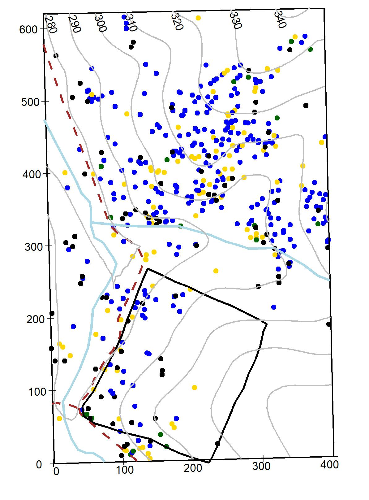{width=50%}{width=50%}
<table class="table table table-striped" style="font-size: 10px; margin-left: auto; margin-right: auto; margin-left: auto; margin-right: auto;">
 <thead>
  <tr>
   <th style="text-align:left;"> X </th>
   <th style="text-align:right;"> X2008 </th>
   <th style="text-align:right;"> X2013 </th>
   <th style="text-align:right;"> X2018 </th>
  </tr>
 </thead>
<tbody>
  <tr>
   <td style="text-align:left;"> Total Stems </td>
   <td style="text-align:right;"> 453.0 </td>
   <td style="text-align:right;"> 421.0 </td>
   <td style="text-align:right;"> 390 </td>
  </tr>
  <tr>
   <td style="text-align:left;"> New Stems (recruit rate) </td>
   <td style="text-align:right;"> NA </td>
   <td style="text-align:right;"> NA </td>
   <td style="text-align:right;"> NA </td>
  </tr>
  <tr>
   <td style="text-align:left;"> Dead Stems </td>
   <td style="text-align:right;"> 26.0 </td>
   <td style="text-align:right;"> 58.0 </td>
   <td style="text-align:right;"> 89 </td>
  </tr>
  <tr>
   <td style="text-align:left;"> Min DBH </td>
   <td style="text-align:right;"> 11.2 </td>
   <td style="text-align:right;"> 10.5 </td>
   <td style="text-align:right;"> 12 </td>
  </tr>
  <tr>
   <td style="text-align:left;"> Max DBH </td>
   <td style="text-align:right;"> 1017.5 </td>
   <td style="text-align:right;"> 1031.9 </td>
   <td style="text-align:right;"> 1056 </td>
  </tr>
</tbody>
</table>

### *Quercus coccinea* Muenchh. {-#Quercus-coccinea}
Common name: Scarlet Oak. Species code: quco. Stratum: canopy. Native. Conservation status: Least concern.

Trees up to 35 m, bark gray, with slightly paler ridges, inner bark reddish-brown, twigs glabrous; leaves simple, alternate, 7-20 cm long, ovate to obovate with 2-3 pairs of deeply cut lobes, margin smooth but with bristled tips, glabrous and shiny above with clusters of hair in vein axes below, bright red in the fall; inflorescences unisexual, flowers many, male flowers yellow-green, occurring in slender catkins 5-10 cm; females flowers reddish-green and appear as very small single spikes; fruits an ovoid acorn 1.3-2.7 cm, cups bowl-shaped covering ½ of the nut, scales tightly appressed, shiny. Very rare through the plot.

{width=50%}{width=50%}
<table class="table table table-striped" style="font-size: 10px; margin-left: auto; margin-right: auto; margin-left: auto; margin-right: auto;">
 <thead>
  <tr>
   <th style="text-align:left;"> X </th>
   <th style="text-align:right;"> X2008 </th>
   <th style="text-align:right;"> X2013 </th>
   <th style="text-align:right;"> X2018 </th>
  </tr>
 </thead>
<tbody>
  <tr>
   <td style="text-align:left;"> Total Stems </td>
   <td style="text-align:right;"> 2.0 </td>
   <td style="text-align:right;"> 1.0 </td>
   <td style="text-align:right;"> 1 </td>
  </tr>
  <tr>
   <td style="text-align:left;"> New Stems (recruit rate) </td>
   <td style="text-align:right;"> NA </td>
   <td style="text-align:right;"> NA </td>
   <td style="text-align:right;"> NA </td>
  </tr>
  <tr>
   <td style="text-align:left;"> Dead Stems </td>
   <td style="text-align:right;"> 0.0 </td>
   <td style="text-align:right;"> 1.0 </td>
   <td style="text-align:right;"> 1 </td>
  </tr>
  <tr>
   <td style="text-align:left;"> Min DBH </td>
   <td style="text-align:right;"> 583.0 </td>
   <td style="text-align:right;"> 644.7 </td>
   <td style="text-align:right;"> 665 </td>
  </tr>
  <tr>
   <td style="text-align:left;"> Max DBH </td>
   <td style="text-align:right;"> 624.3 </td>
   <td style="text-align:right;"> 644.7 </td>
   <td style="text-align:right;"> 665 </td>
  </tr>
</tbody>
</table>

### *Quercus falcata* Michx. {-#Quercus-falcata}
Common name: Southern Red Oak, Spanish Oak. Species code: qufa. Stratum: canopy. Native. Conservation status: Least concern.

Trees up to 35 m, bark very dark, shallowly furrowed, inner bark pale yellow, twigs pubescent; leaves simple, alternate, 8-20 cm long, ovate to obovate with a bell-shaped at the base with 1-3 pair of lobes, the primary-central lobes long and narrow, margin smooth but with bristled tips, shiny above and paler and fuzzy below; inflorescences unisexual, flowers many, male flowers yellow-green, occurring in catkins 5-10 cm; females flowers reddish born on short spikes; fruits a subglobose to ovoid acorn 1-1.5 cm, pubescent, cups thin and saucer-shaped covering ½ of the nut, with orange-brown scales tightly appressed. Very rare through the plot.

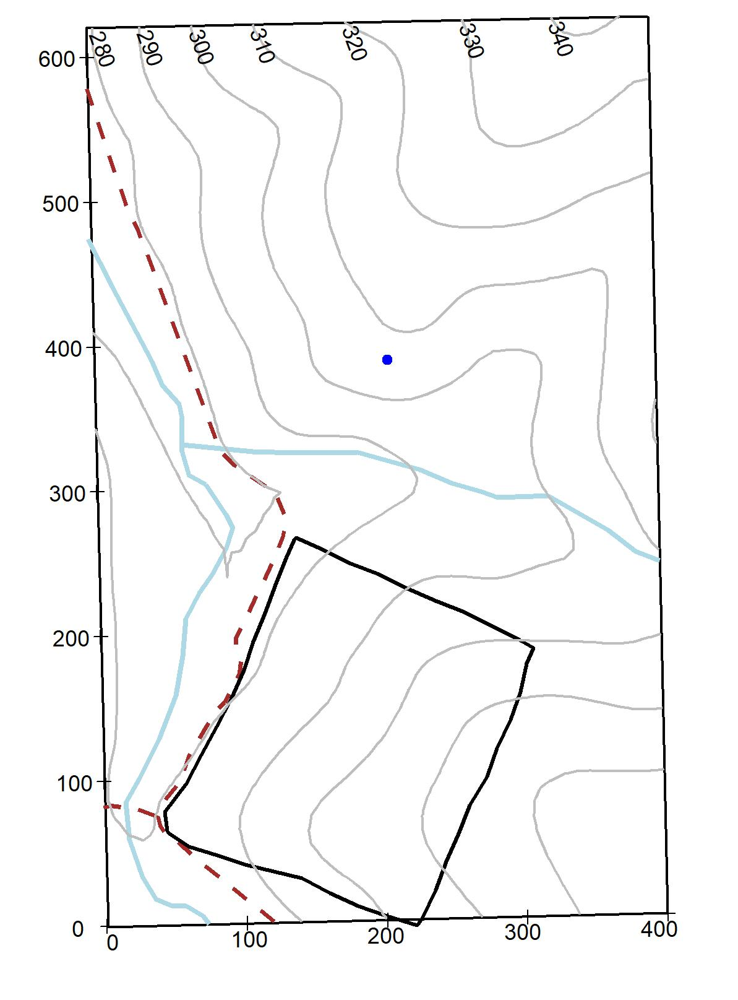{width=50%}{width=50%}
<table class="table table table-striped" style="font-size: 10px; margin-left: auto; margin-right: auto; margin-left: auto; margin-right: auto;">
 <thead>
  <tr>
   <th style="text-align:left;"> X </th>
   <th style="text-align:right;"> X2008 </th>
   <th style="text-align:right;"> X2013 </th>
   <th style="text-align:right;"> X2018 </th>
  </tr>
 </thead>
<tbody>
  <tr>
   <td style="text-align:left;"> Total Stems </td>
   <td style="text-align:right;"> 1 </td>
   <td style="text-align:right;"> 1.0 </td>
   <td style="text-align:right;"> 1 </td>
  </tr>
  <tr>
   <td style="text-align:left;"> New Stems (recruit rate) </td>
   <td style="text-align:right;"> NA </td>
   <td style="text-align:right;"> NA </td>
   <td style="text-align:right;"> NA </td>
  </tr>
  <tr>
   <td style="text-align:left;"> Dead Stems </td>
   <td style="text-align:right;"> 0 </td>
   <td style="text-align:right;"> 0.0 </td>
   <td style="text-align:right;"> 0 </td>
  </tr>
  <tr>
   <td style="text-align:left;"> Min DBH </td>
   <td style="text-align:right;"> 709 </td>
   <td style="text-align:right;"> 735.2 </td>
   <td style="text-align:right;"> 772 </td>
  </tr>
  <tr>
   <td style="text-align:left;"> Max DBH </td>
   <td style="text-align:right;"> 709 </td>
   <td style="text-align:right;"> 735.2 </td>
   <td style="text-align:right;"> 772 </td>
  </tr>
</tbody>
</table>

### *Quercus michauxii* Nutt. {-#Quercus-michauxii}
Common name: Swamp Chestnut Oak, Basket Oak. Species code: qufa. Stratum: canopy. Native. Conservation status: Least concern.

Trees up to 40 m, bark pale gray, flaky or with ridges; leaves simple, alternate, 6-18 cm long, oval to obovate, margin with large round blunt ascending teeth, lamina dark green and shiny above and pubescent below; inflorescences unisexual, male flowers yellow-green, occurring in catkins 5-10 cm; females flowers green to reddish, very small in leaf axils; fruits an ovoid acorn 2.5-3.5 cm, cups bowl-shaped covering ½ of the nut, cups rough scaly. Rare through the plot.

{width=50%}{width=50%}
<table class="table table table-striped" style="font-size: 10px; margin-left: auto; margin-right: auto; margin-left: auto; margin-right: auto;">
 <thead>
  <tr>
   <th style="text-align:left;"> X </th>
   <th style="text-align:right;"> X2008 </th>
   <th style="text-align:right;"> X2013 </th>
   <th style="text-align:right;"> X2018 </th>
  </tr>
 </thead>
<tbody>
  <tr>
   <td style="text-align:left;"> Total Stems </td>
   <td style="text-align:right;"> 4.0 </td>
   <td style="text-align:right;"> 4.0 </td>
   <td style="text-align:right;"> 2 </td>
  </tr>
  <tr>
   <td style="text-align:left;"> New Stems (recruit rate) </td>
   <td style="text-align:right;"> NA </td>
   <td style="text-align:right;"> NA </td>
   <td style="text-align:right;"> NA </td>
  </tr>
  <tr>
   <td style="text-align:left;"> Dead Stems </td>
   <td style="text-align:right;"> 0.0 </td>
   <td style="text-align:right;"> 0.0 </td>
   <td style="text-align:right;"> 2 </td>
  </tr>
  <tr>
   <td style="text-align:left;"> Min DBH </td>
   <td style="text-align:right;"> 155.2 </td>
   <td style="text-align:right;"> 165.3 </td>
   <td style="text-align:right;"> 174 </td>
  </tr>
  <tr>
   <td style="text-align:left;"> Max DBH </td>
   <td style="text-align:right;"> 564.8 </td>
   <td style="text-align:right;"> 567.8 </td>
   <td style="text-align:right;"> 580 </td>
  </tr>
</tbody>
</table>

### *Quercus montana* Willd. {-#Quercus-montana}
Common name: Chestnut Oak, Rock Chestnut Oak. Species code: qupr. Stratum: canopy. Native. Conservation status: Least concern.

Trees up to 35 m, bark dark, thick, tight and deeply furrowed, twigs hairless; leaves simple, alternate, 10-30 cm long, obovate to oblong or elliptic, margin crenate, shiny green above and fine pubescent and paler below; inflorescences unisexual, male flowers yellow-green, occurring in catkins 5-10 cm; females flowers reddish born on short spikes; fruits an ovoid acorn 2.5-4 cm, cups thin and funnel-shaped covering ½ of the nut. Common through the plot.

{width=50%}{width=50%}
<table class="table table table-striped" style="font-size: 10px; margin-left: auto; margin-right: auto; margin-left: auto; margin-right: auto;">
 <thead>
  <tr>
   <th style="text-align:left;"> X </th>
   <th style="text-align:right;"> X2008 </th>
   <th style="text-align:right;"> X2013 </th>
   <th style="text-align:right;"> X2018 </th>
  </tr>
 </thead>
<tbody>
  <tr>
   <td style="text-align:left;"> Total Stems </td>
   <td style="text-align:right;"> 318.0 </td>
   <td style="text-align:right;"> 287.0 </td>
   <td style="text-align:right;"> 259 </td>
  </tr>
  <tr>
   <td style="text-align:left;"> New Stems (recruit rate) </td>
   <td style="text-align:right;"> NA </td>
   <td style="text-align:right;"> NA </td>
   <td style="text-align:right;"> NA </td>
  </tr>
  <tr>
   <td style="text-align:left;"> Dead Stems </td>
   <td style="text-align:right;"> 47.0 </td>
   <td style="text-align:right;"> 78.0 </td>
   <td style="text-align:right;"> 106 </td>
  </tr>
  <tr>
   <td style="text-align:left;"> Min DBH </td>
   <td style="text-align:right;"> 10.6 </td>
   <td style="text-align:right;"> 10.1 </td>
   <td style="text-align:right;"> 11 </td>
  </tr>
  <tr>
   <td style="text-align:left;"> Max DBH </td>
   <td style="text-align:right;"> 991.2 </td>
   <td style="text-align:right;"> 993.4 </td>
   <td style="text-align:right;"> 1009 </td>
  </tr>
</tbody>
</table>

### *Quercus rubra*	L. {-#Quercus-rubra}
Common name: Northern Red Oak. Species code: quru. Stratum: canopy to subcanopy. Native. Conservation status: Least concern.

Trees up to 40 m, bark smooth in young stems then broken into light gray, flat ridges separated by darker, broad and shallow furrows when maturing, inner bark reddish, twigs hairless and reddish brown; leaves simple, alternate, 10-24 cm long, widely obovate, with 3-5 pair of bristle-tipped lobes, sinuses extending 1/3 to 1/2 of the way to midvein; margin smooth, lamina dull green to blue-green and hairless above, often with small turf of hairs in the vein axils below; inflorescences unisexual, flowers many, male flowers yellow-green, borne in catkins 5-10 cm; females flowers born on short spikes; fruits an ovoid to ellipsoid acorn 2-3 cm, cups saucer-shaped covering 1/4 of the nut. Common and dominant through the plot.

{width=50%}{width=50%}
<table class="table table table-striped" style="font-size: 10px; margin-left: auto; margin-right: auto; margin-left: auto; margin-right: auto;">
 <thead>
  <tr>
   <th style="text-align:left;"> X </th>
   <th style="text-align:right;"> X2008 </th>
   <th style="text-align:right;"> X2013 </th>
   <th style="text-align:right;"> X2018 </th>
  </tr>
 </thead>
<tbody>
  <tr>
   <td style="text-align:left;"> Total Stems </td>
   <td style="text-align:right;"> 479.0 </td>
   <td style="text-align:right;"> 416 </td>
   <td style="text-align:right;"> 389 </td>
  </tr>
  <tr>
   <td style="text-align:left;"> New Stems (recruit rate) </td>
   <td style="text-align:right;"> NA </td>
   <td style="text-align:right;"> NA </td>
   <td style="text-align:right;"> NA </td>
  </tr>
  <tr>
   <td style="text-align:left;"> Dead Stems </td>
   <td style="text-align:right;"> 34.0 </td>
   <td style="text-align:right;"> 97 </td>
   <td style="text-align:right;"> 124 </td>
  </tr>
  <tr>
   <td style="text-align:left;"> Min DBH </td>
   <td style="text-align:right;"> 10.4 </td>
   <td style="text-align:right;"> 10 </td>
   <td style="text-align:right;"> 10 </td>
  </tr>
  <tr>
   <td style="text-align:left;"> Max DBH </td>
   <td style="text-align:right;"> 1432.1 </td>
   <td style="text-align:right;"> 1483 </td>
   <td style="text-align:right;"> 1533 </td>
  </tr>
</tbody>
</table>

### *Quercus velutina* Lam. {-#Quercus-velutina}
Common name: Black Oak. Species code: quve. Stratum: canopy. Native. Conservation status: Least concern.

Trees up to 35 m, bark very dark, rough and scaly, with low ridges, inner bark orange-yellow, twigs hairless; leaves simple, alternate, 10-25 cm long, ovate-oblong to obovate, with 2-3 pair of lobes, with sinuses from shallow to deep, lamina thick, dull green slightly pubescent above, star-shape pubescence below; inflorescences unisexual, flowers many, male flowers yellow-green, borne in catkins 5-10 cm; females flowers born on short spikes; fruits an ovoid acorn 1-2.5 cm, cups bowl shaped, covering ½ of the nut, scales pubescent. Common through the plot.

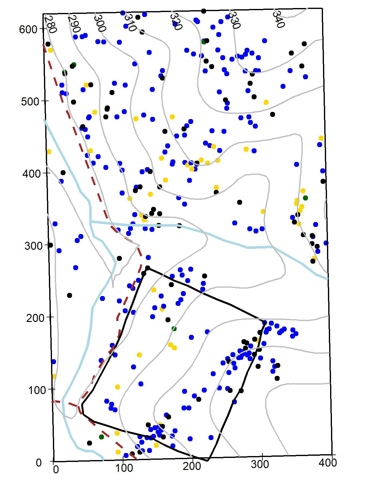{width=50%}{width=50%}
<table class="table table table-striped" style="font-size: 10px; margin-left: auto; margin-right: auto; margin-left: auto; margin-right: auto;">
 <thead>
  <tr>
   <th style="text-align:left;"> X </th>
   <th style="text-align:right;"> X2008 </th>
   <th style="text-align:right;"> X2013 </th>
   <th style="text-align:right;"> X2018 </th>
  </tr>
 </thead>
<tbody>
  <tr>
   <td style="text-align:left;"> Total Stems </td>
   <td style="text-align:right;"> 336.0 </td>
   <td style="text-align:right;"> 295.0 </td>
   <td style="text-align:right;"> 262 </td>
  </tr>
  <tr>
   <td style="text-align:left;"> New Stems (recruit rate) </td>
   <td style="text-align:right;"> NA </td>
   <td style="text-align:right;"> NA </td>
   <td style="text-align:right;"> NA </td>
  </tr>
  <tr>
   <td style="text-align:left;"> Dead Stems </td>
   <td style="text-align:right;"> 20.0 </td>
   <td style="text-align:right;"> 61.0 </td>
   <td style="text-align:right;"> 94 </td>
  </tr>
  <tr>
   <td style="text-align:left;"> Min DBH </td>
   <td style="text-align:right;"> 23.0 </td>
   <td style="text-align:right;"> 15.4 </td>
   <td style="text-align:right;"> 15 </td>
  </tr>
  <tr>
   <td style="text-align:left;"> Max DBH </td>
   <td style="text-align:right;"> 1511.4 </td>
   <td style="text-align:right;"> 1520.0 </td>
   <td style="text-align:right;"> 1534 </td>
  </tr>
</tbody>
</table>

## Hamamelidaceae
### *Hamamelis virginiana* L. var. virginiana {-#Hamamelis-virginiana}
Common name: Witch Hazel. Species code: havi. Stratum: canopy. Native. Conservation status: Least concern.

Shrub or small trees, 5-8 m tall, bark smooth, gray to gray-brown, twigs hairless or fine pubescent; leaves simple, alternate, 7-15 cm long, broadly ovate to obovate, inequilateral, coarsely lobed to toothed, lamina densely pubescent when young, hairless when mature, paler below; inflorescences in cluster of 3 flowers, pale yellow and very slender petals; fruits a capsule 1-1.5 cm, oblong to ovoid, densely pubescent. Common through the plot.

{width=50%}{width=50%}
<table class="table table table-striped" style="font-size: 10px; margin-left: auto; margin-right: auto; margin-left: auto; margin-right: auto;">
 <thead>
  <tr>
   <th style="text-align:left;"> X </th>
   <th style="text-align:right;"> X2008 </th>
   <th style="text-align:right;"> X2013 </th>
   <th style="text-align:right;"> X2018 </th>
  </tr>
 </thead>
<tbody>
  <tr>
   <td style="text-align:left;"> Total Stems </td>
   <td style="text-align:right;"> 1406.0 </td>
   <td style="text-align:right;"> 1369.0 </td>
   <td style="text-align:right;"> 1449 </td>
  </tr>
  <tr>
   <td style="text-align:left;"> New Stems (recruit rate) </td>
   <td style="text-align:right;"> NA </td>
   <td style="text-align:right;"> NA </td>
   <td style="text-align:right;"> NA </td>
  </tr>
  <tr>
   <td style="text-align:left;"> Dead Stems </td>
   <td style="text-align:right;"> 633.0 </td>
   <td style="text-align:right;"> 670.0 </td>
   <td style="text-align:right;"> 590 </td>
  </tr>
  <tr>
   <td style="text-align:left;"> Min DBH </td>
   <td style="text-align:right;"> 10.0 </td>
   <td style="text-align:right;"> 10.0 </td>
   <td style="text-align:right;"> 10 </td>
  </tr>
  <tr>
   <td style="text-align:left;"> Max DBH </td>
   <td style="text-align:right;"> 126.7 </td>
   <td style="text-align:right;"> 124.3 </td>
   <td style="text-align:right;"> 131 </td>
  </tr>
</tbody>
</table>

## Juglandaceae
### *Carya cordiformis* (Wangenh.) K. Koch {-#Carya-cordiformis}
Common name: Bitternut Hickory. Species code: caco. Stratum: canopy. Native. Conservation status: Least concern.

Trees up to 40 m, bark tight, shallowly ridged when mature, twigs slender with a bright sulfur-yellow terminal bud; leaves compound, alternate, 17-25 cm long, leaflets 7-11, lanceolate, margin serrate, dark green above, paler and pubescent beneath; inflorescences unisexual, male flowers yellow-green in drooping catkins with 3 hanging from one stalk, 7-10 cm long; female flowers short and solitary; fruits a subglobose to ovoid nut 2-3.5 cm, slightly flattened, splitting incomplete from the middle to the sharp-pointed tip; husk 4-winged above the middle, often dusty-yellow looking. Common through the plot.

{width=50%}{width=50%}
<table class="table table table-striped" style="font-size: 10px; margin-left: auto; margin-right: auto; margin-left: auto; margin-right: auto;">
 <thead>
  <tr>
   <th style="text-align:left;"> X </th>
   <th style="text-align:right;"> X2008 </th>
   <th style="text-align:right;"> X2013 </th>
   <th style="text-align:right;"> X2018 </th>
  </tr>
 </thead>
<tbody>
  <tr>
   <td style="text-align:left;"> Total Stems </td>
   <td style="text-align:right;"> 462.0 </td>
   <td style="text-align:right;"> 466.0 </td>
   <td style="text-align:right;"> 451 </td>
  </tr>
  <tr>
   <td style="text-align:left;"> New Stems (recruit rate) </td>
   <td style="text-align:right;"> NA </td>
   <td style="text-align:right;"> NA </td>
   <td style="text-align:right;"> NA </td>
  </tr>
  <tr>
   <td style="text-align:left;"> Dead Stems </td>
   <td style="text-align:right;"> 64.0 </td>
   <td style="text-align:right;"> 60.0 </td>
   <td style="text-align:right;"> 75 </td>
  </tr>
  <tr>
   <td style="text-align:left;"> Min DBH </td>
   <td style="text-align:right;"> 10.0 </td>
   <td style="text-align:right;"> 10.1 </td>
   <td style="text-align:right;"> 10 </td>
  </tr>
  <tr>
   <td style="text-align:left;"> Max DBH </td>
   <td style="text-align:right;"> 681.7 </td>
   <td style="text-align:right;"> 698.3 </td>
   <td style="text-align:right;"> 739 </td>
  </tr>
</tbody>
</table>

### *Carya glabra* (P. Mill.) {-#Carya-glabra}
Common name: Pignut Hickory. Species code: cagl. Stratum: canopy. Native. Conservation status: Least concern.

Trees up to 45 m, bark tight, deeply furrowed at maturity, twigs slender; leaves compound, alternate, 20-30 cm long, leaflets 5 but sometimes 3-7, lanceolate and serrate margin, dark green above, paler and pubescent beneath; inflorescences unisexual, male flowers yellow-green in drooping catkins with 3 hanging from one stalk, 7-10 cm long; female flowers short and solitary, found in clusters at the end of branches; fruits a nut, pear-shaped to ellipsoid 2-4 cm, slightly flattened, husk thick usually splitting incomplete from the middle towards the base;. Very common through the plot.

{width=50%}{width=50%}
<table class="table table table-striped" style="font-size: 10px; margin-left: auto; margin-right: auto; margin-left: auto; margin-right: auto;">
 <thead>
  <tr>
   <th style="text-align:left;"> X </th>
   <th style="text-align:right;"> X2008 </th>
   <th style="text-align:right;"> X2013 </th>
   <th style="text-align:right;"> X2018 </th>
  </tr>
 </thead>
<tbody>
  <tr>
   <td style="text-align:left;"> Total Stems </td>
   <td style="text-align:right;"> 1850.0 </td>
   <td style="text-align:right;"> 1772.0 </td>
   <td style="text-align:right;"> 1679 </td>
  </tr>
  <tr>
   <td style="text-align:left;"> New Stems (recruit rate) </td>
   <td style="text-align:right;"> NA </td>
   <td style="text-align:right;"> NA </td>
   <td style="text-align:right;"> NA </td>
  </tr>
  <tr>
   <td style="text-align:left;"> Dead Stems </td>
   <td style="text-align:right;"> 82.0 </td>
   <td style="text-align:right;"> 160.0 </td>
   <td style="text-align:right;"> 253 </td>
  </tr>
  <tr>
   <td style="text-align:left;"> Min DBH </td>
   <td style="text-align:right;"> 10.0 </td>
   <td style="text-align:right;"> 10.0 </td>
   <td style="text-align:right;"> 10 </td>
  </tr>
  <tr>
   <td style="text-align:left;"> Max DBH </td>
   <td style="text-align:right;"> 779.5 </td>
   <td style="text-align:right;"> 793.5 </td>
   <td style="text-align:right;"> 805 </td>
  </tr>
</tbody>
</table>

### *Carya ovalis* (Wangenh.) Sarg. {-#Carya-ovalis}
Common name: Red Hickory, Sweet Pignut Hickory. Species code: caovl. Stratum: canopy. Native. Conservation status: Least concern.

Trees up to 40 m, bark Initially smooth then deeply furrowed when mature, sometimes scaly at bottom or top, twigs slender; leaves compound, alternate, 20-30 cm long, leaflets mostly 7 (sometimes 5), lanceolate and serrate margin, dark green above, with scattered hair confine to veins beneath; inflorescences unisexual, male flowers yellow-green in drooping catkins with 3 hanging from one stalk, 7-10 cm long; female flowers short found in clusters at the end of branches; fruits an ellipsoid nut 2-4.5 cm in diameter, sutures sometimes winged, husk splitting almost complete from top to base. Common through the plot.

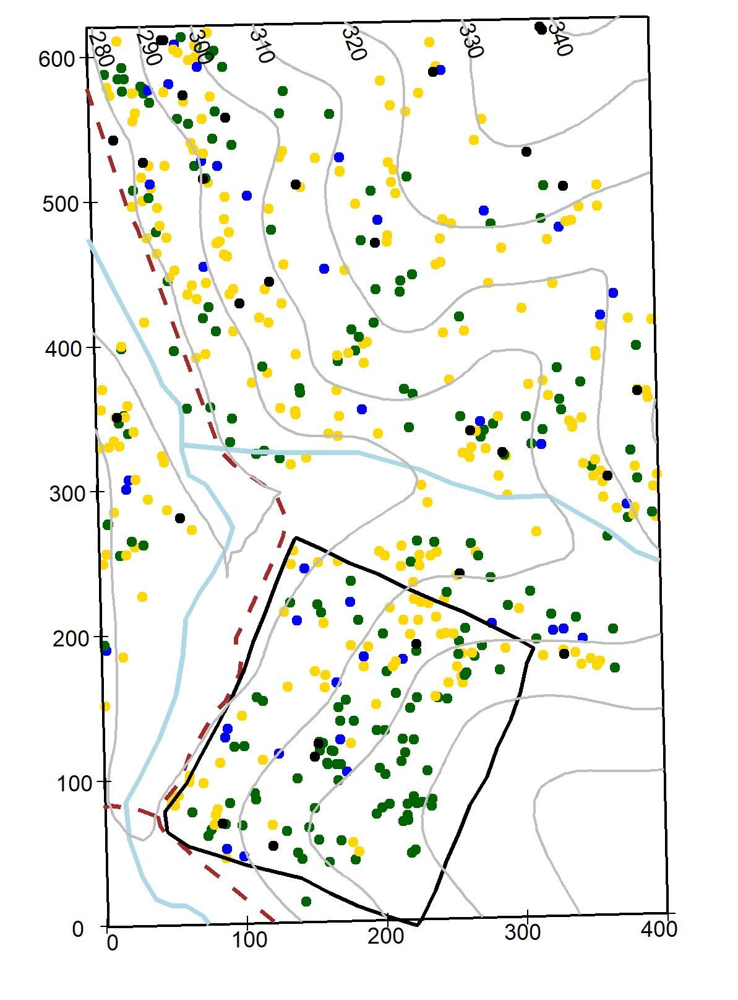{width=50%}{width=50%}
<table class="table table table-striped" style="font-size: 10px; margin-left: auto; margin-right: auto; margin-left: auto; margin-right: auto;">
 <thead>
  <tr>
   <th style="text-align:left;"> X </th>
   <th style="text-align:right;"> X2008 </th>
   <th style="text-align:right;"> X2013 </th>
   <th style="text-align:right;"> X2018 </th>
  </tr>
 </thead>
<tbody>
  <tr>
   <td style="text-align:left;"> Total Stems </td>
   <td style="text-align:right;"> 477.0 </td>
   <td style="text-align:right;"> 483.0 </td>
   <td style="text-align:right;"> 493 </td>
  </tr>
  <tr>
   <td style="text-align:left;"> New Stems (recruit rate) </td>
   <td style="text-align:right;"> NA </td>
   <td style="text-align:right;"> NA </td>
   <td style="text-align:right;"> NA </td>
  </tr>
  <tr>
   <td style="text-align:left;"> Dead Stems </td>
   <td style="text-align:right;"> 53.0 </td>
   <td style="text-align:right;"> 47.0 </td>
   <td style="text-align:right;"> 37 </td>
  </tr>
  <tr>
   <td style="text-align:left;"> Min DBH </td>
   <td style="text-align:right;"> 10.5 </td>
   <td style="text-align:right;"> 10.0 </td>
   <td style="text-align:right;"> 10 </td>
  </tr>
  <tr>
   <td style="text-align:left;"> Max DBH </td>
   <td style="text-align:right;"> 631.0 </td>
   <td style="text-align:right;"> 662.2 </td>
   <td style="text-align:right;"> 677 </td>
  </tr>
</tbody>
</table>

### *Carya tomentosa* (Lam. ex Pior.) Nutt. {-#Carya-tomentosa}
Common name: Mockernut Hickory. Species code: cato. Stratum: canopy. Native. Conservation status: Least concern.

Trees up to 42 m, bark tight, eventually deeply furrowed, twigs stout; leaves compound, alternate, 20-35 cm long, leaflets 5-11, lanceolate to obovate, margin serrate, dark green above, paler and pubescent beneath, fragrant; inflorescences unisexual, male flowers yellow-green in drooping catkins with 3 hanging from one stalk; female flowers short and solitary, found in clusters at the end of branches; fruits a nut, obovoid to ellipsoid 3.5-5 cm diameter, husk thick usually splitting almost complete from top to base. Very common through the plot.

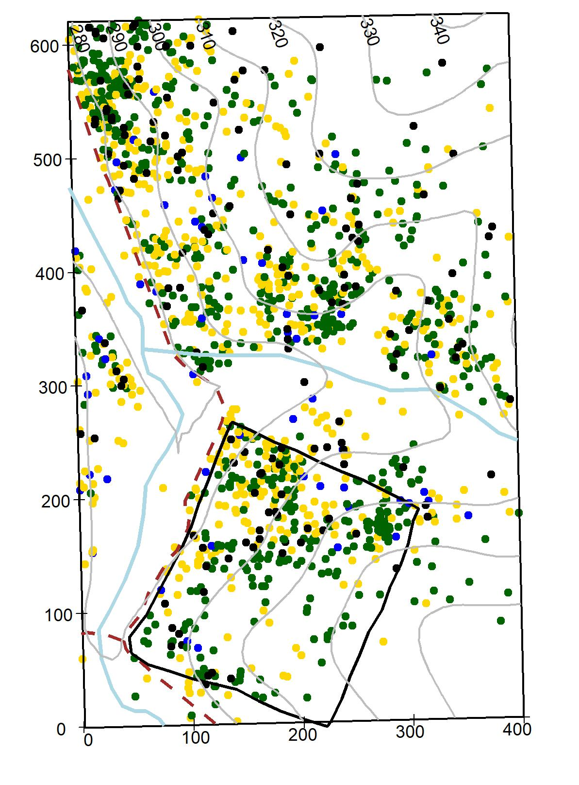{width=50%}{width=50%}
<table class="table table table-striped" style="font-size: 10px; margin-left: auto; margin-right: auto; margin-left: auto; margin-right: auto;">
 <thead>
  <tr>
   <th style="text-align:left;"> X </th>
   <th style="text-align:right;"> X2008 </th>
   <th style="text-align:right;"> X2013 </th>
   <th style="text-align:right;"> X2018 </th>
  </tr>
 </thead>
<tbody>
  <tr>
   <td style="text-align:left;"> Total Stems </td>
   <td style="text-align:right;"> 1440.0 </td>
   <td style="text-align:right;"> 1393.0 </td>
   <td style="text-align:right;"> 1343 </td>
  </tr>
  <tr>
   <td style="text-align:left;"> New Stems (recruit rate) </td>
   <td style="text-align:right;"> NA </td>
   <td style="text-align:right;"> NA </td>
   <td style="text-align:right;"> NA </td>
  </tr>
  <tr>
   <td style="text-align:left;"> Dead Stems </td>
   <td style="text-align:right;"> 74.0 </td>
   <td style="text-align:right;"> 121.0 </td>
   <td style="text-align:right;"> 171 </td>
  </tr>
  <tr>
   <td style="text-align:left;"> Min DBH </td>
   <td style="text-align:right;"> 10.3 </td>
   <td style="text-align:right;"> 10.4 </td>
   <td style="text-align:right;"> 10 </td>
  </tr>
  <tr>
   <td style="text-align:left;"> Max DBH </td>
   <td style="text-align:right;"> 572.6 </td>
   <td style="text-align:right;"> 693.8 </td>
   <td style="text-align:right;"> 718 </td>
  </tr>
</tbody>
</table>

### *Juglans cinerea* L. {-#Juglans-cinerea}
Common name: Butternut, White Walnut. Species code: juci. Stratum: canopy. Native. Conservation status: Endangered.

Trees up to 30 m, bark flat with gray ridges separated by dark fissures, developing diamond shaped patterns at maturity, twigs stout; leaf scars not notched on top; leaves compound, alternate, 30-60 cm long, leaflets 7-17, oblong-lanceolate, margin serrate, green above and paler beneath; inflorescences unisexual, male flowers densely arranged, yellow-green in drooping catkins 7-12 cm near apex of 2-nd year twigs; female flowers short, solitary or in groups at the end of the branch; fruits a nut, oblong (lemon shaped), 4-8 x 2.5-3 cm, husk thick, non-splitting. Very rare through the plot.

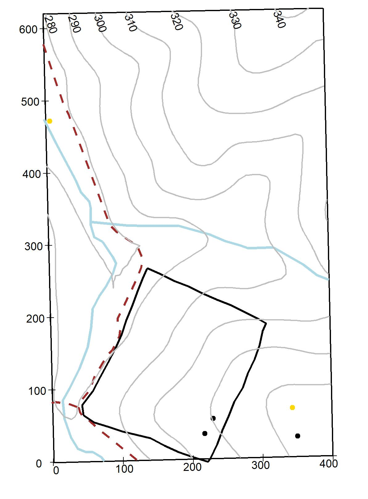{width=50%}{width=50%}
<table class="table table table-striped" style="font-size: 10px; margin-left: auto; margin-right: auto; margin-left: auto; margin-right: auto;">
 <thead>
  <tr>
   <th style="text-align:left;"> X </th>
   <th style="text-align:right;"> X2008 </th>
   <th style="text-align:right;"> X2013 </th>
   <th style="text-align:right;"> X2018 </th>
  </tr>
 </thead>
<tbody>
  <tr>
   <td style="text-align:left;"> Total Stems </td>
   <td style="text-align:right;"> 4.0 </td>
   <td style="text-align:right;"> 3.0 </td>
   <td style="text-align:right;"> 3 </td>
  </tr>
  <tr>
   <td style="text-align:left;"> New Stems (recruit rate) </td>
   <td style="text-align:right;"> NA </td>
   <td style="text-align:right;"> NA </td>
   <td style="text-align:right;"> NA </td>
  </tr>
  <tr>
   <td style="text-align:left;"> Dead Stems </td>
   <td style="text-align:right;"> 2.0 </td>
   <td style="text-align:right;"> 3.0 </td>
   <td style="text-align:right;"> 3 </td>
  </tr>
  <tr>
   <td style="text-align:left;"> Min DBH </td>
   <td style="text-align:right;"> 12.5 </td>
   <td style="text-align:right;"> 45.8 </td>
   <td style="text-align:right;"> 21 </td>
  </tr>
  <tr>
   <td style="text-align:left;"> Max DBH </td>
   <td style="text-align:right;"> 280.9 </td>
   <td style="text-align:right;"> 282.9 </td>
   <td style="text-align:right;"> 282 </td>
  </tr>
</tbody>
</table>

### *Juglans nigra*	L. {-#Juglans-nigra}
Common name: Black Walnut. Species code: juni. Stratum: canopy. Native. Conservation status: Least concern.

Trees up to 35 m, bark thick, rough, deeply ridged with a rough diamond pattern, dark brown to nearly black, twigs stout; leaf scars notched on top; leaves compound, alternate, 30-60 cm long, leaflets 9-23, ovate-lanceolate, terminal leaflet usually missing, margin finely serrate, yellow-green to green above and paler below; inflorescences unisexual, dense male flowers clusters, yellow-green in drooping catkins 7-12 cm near apex of 2-nd year twigs; female flowers short, solitary or in groups at the end of the branch; fruits a nut, globose to subglobose, 3.5-8 cm diameter, husk thick, irregularly furrowed, non-splitting. Common through the plot.

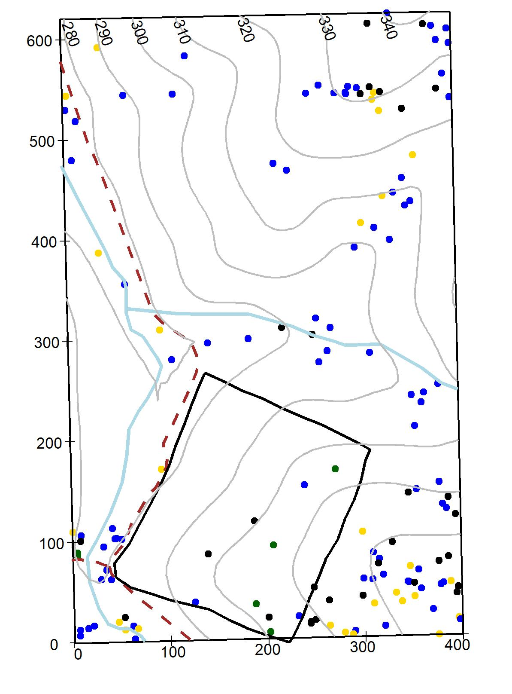{width=50%}{width=50%}
<table class="table table table-striped" style="font-size: 10px; margin-left: auto; margin-right: auto; margin-left: auto; margin-right: auto;">
 <thead>
  <tr>
   <th style="text-align:left;"> X </th>
   <th style="text-align:right;"> X2008 </th>
   <th style="text-align:right;"> X2013 </th>
   <th style="text-align:right;"> X2018 </th>
  </tr>
 </thead>
<tbody>
  <tr>
   <td style="text-align:left;"> Total Stems </td>
   <td style="text-align:right;"> 129.0 </td>
   <td style="text-align:right;"> 126.0 </td>
   <td style="text-align:right;"> 119 </td>
  </tr>
  <tr>
   <td style="text-align:left;"> New Stems (recruit rate) </td>
   <td style="text-align:right;"> NA </td>
   <td style="text-align:right;"> NA </td>
   <td style="text-align:right;"> NA </td>
  </tr>
  <tr>
   <td style="text-align:left;"> Dead Stems </td>
   <td style="text-align:right;"> 22.0 </td>
   <td style="text-align:right;"> 25.0 </td>
   <td style="text-align:right;"> 32 </td>
  </tr>
  <tr>
   <td style="text-align:left;"> Min DBH </td>
   <td style="text-align:right;"> 10.6 </td>
   <td style="text-align:right;"> 11.1 </td>
   <td style="text-align:right;"> 11 </td>
  </tr>
  <tr>
   <td style="text-align:left;"> Max DBH </td>
   <td style="text-align:right;"> 911.8 </td>
   <td style="text-align:right;"> 927.8 </td>
   <td style="text-align:right;"> 956 </td>
  </tr>
</tbody>
</table>

## Lauraceae
### *Lindera benzoin* (L.) Blume {-#Lindera-benzoin}
Common name: Spicebush. Species code: libe. Stratum: understory. Native. Conservation status: Least concern.

Shrub 1-5 m, multi-stemmed, aromatic, twigs slender with numerous dot- lenticels; leaves simple, alternate, 6-12 cm long, obovate to elliptical, strong and spicy odor when crushed, green above and slightly paler below; inflorescences 2-cm wide, flowers small, 5-7 mm, in small clusters appearing before the leaves, yellow petals; fruits a bright red drupe when ripe, 6-10 x 5-7 mm, ellipsoid. Very abundant through the southern part of the plot.

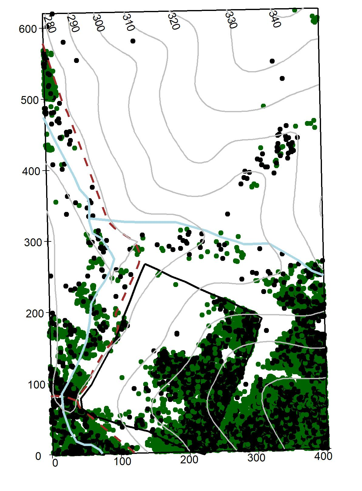{width=50%}{width=50%}
<table class="table table table-striped" style="font-size: 10px; margin-left: auto; margin-right: auto; margin-left: auto; margin-right: auto;">
 <thead>
  <tr>
   <th style="text-align:left;"> X </th>
   <th style="text-align:right;"> X2008 </th>
   <th style="text-align:right;"> X2013 </th>
   <th style="text-align:right;"> X2018 </th>
  </tr>
 </thead>
<tbody>
  <tr>
   <td style="text-align:left;"> Total Stems </td>
   <td style="text-align:right;"> 13877.0 </td>
   <td style="text-align:right;"> 20131.0 </td>
   <td style="text-align:right;"> 24649 </td>
  </tr>
  <tr>
   <td style="text-align:left;"> New Stems (recruit rate) </td>
   <td style="text-align:right;"> NA </td>
   <td style="text-align:right;"> NA </td>
   <td style="text-align:right;"> NA </td>
  </tr>
  <tr>
   <td style="text-align:left;"> Dead Stems </td>
   <td style="text-align:right;"> 22883.0 </td>
   <td style="text-align:right;"> 16628.0 </td>
   <td style="text-align:right;"> 12110 </td>
  </tr>
  <tr>
   <td style="text-align:left;"> Min DBH </td>
   <td style="text-align:right;"> 10.0 </td>
   <td style="text-align:right;"> 0.0 </td>
   <td style="text-align:right;"> 10 </td>
  </tr>
  <tr>
   <td style="text-align:left;"> Max DBH </td>
   <td style="text-align:right;"> 208.5 </td>
   <td style="text-align:right;"> 113.1 </td>
   <td style="text-align:right;"> 96 </td>
  </tr>
</tbody>
</table>

### *Sassafras albidum* (Nutt.) Nees {-#Sassafras-albidum}
Common name: Sassafras. Species code: saal. Stratum: Subcanopy to understory. Native. Conservation status: Least concern.

Shrub or trees to 30 m, bark becoming furrowed at maturity, twigs yellowish, hairless or pubescent when young; leaves simple, alternate, 5-18 cm long, obovate to elliptical, leaves may be unlobed or 2-5 lobed (resemble a mitten), green above and densely pubescent below, fragrant when crushed; flowers small, clustered axillary or at branch tips, 6-7 mm wide, yellow petals; fruits a dark shiny blue drupe, 6-13 mm, ellipsoid to ovoid, borne in a red cup attached to a red stalks. Common through the southern part of the plot.

{width=50%}{width=50%}
<table class="table table table-striped" style="font-size: 10px; margin-left: auto; margin-right: auto; margin-left: auto; margin-right: auto;">
 <thead>
  <tr>
   <th style="text-align:left;"> X </th>
   <th style="text-align:right;"> X2008 </th>
   <th style="text-align:right;"> X2013 </th>
   <th style="text-align:right;"> X2018 </th>
  </tr>
 </thead>
<tbody>
  <tr>
   <td style="text-align:left;"> Total Stems </td>
   <td style="text-align:right;"> 195.0 </td>
   <td style="text-align:right;"> 154.0 </td>
   <td style="text-align:right;"> 137 </td>
  </tr>
  <tr>
   <td style="text-align:left;"> New Stems (recruit rate) </td>
   <td style="text-align:right;"> NA </td>
   <td style="text-align:right;"> NA </td>
   <td style="text-align:right;"> NA </td>
  </tr>
  <tr>
   <td style="text-align:left;"> Dead Stems </td>
   <td style="text-align:right;"> 70.0 </td>
   <td style="text-align:right;"> 111.0 </td>
   <td style="text-align:right;"> 128 </td>
  </tr>
  <tr>
   <td style="text-align:left;"> Min DBH </td>
   <td style="text-align:right;"> 10.0 </td>
   <td style="text-align:right;"> 10.3 </td>
   <td style="text-align:right;"> 10 </td>
  </tr>
  <tr>
   <td style="text-align:left;"> Max DBH </td>
   <td style="text-align:right;"> 475.1 </td>
   <td style="text-align:right;"> 456.1 </td>
   <td style="text-align:right;"> 446 </td>
  </tr>
</tbody>
</table>

## Magnoliaceae
### *Liriodendron tulipifera*	L. {-#Liriodendron-tulipifera}
Common name: Tulip-Poplar, Yellow Poplar, Tuliptree. Species code: litu. Stratum: canopy. Native. Conservation status: Least concern.

Trees up to 50 m, bark soft, light gray-green and smooth when young, developing flat-topped ridges white colored furrows in diamond shaped at maturity, twigs stout; leaves simple, alternate, 4-20 x 5-28 cm, mostly orbicular, 4-lobed with, lamina notched or flat at apex, shiny green above and paler below; flowers showy, large and solitary at end of branches, petals greenish yellow, orange at base; fruits an oblong (cone-like) aggregate of samaras, 5-6 cm long,  each samara is 1-winged, 2.5-3 cm long. Occurs widely through the plot.

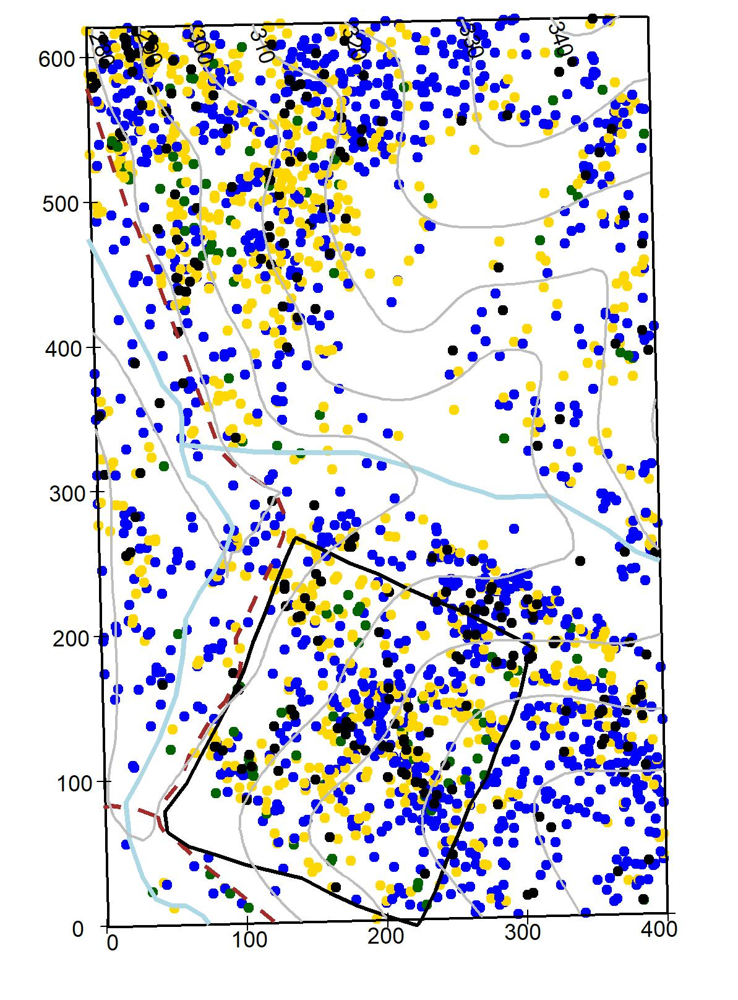{width=50%}{width=50%}
<table class="table table table-striped" style="font-size: 10px; margin-left: auto; margin-right: auto; margin-left: auto; margin-right: auto;">
 <thead>
  <tr>
   <th style="text-align:left;"> X </th>
   <th style="text-align:right;"> X2008 </th>
   <th style="text-align:right;"> X2013 </th>
   <th style="text-align:right;"> X2018 </th>
  </tr>
 </thead>
<tbody>
  <tr>
   <td style="text-align:left;"> Total Stems </td>
   <td style="text-align:right;"> 2496.0 </td>
   <td style="text-align:right;"> 2410.0 </td>
   <td style="text-align:right;"> 2305 </td>
  </tr>
  <tr>
   <td style="text-align:left;"> New Stems (recruit rate) </td>
   <td style="text-align:right;"> NA </td>
   <td style="text-align:right;"> NA </td>
   <td style="text-align:right;"> NA </td>
  </tr>
  <tr>
   <td style="text-align:left;"> Dead Stems </td>
   <td style="text-align:right;"> 103.0 </td>
   <td style="text-align:right;"> 189.0 </td>
   <td style="text-align:right;"> 294 </td>
  </tr>
  <tr>
   <td style="text-align:left;"> Min DBH </td>
   <td style="text-align:right;"> 10.1 </td>
   <td style="text-align:right;"> 10.1 </td>
   <td style="text-align:right;"> 10 </td>
  </tr>
  <tr>
   <td style="text-align:left;"> Max DBH </td>
   <td style="text-align:right;"> 1365.2 </td>
   <td style="text-align:right;"> 1422.3 </td>
   <td style="text-align:right;"> 1436 </td>
  </tr>
</tbody>
</table>

## Malvaceae
### *Tilia americana* L. {-#Tilia-americana}
Common name: American Basswood. Species code: tiam. Stratum: subcanopy to understory. Native. Conservation status: Least concern.

Trees up to 25 m, bark smooth and gray-green when young becoming ridged and furrowed at maturity, twigs stout, in zigzag, green or red; leaves simple, alternate, 10-15 cm long, ovate to cordate, margin serrate, green above and densely pubescent below; flowers small, 10-15 mm, borne in clusters below a long, curving leafy wing (5-12 cm), petals pale yellow; fruits a round nutlet, 4-6 mm, covered with gray-brown hair, hanging in clusters. Only common in wet areas.

{width=50%}{width=50%}
<table class="table table table-striped" style="font-size: 10px; margin-left: auto; margin-right: auto; margin-left: auto; margin-right: auto;">
 <thead>
  <tr>
   <th style="text-align:left;"> X </th>
   <th style="text-align:right;"> X2008 </th>
   <th style="text-align:right;"> X2013 </th>
   <th style="text-align:right;"> X2018 </th>
  </tr>
 </thead>
<tbody>
  <tr>
   <td style="text-align:left;"> Total Stems </td>
   <td style="text-align:right;"> 179.0 </td>
   <td style="text-align:right;"> 173.0 </td>
   <td style="text-align:right;"> 173 </td>
  </tr>
  <tr>
   <td style="text-align:left;"> New Stems (recruit rate) </td>
   <td style="text-align:right;"> NA </td>
   <td style="text-align:right;"> NA </td>
   <td style="text-align:right;"> NA </td>
  </tr>
  <tr>
   <td style="text-align:left;"> Dead Stems </td>
   <td style="text-align:right;"> 33.0 </td>
   <td style="text-align:right;"> 39.0 </td>
   <td style="text-align:right;"> 39 </td>
  </tr>
  <tr>
   <td style="text-align:left;"> Min DBH </td>
   <td style="text-align:right;"> 10.2 </td>
   <td style="text-align:right;"> 12.4 </td>
   <td style="text-align:right;"> 10 </td>
  </tr>
  <tr>
   <td style="text-align:left;"> Max DBH </td>
   <td style="text-align:right;"> 688.2 </td>
   <td style="text-align:right;"> 690.5 </td>
   <td style="text-align:right;"> 693 </td>
  </tr>
</tbody>
</table>

## Nyssaceae
### *Nyssa sylvatica* Marsh. {-#Nyssa-sylvatica}
Common name: Black Gum, Sour Gum. Species code: nysy. Stratum: subcanopy to understory. Native. Conservation status: Least concern.

Trees up to 25 m, bark gray-brown and irregularly furrowed, becoming blocky at maturity, twigs stout, red-brown to red; leaves simple, alternate, very thing, 3-15 cm long, oblong to obovate, dark green shinny above and paler below; flowers very small, 10-15 mm, hanging in clusters, light green; fruits a drupe, 6-12 mm, ellipsoid to globose, hanging in clusters, blue to blue-black. Only common in wet areas.

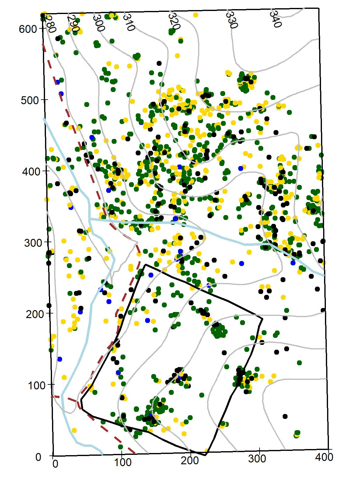{width=50%}{width=50%}
<table class="table table table-striped" style="font-size: 10px; margin-left: auto; margin-right: auto; margin-left: auto; margin-right: auto;">
 <thead>
  <tr>
   <th style="text-align:left;"> X </th>
   <th style="text-align:right;"> X2008 </th>
   <th style="text-align:right;"> X2013 </th>
   <th style="text-align:right;"> X2018 </th>
  </tr>
 </thead>
<tbody>
  <tr>
   <td style="text-align:left;"> Total Stems </td>
   <td style="text-align:right;"> 1438.0 </td>
   <td style="text-align:right;"> 1347.0 </td>
   <td style="text-align:right;"> 1248 </td>
  </tr>
  <tr>
   <td style="text-align:left;"> New Stems (recruit rate) </td>
   <td style="text-align:right;"> NA </td>
   <td style="text-align:right;"> NA </td>
   <td style="text-align:right;"> NA </td>
  </tr>
  <tr>
   <td style="text-align:left;"> Dead Stems </td>
   <td style="text-align:right;"> 71.0 </td>
   <td style="text-align:right;"> 162.0 </td>
   <td style="text-align:right;"> 261 </td>
  </tr>
  <tr>
   <td style="text-align:left;"> Min DBH </td>
   <td style="text-align:right;"> 10.0 </td>
   <td style="text-align:right;"> 10.0 </td>
   <td style="text-align:right;"> 10 </td>
  </tr>
  <tr>
   <td style="text-align:left;"> Max DBH </td>
   <td style="text-align:right;"> 666.8 </td>
   <td style="text-align:right;"> 657.2 </td>
   <td style="text-align:right;"> 664 </td>
  </tr>
</tbody>
</table>

## Oleaceae
### *Chionanthus virginicus* L. {-#Chionanthus-virginicus}
Common name: Fringetree, Old Man's Beard. Species code: chvi. Stratum: understory. Native. Conservation status: Least concern.

Shrub or small tree up to 10 m, bark dark gray-brown, becoming furrowed with reddish scales at maturity, twigs stout, ashy-gray; leaves simple, opposite, 10-20 cm long, ovate to elliptical, green above and paler below; flowers very showy, 20-25 mm, borne in clusters, petals linear, white, very fragrant; fruits an ovoid drupe, 1-1.5 cm, dark-blue to black, hanging in clusters. Very uncommon in the plot.

{width=50%}{width=50%}
<table class="table table table-striped" style="font-size: 10px; margin-left: auto; margin-right: auto; margin-left: auto; margin-right: auto;">
 <thead>
  <tr>
   <th style="text-align:left;"> X </th>
   <th style="text-align:right;"> X2008 </th>
   <th style="text-align:right;"> X2013 </th>
   <th style="text-align:right;"> X2018 </th>
  </tr>
 </thead>
<tbody>
  <tr>
   <td style="text-align:left;"> Total Stems </td>
   <td style="text-align:right;"> 15.0 </td>
   <td style="text-align:right;"> 10.0 </td>
   <td style="text-align:right;"> 10 </td>
  </tr>
  <tr>
   <td style="text-align:left;"> New Stems (recruit rate) </td>
   <td style="text-align:right;"> NA </td>
   <td style="text-align:right;"> NA </td>
   <td style="text-align:right;"> NA </td>
  </tr>
  <tr>
   <td style="text-align:left;"> Dead Stems </td>
   <td style="text-align:right;"> 3.0 </td>
   <td style="text-align:right;"> 8.0 </td>
   <td style="text-align:right;"> 8 </td>
  </tr>
  <tr>
   <td style="text-align:left;"> Min DBH </td>
   <td style="text-align:right;"> 12.0 </td>
   <td style="text-align:right;"> 20.5 </td>
   <td style="text-align:right;"> 12 </td>
  </tr>
  <tr>
   <td style="text-align:left;"> Max DBH </td>
   <td style="text-align:right;"> 85.5 </td>
   <td style="text-align:right;"> 90.3 </td>
   <td style="text-align:right;"> 92 </td>
  </tr>
</tbody>
</table>

### *Fraxinus americana* L. {-#Fraxinus-americana}
Common name: White Ash. Species code: fram. Stratum: canopy. Native. Conservation status: Critically endangered.

Trees up to 40 m, bark gray furrowed or finely ridged, with interlacing corky ridges forming diamonds, twigs stout, gray to olive-green; leaves compound, opposite, 5-20 cm long, leaflets 5-9, oblong to ovate or obovate to lanceolate, rounded at base, mostly hairless, margin serrate to smooth, green above and slightly paler below; flowers small, light green to purplish, lacking petals, females occurring in loose panicles, males in tighter clusters; fruits a one-winged, dry, flattened samara, 3-4 cm, with a full, rounded, seed cavity, hanging in clusters. Abundant through the plot.

{width=50%}{width=50%}
<table class="table table table-striped" style="font-size: 10px; margin-left: auto; margin-right: auto; margin-left: auto; margin-right: auto;">
 <thead>
  <tr>
   <th style="text-align:left;"> X </th>
   <th style="text-align:right;"> X2008 </th>
   <th style="text-align:right;"> X2013 </th>
   <th style="text-align:right;"> X2018 </th>
  </tr>
 </thead>
<tbody>
  <tr>
   <td style="text-align:left;"> Total Stems </td>
   <td style="text-align:right;"> 791.0 </td>
   <td style="text-align:right;"> 748.0 </td>
   <td style="text-align:right;"> 636 </td>
  </tr>
  <tr>
   <td style="text-align:left;"> New Stems (recruit rate) </td>
   <td style="text-align:right;"> NA </td>
   <td style="text-align:right;"> NA </td>
   <td style="text-align:right;"> NA </td>
  </tr>
  <tr>
   <td style="text-align:left;"> Dead Stems </td>
   <td style="text-align:right;"> 174.0 </td>
   <td style="text-align:right;"> 217.0 </td>
   <td style="text-align:right;"> 329 </td>
  </tr>
  <tr>
   <td style="text-align:left;"> Min DBH </td>
   <td style="text-align:right;"> 10.1 </td>
   <td style="text-align:right;"> 10.0 </td>
   <td style="text-align:right;"> 10 </td>
  </tr>
  <tr>
   <td style="text-align:left;"> Max DBH </td>
   <td style="text-align:right;"> 1053.4 </td>
   <td style="text-align:right;"> 1072.1 </td>
   <td style="text-align:right;"> 1102 </td>
  </tr>
</tbody>
</table>

### *Fraxinus nigra* Marsh. {-#Fraxinus-nigra}
Common name: Black Ash. Species code: frni. Stratum: canopy. Native. Conservation status: Critically endangered.

Trees up to 25 m, bark pale gray, flaky, scaly to corky at maturity, twigs stout, light brown to gray, opposite buds are nearly black; leaves compound, opposite, 7-12 cm long, leaflets 7-12, sessile, lanceolate to oblong, margin serrate, dark green above, lighter below with tufts of brown hair; flowers small, light green to purplish, lacking petals, females occurring in loose panicles, males in very tight rounded clusters; fruits a samara, one-winged, 2.5-4 cm, with an indistinct seed cavity, hanging in clusters. Sparse through the plot, grown only close to wet areas.

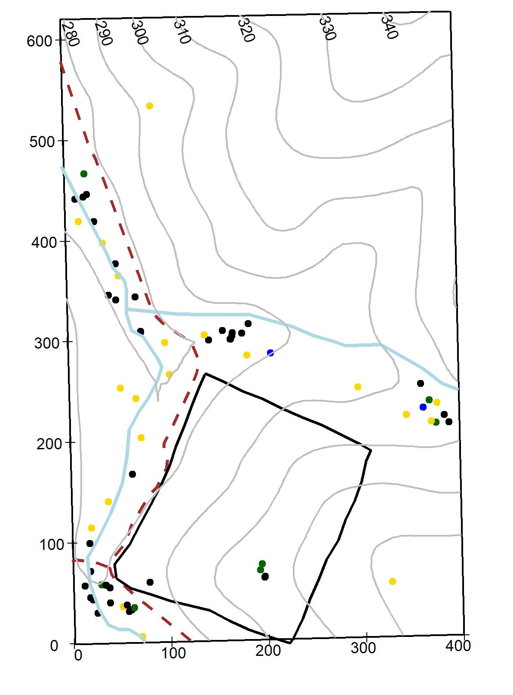{width=50%}{width=50%}
<table class="table table table-striped" style="font-size: 10px; margin-left: auto; margin-right: auto; margin-left: auto; margin-right: auto;">
 <thead>
  <tr>
   <th style="text-align:left;"> X </th>
   <th style="text-align:right;"> X2008 </th>
   <th style="text-align:right;"> X2013 </th>
   <th style="text-align:right;"> X2018 </th>
  </tr>
 </thead>
<tbody>
  <tr>
   <td style="text-align:left;"> Total Stems </td>
   <td style="text-align:right;"> 69.0 </td>
   <td style="text-align:right;"> 64.0 </td>
   <td style="text-align:right;"> 25 </td>
  </tr>
  <tr>
   <td style="text-align:left;"> New Stems (recruit rate) </td>
   <td style="text-align:right;"> NA </td>
   <td style="text-align:right;"> NA </td>
   <td style="text-align:right;"> NA </td>
  </tr>
  <tr>
   <td style="text-align:left;"> Dead Stems </td>
   <td style="text-align:right;"> 14.0 </td>
   <td style="text-align:right;"> 19.0 </td>
   <td style="text-align:right;"> 58 </td>
  </tr>
  <tr>
   <td style="text-align:left;"> Min DBH </td>
   <td style="text-align:right;"> 10.7 </td>
   <td style="text-align:right;"> 10.2 </td>
   <td style="text-align:right;"> 10 </td>
  </tr>
  <tr>
   <td style="text-align:left;"> Max DBH </td>
   <td style="text-align:right;"> 425.1 </td>
   <td style="text-align:right;"> 458.0 </td>
   <td style="text-align:right;"> 458 </td>
  </tr>
</tbody>
</table>

### *Fraxinus pennsylvanica* Marsh. {-#Fraxinus-pennsylvanica}
Common name: Green Ash. Species code: frpe. Stratum: canopy. Native. Conservation status: Critically endangered.

Trees up to 25 m, bark dark gray to brown, furrowed, twigs stout, gray to green-brown, hairless or pubescent; leaves compound, opposite, 7-18 cm long, leaflets 5-11, ovate or oblong to elliptic, margin serrate or entire, green above and hairless to silky-pubescent below; flowers small, light green to purplish, lacking petals, females occurring in loose panicles, males in tight clusters; fruits a samara, one-winged, 2.5-4 cm, with a slender, thin seed cavity, hanging in clusters. Rare through the plot.

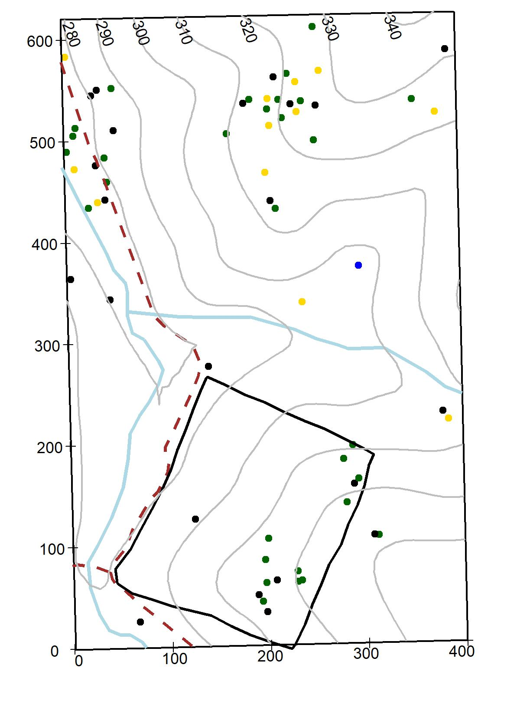{width=50%}{width=50%}
<table class="table table table-striped" style="font-size: 10px; margin-left: auto; margin-right: auto; margin-left: auto; margin-right: auto;">
 <thead>
  <tr>
   <th style="text-align:left;"> X </th>
   <th style="text-align:right;"> X2008 </th>
   <th style="text-align:right;"> X2013 </th>
   <th style="text-align:right;"> X2018 </th>
  </tr>
 </thead>
<tbody>
  <tr>
   <td style="text-align:left;"> Total Stems </td>
   <td style="text-align:right;"> 58.0 </td>
   <td style="text-align:right;"> 53.0 </td>
   <td style="text-align:right;"> 44 </td>
  </tr>
  <tr>
   <td style="text-align:left;"> New Stems (recruit rate) </td>
   <td style="text-align:right;"> NA </td>
   <td style="text-align:right;"> NA </td>
   <td style="text-align:right;"> NA </td>
  </tr>
  <tr>
   <td style="text-align:left;"> Dead Stems </td>
   <td style="text-align:right;"> 12.0 </td>
   <td style="text-align:right;"> 17.0 </td>
   <td style="text-align:right;"> 26 </td>
  </tr>
  <tr>
   <td style="text-align:left;"> Min DBH </td>
   <td style="text-align:right;"> 10.0 </td>
   <td style="text-align:right;"> 10.0 </td>
   <td style="text-align:right;"> 11 </td>
  </tr>
  <tr>
   <td style="text-align:left;"> Max DBH </td>
   <td style="text-align:right;"> 329.2 </td>
   <td style="text-align:right;"> 351.3 </td>
   <td style="text-align:right;"> 373 </td>
  </tr>
</tbody>
</table>

## Paulowniaceae
### *Paulownia tomentosa*	(Thunb.) Sieb. & Zucc. ex Steud. {-#Paulownia-tomentosa}
Common name: Royal Paulownia, Princess Tree, Empress Tree. Species code: pato. Stratum: Canopy. Introduced. Conservation status: Least concern.

Trees up to 20 m, bark dark to brownish-gray, with shallow fissures, twigs stout, light brown with prominent white lenticels; leaves simple, opposite, 10-30 cm long, broadly ovate with a heart shape base, margin entire, green above and paler below, typically velvety; inflorescences in clusters, flowers large, 5-7 cm, violet to light purple with yellow stripes within, very fragrant; fruits an oval capsule, 3-4 cm, woody with minute and abundant seeds. Uncommon through the plot.

{width=50%}{width=50%}
<table class="table table table-striped" style="font-size: 10px; margin-left: auto; margin-right: auto; margin-left: auto; margin-right: auto;">
 <thead>
  <tr>
   <th style="text-align:left;"> X </th>
   <th style="text-align:right;"> X2008 </th>
   <th style="text-align:right;"> X2013 </th>
   <th style="text-align:right;"> X2018 </th>
  </tr>
 </thead>
<tbody>
  <tr>
   <td style="text-align:left;"> Total Stems </td>
   <td style="text-align:right;"> 3.0 </td>
   <td style="text-align:right;"> 3.0 </td>
   <td style="text-align:right;"> 4 </td>
  </tr>
  <tr>
   <td style="text-align:left;"> New Stems (recruit rate) </td>
   <td style="text-align:right;"> NA </td>
   <td style="text-align:right;"> NA </td>
   <td style="text-align:right;"> NA </td>
  </tr>
  <tr>
   <td style="text-align:left;"> Dead Stems </td>
   <td style="text-align:right;"> 2.0 </td>
   <td style="text-align:right;"> 2.0 </td>
   <td style="text-align:right;"> 1 </td>
  </tr>
  <tr>
   <td style="text-align:left;"> Min DBH </td>
   <td style="text-align:right;"> 362.6 </td>
   <td style="text-align:right;"> 54.7 </td>
   <td style="text-align:right;"> 24 </td>
  </tr>
  <tr>
   <td style="text-align:left;"> Max DBH </td>
   <td style="text-align:right;"> 531.4 </td>
   <td style="text-align:right;"> 544.9 </td>
   <td style="text-align:right;"> 561 </td>
  </tr>
</tbody>
</table>

## Pinaceae
### *Pinus pungens*	Lamb. {-#Pinus-pungens}
Common name: Table-Mountain Pine. Species code: pipu. Stratum: subcanopy. Native.
Conservation status: Least concern.

Trees up to 20 m, bark nearly smooth to flaky, in plates; leaves 3-7 cm, 2 (3) per fascicle; females cones 5-9 cm, conic-ovoid, 3-8 mm stout spines.

{width=50%}{width=50%}
<table class="table table table-striped" style="font-size: 10px; margin-left: auto; margin-right: auto; margin-left: auto; margin-right: auto;">
 <thead>
  <tr>
   <th style="text-align:left;"> X </th>
   <th style="text-align:right;"> X2008 </th>
   <th style="text-align:right;"> X2013 </th>
   <th style="text-align:right;"> X2018 </th>
  </tr>
 </thead>
<tbody>
  <tr>
   <td style="text-align:left;"> Total Stems </td>
   <td style="text-align:right;"> 1.0 </td>
   <td style="text-align:right;"> 1.0 </td>
   <td style="text-align:right;"> 1 </td>
  </tr>
  <tr>
   <td style="text-align:left;"> New Stems (recruit rate) </td>
   <td style="text-align:right;"> NA </td>
   <td style="text-align:right;"> NA </td>
   <td style="text-align:right;"> NA </td>
  </tr>
  <tr>
   <td style="text-align:left;"> Dead Stems </td>
   <td style="text-align:right;"> 0.0 </td>
   <td style="text-align:right;"> 0.0 </td>
   <td style="text-align:right;"> 0 </td>
  </tr>
  <tr>
   <td style="text-align:left;"> Min DBH </td>
   <td style="text-align:right;"> 416.3 </td>
   <td style="text-align:right;"> 416.1 </td>
   <td style="text-align:right;"> 414 </td>
  </tr>
  <tr>
   <td style="text-align:left;"> Max DBH </td>
   <td style="text-align:right;"> 416.3 </td>
   <td style="text-align:right;"> 416.1 </td>
   <td style="text-align:right;"> 414 </td>
  </tr>
</tbody>
</table>

### *Pinus strobus* L. {-#Pinus-strobus}
Common name: Eastern White Pine. Species code: pist. Stratum: subcanopy. Native. Conservation status: Least concern.

Trees up to 50 m, rarely more than 60 m, bark and branches dark gray and smooth when young thick and rectangle blocks on mature trees; leaves 5-13 cm, 5 needles per fascicle, pale green; female cones 6-25 cm, slender, curved, spines lacking.

{width=50%}{width=50%}
<table class="table table table-striped" style="font-size: 10px; margin-left: auto; margin-right: auto; margin-left: auto; margin-right: auto;">
 <thead>
  <tr>
   <th style="text-align:left;"> X </th>
   <th style="text-align:right;"> X2008 </th>
   <th style="text-align:right;"> X2013 </th>
   <th style="text-align:right;"> X2018 </th>
  </tr>
 </thead>
<tbody>
  <tr>
   <td style="text-align:left;"> Total Stems </td>
   <td style="text-align:right;"> 100.0 </td>
   <td style="text-align:right;"> 88.0 </td>
   <td style="text-align:right;"> 84 </td>
  </tr>
  <tr>
   <td style="text-align:left;"> New Stems (recruit rate) </td>
   <td style="text-align:right;"> NA </td>
   <td style="text-align:right;"> NA </td>
   <td style="text-align:right;"> NA </td>
  </tr>
  <tr>
   <td style="text-align:left;"> Dead Stems </td>
   <td style="text-align:right;"> 10.0 </td>
   <td style="text-align:right;"> 22.0 </td>
   <td style="text-align:right;"> 26 </td>
  </tr>
  <tr>
   <td style="text-align:left;"> Min DBH </td>
   <td style="text-align:right;"> 75.2 </td>
   <td style="text-align:right;"> 73.4 </td>
   <td style="text-align:right;"> 74 </td>
  </tr>
  <tr>
   <td style="text-align:left;"> Max DBH </td>
   <td style="text-align:right;"> 649.5 </td>
   <td style="text-align:right;"> 682.9 </td>
   <td style="text-align:right;"> 716 </td>
  </tr>
</tbody>
</table>

### *Pinus virginiana* P. Mill.	{-#Pinus-virginiana}
Common name: Virginia Pine. Species code: pivi. Stratum: subcanopy. Native. Conservation status: Least concern.

Trees up to 20 m, rarely up to 30 m, bark thin and scaly with red-brown fissures; lower branches hold longer than other Pinus; leaves 2-13 cm, needles short, slender, 2 per fascicle, twisted; female cones 3-7 cm, ovoid, with curved spines, cones persistent.

{width=50%}{width=50%}
<table class="table table table-striped" style="font-size: 10px; margin-left: auto; margin-right: auto; margin-left: auto; margin-right: auto;">
 <thead>
  <tr>
   <th style="text-align:left;"> X </th>
   <th style="text-align:right;"> X2008 </th>
   <th style="text-align:right;"> X2013 </th>
   <th style="text-align:right;"> X2018 </th>
  </tr>
 </thead>
<tbody>
  <tr>
   <td style="text-align:left;"> Total Stems </td>
   <td style="text-align:right;"> 3.0 </td>
   <td style="text-align:right;"> 3.0 </td>
   <td style="text-align:right;"> 3 </td>
  </tr>
  <tr>
   <td style="text-align:left;"> New Stems (recruit rate) </td>
   <td style="text-align:right;"> NA </td>
   <td style="text-align:right;"> NA </td>
   <td style="text-align:right;"> NA </td>
  </tr>
  <tr>
   <td style="text-align:left;"> Dead Stems </td>
   <td style="text-align:right;"> 3.0 </td>
   <td style="text-align:right;"> 3.0 </td>
   <td style="text-align:right;"> 3 </td>
  </tr>
  <tr>
   <td style="text-align:left;"> Min DBH </td>
   <td style="text-align:right;"> 240.1 </td>
   <td style="text-align:right;"> 240.8 </td>
   <td style="text-align:right;"> 242 </td>
  </tr>
  <tr>
   <td style="text-align:left;"> Max DBH </td>
   <td style="text-align:right;"> 422.9 </td>
   <td style="text-align:right;"> 433.8 </td>
   <td style="text-align:right;"> 452 </td>
  </tr>
</tbody>
</table>

## Platanaceae
### *Platanus occidentalis* L. {-#Platanus-occidentalis}
Common name: Sycamore, American Sycamore. Species code: ploc. Stratum: canopy. Native. Conservation status: Least concern.

Trees up to 40 m, bark pale gray-green to white, gray-brown and scaly at maturity, twigs in zigzag, orange-brown; leaves simple, alternate, 10-20 cm wide, broadly ovate with a truncate base, palmately veined, with 3-5 broad lobes, margins coarsely toothed, green above and paler and slightly pubescent below; inflorescences solitary, globose, 1-4 cm diameter, male and female flowers very small, 2-3 mm, light green; fruits a spherical cluster of achenes, 7-9 mm, borne on a 7-15 cm stalk. Rare through the plot.

{width=50%}{width=50%}
<table class="table table table-striped" style="font-size: 10px; margin-left: auto; margin-right: auto; margin-left: auto; margin-right: auto;">
 <thead>
  <tr>
   <th style="text-align:left;"> X </th>
   <th style="text-align:right;"> X2008 </th>
   <th style="text-align:right;"> X2013 </th>
   <th style="text-align:right;"> X2018 </th>
  </tr>
 </thead>
<tbody>
  <tr>
   <td style="text-align:left;"> Total Stems </td>
   <td style="text-align:right;"> 36.0 </td>
   <td style="text-align:right;"> 32.0 </td>
   <td style="text-align:right;"> 30 </td>
  </tr>
  <tr>
   <td style="text-align:left;"> New Stems (recruit rate) </td>
   <td style="text-align:right;"> NA </td>
   <td style="text-align:right;"> NA </td>
   <td style="text-align:right;"> NA </td>
  </tr>
  <tr>
   <td style="text-align:left;"> Dead Stems </td>
   <td style="text-align:right;"> 3.0 </td>
   <td style="text-align:right;"> 7.0 </td>
   <td style="text-align:right;"> 9 </td>
  </tr>
  <tr>
   <td style="text-align:left;"> Min DBH </td>
   <td style="text-align:right;"> 10.2 </td>
   <td style="text-align:right;"> 11.5 </td>
   <td style="text-align:right;"> 29 </td>
  </tr>
  <tr>
   <td style="text-align:left;"> Max DBH </td>
   <td style="text-align:right;"> 929.5 </td>
   <td style="text-align:right;"> 961.6 </td>
   <td style="text-align:right;"> 989 </td>
  </tr>
</tbody>
</table>

## Rosaceae
### *Amelanchier arborea*	(Michx. f.) Fern. {-#Amelanchier-arborea}
Common name: Downy Serviceberry. Species code: amar. Stratum: understory. Native. Conservation status: Least concern.

Shrubs or small trees up to 10 m, bark smooth when young, ashy-gray with darker stripes, becoming rough with long vertical splits at maturity, twigs slender, flexible, red-brown to gray, with very short hair when young; leaves simple, alternate, 4-12 cm long, elliptic or obovate, mostly rounded at base, margins finely serrate, green above and paler below, slightly pubescent below when young; inflorescences racemose, pending, 3-5 cm long, showy white petals 2-2.5 cm long, occurring in drooping clusters; fruits a globose berry-like pome, 6-10 mm in diameter, dark purple to reddish purple or red, hanging in clusters. Abundant through the plot.

{width=50%}{width=50%}
<table class="table table table-striped" style="font-size: 10px; margin-left: auto; margin-right: auto; margin-left: auto; margin-right: auto;">
 <thead>
  <tr>
   <th style="text-align:left;"> X </th>
   <th style="text-align:right;"> X2008 </th>
   <th style="text-align:right;"> X2013 </th>
   <th style="text-align:right;"> X2018 </th>
  </tr>
 </thead>
<tbody>
  <tr>
   <td style="text-align:left;"> Total Stems </td>
   <td style="text-align:right;"> 355.0 </td>
   <td style="text-align:right;"> 309.0 </td>
   <td style="text-align:right;"> 285 </td>
  </tr>
  <tr>
   <td style="text-align:left;"> New Stems (recruit rate) </td>
   <td style="text-align:right;"> NA </td>
   <td style="text-align:right;"> NA </td>
   <td style="text-align:right;"> NA </td>
  </tr>
  <tr>
   <td style="text-align:left;"> Dead Stems </td>
   <td style="text-align:right;"> 63.0 </td>
   <td style="text-align:right;"> 109.0 </td>
   <td style="text-align:right;"> 133 </td>
  </tr>
  <tr>
   <td style="text-align:left;"> Min DBH </td>
   <td style="text-align:right;"> 10.3 </td>
   <td style="text-align:right;"> 10.1 </td>
   <td style="text-align:right;"> 10 </td>
  </tr>
  <tr>
   <td style="text-align:left;"> Max DBH </td>
   <td style="text-align:right;"> 213.1 </td>
   <td style="text-align:right;"> 227.9 </td>
   <td style="text-align:right;"> 237 </td>
  </tr>
</tbody>
</table>

### *Crataegus pruinosa* (Wendl. f.) K. Koch var. pruinosa {-#Crataegus-pruinosa}
Common name: Frosted Hawthorn, Waxyfruit Hawthorn. Species code: crpr. Stratum: understory. Native. Conservation status: Least concern.

Shrubs or small trees up to 5 m, bark smooth and gray-brown when young, becoming darker and scaly at maturity, twigs slender, gray, growing a 2-2.5 cm long thorn at random intervals; leaves simple, alternate, 3-6 cm long, ovate to deltoid, sometimes deeply lobed, born compactly in clusters of 2-3 leaves, margins sharply serrate, dark green to blue-green above and paler below, hairless; flowers small, 5-25 mm in diameter, growing in groups of 5-10, erect, white; fruits a small pome, 5-6 mm in diameter, yellow to red, hanging in short clusters. Rare in the plot.

{width=50%}{width=50%}
<table class="table table table-striped" style="font-size: 10px; margin-left: auto; margin-right: auto; margin-left: auto; margin-right: auto;">
 <thead>
  <tr>
   <th style="text-align:left;"> X </th>
   <th style="text-align:right;"> X2008 </th>
   <th style="text-align:right;"> X2013 </th>
   <th style="text-align:right;"> X2018 </th>
  </tr>
 </thead>
<tbody>
  <tr>
   <td style="text-align:left;"> Total Stems </td>
   <td style="text-align:right;"> 1.0 </td>
   <td style="text-align:right;"> 1.0 </td>
   <td style="text-align:right;"> 0 </td>
  </tr>
  <tr>
   <td style="text-align:left;"> New Stems (recruit rate) </td>
   <td style="text-align:right;"> NA </td>
   <td style="text-align:right;"> NA </td>
   <td style="text-align:right;"> NA </td>
  </tr>
  <tr>
   <td style="text-align:left;"> Dead Stems </td>
   <td style="text-align:right;"> 0.0 </td>
   <td style="text-align:right;"> 0.0 </td>
   <td style="text-align:right;"> 1 </td>
  </tr>
  <tr>
   <td style="text-align:left;"> Min DBH </td>
   <td style="text-align:right;"> 23.9 </td>
   <td style="text-align:right;"> 25.4 </td>
   <td style="text-align:right;"> Inf </td>
  </tr>
  <tr>
   <td style="text-align:left;"> Max DBH </td>
   <td style="text-align:right;"> 23.9 </td>
   <td style="text-align:right;"> 25.4 </td>
   <td style="text-align:right;"> -Inf </td>
  </tr>
</tbody>
</table>

### *Prunus avium* (L.) L. {-#Prunus-avium}
Common name: Sweet Cherry, Bird Cherry. Species code: prav. Stratum: subcanopy to understory. Introduced. Conservation status: Least concern.

Trees up to 20 m, bark reddish to brown, with prominent, long horizontal lenticels, often peels, branches not thorny, twigs irregular, textured, with a bitter almond taste; leaves simple, alternate, 7-15 cm long, ovate to obovate, margin double serrate, green above and paler below with two conspicuous red glands on petiole; inflorescences crowded with 3-5 flowers, flowers showy, 2-3 cm diameter, white; fruits a red/orange drupe, 1.5-2.5 cm, borne in clusters of 2-3. Common through the plot.

{width=50%}{width=50%}
<table class="table table table-striped" style="font-size: 10px; margin-left: auto; margin-right: auto; margin-left: auto; margin-right: auto;">
 <thead>
  <tr>
   <th style="text-align:left;"> X </th>
   <th style="text-align:right;"> X2008 </th>
   <th style="text-align:right;"> X2013 </th>
   <th style="text-align:right;"> X2018 </th>
  </tr>
 </thead>
<tbody>
  <tr>
   <td style="text-align:left;"> Total Stems </td>
   <td style="text-align:right;"> 98 </td>
   <td style="text-align:right;"> 95.0 </td>
   <td style="text-align:right;"> 99 </td>
  </tr>
  <tr>
   <td style="text-align:left;"> New Stems (recruit rate) </td>
   <td style="text-align:right;"> NA </td>
   <td style="text-align:right;"> NA </td>
   <td style="text-align:right;"> NA </td>
  </tr>
  <tr>
   <td style="text-align:left;"> Dead Stems </td>
   <td style="text-align:right;"> 39 </td>
   <td style="text-align:right;"> 42.0 </td>
   <td style="text-align:right;"> 38 </td>
  </tr>
  <tr>
   <td style="text-align:left;"> Min DBH </td>
   <td style="text-align:right;"> 10 </td>
   <td style="text-align:right;"> 10.5 </td>
   <td style="text-align:right;"> 10 </td>
  </tr>
  <tr>
   <td style="text-align:left;"> Max DBH </td>
   <td style="text-align:right;"> 401 </td>
   <td style="text-align:right;"> 414.2 </td>
   <td style="text-align:right;"> 428 </td>
  </tr>
</tbody>
</table>

### *Prunus persica* (L.) Batsch {-#Prunus-persica}
Common name: Peach. Species code: prpe. Stratum: understory. Introduced. Conservation status: Least concern.

Trees up to 10 m, bark reddish brown, becoming scaly at maturity, branches not thorny, twigs irregular, red or green; leaves simple, alternate, 8-15 cm long, lanceolate or oblanceolate, margin finely serrate, shiny dark green above and paler below; flowers solitary or in clusters, flowers showy, 2.5-4 cm wide, pink to lavender; fruits a drupe, 5-9.5 cm, subglobose, fuzzy, yellow and red. Only one specimen in the plot.

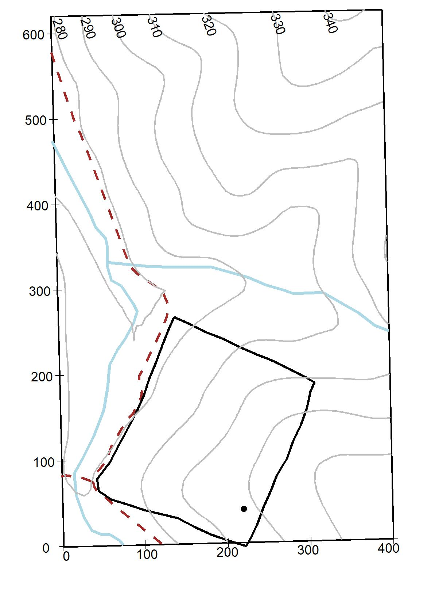{width=50%}{width=50%}
<table class="table table table-striped" style="font-size: 10px; margin-left: auto; margin-right: auto; margin-left: auto; margin-right: auto;">
 <thead>
  <tr>
   <th style="text-align:left;"> X </th>
   <th style="text-align:right;"> X2008 </th>
   <th style="text-align:right;"> X2013 </th>
   <th style="text-align:right;"> X2018 </th>
  </tr>
 </thead>
<tbody>
  <tr>
   <td style="text-align:left;"> Total Stems </td>
   <td style="text-align:right;"> 0 </td>
   <td style="text-align:right;"> 0 </td>
   <td style="text-align:right;"> 0 </td>
  </tr>
  <tr>
   <td style="text-align:left;"> New Stems (recruit rate) </td>
   <td style="text-align:right;"> NA </td>
   <td style="text-align:right;"> NA </td>
   <td style="text-align:right;"> NA </td>
  </tr>
  <tr>
   <td style="text-align:left;"> Dead Stems </td>
   <td style="text-align:right;"> 1 </td>
   <td style="text-align:right;"> 1 </td>
   <td style="text-align:right;"> 1 </td>
  </tr>
  <tr>
   <td style="text-align:left;"> Min DBH </td>
   <td style="text-align:right;"> Inf </td>
   <td style="text-align:right;"> Inf </td>
   <td style="text-align:right;"> Inf </td>
  </tr>
  <tr>
   <td style="text-align:left;"> Max DBH </td>
   <td style="text-align:right;"> -Inf </td>
   <td style="text-align:right;"> -Inf </td>
   <td style="text-align:right;"> -Inf </td>
  </tr>
</tbody>
</table>

### *Prunus serotina* Ehrh. var serotina {-#Prunus-serotina}
Common name: Black Cherry, Wild Black Cherry. Species code: prse. Stratum: understory. Native. Conservation status: Least concern.

Trees up to 30 m, bark smooth when young with numerous horizontal lenticels, dark to nearly black, breaking into small plates and becoming scaly at maturity, branches not thorny, twigs slender, reddish brown; leaves simple, alternate, 6-15 cm long, lanceolate or oblong, margin finely serrate, dark green and shiny above and paler below with dense brown minute hair along the midrib; inflorescences a hanging raceme, 10-16 cm long, flowers small, 7-13 mm wide, white; fruits a small drupe, 0.7-1.2 cm, globose, red becoming purple-black or black. Common thought the plot.

{width=50%}{width=50%}
<table class="table table table-striped" style="font-size: 10px; margin-left: auto; margin-right: auto; margin-left: auto; margin-right: auto;">
 <thead>
  <tr>
   <th style="text-align:left;"> X </th>
   <th style="text-align:right;"> X2008 </th>
   <th style="text-align:right;"> X2013 </th>
   <th style="text-align:right;"> X2018 </th>
  </tr>
 </thead>
<tbody>
  <tr>
   <td style="text-align:left;"> Total Stems </td>
   <td style="text-align:right;"> 41.0 </td>
   <td style="text-align:right;"> 63.0 </td>
   <td style="text-align:right;"> 75 </td>
  </tr>
  <tr>
   <td style="text-align:left;"> New Stems (recruit rate) </td>
   <td style="text-align:right;"> NA </td>
   <td style="text-align:right;"> NA </td>
   <td style="text-align:right;"> NA </td>
  </tr>
  <tr>
   <td style="text-align:left;"> Dead Stems </td>
   <td style="text-align:right;"> 54.0 </td>
   <td style="text-align:right;"> 32.0 </td>
   <td style="text-align:right;"> 20 </td>
  </tr>
  <tr>
   <td style="text-align:left;"> Min DBH </td>
   <td style="text-align:right;"> 10.2 </td>
   <td style="text-align:right;"> 10.4 </td>
   <td style="text-align:right;"> 10 </td>
  </tr>
  <tr>
   <td style="text-align:left;"> Max DBH </td>
   <td style="text-align:right;"> 931.0 </td>
   <td style="text-align:right;"> 939.1 </td>
   <td style="text-align:right;"> 674 </td>
  </tr>
</tbody>
</table>

### *Rosa multiflora* Thunb. ex Murr. {-#Rose-multiflora}
Common name: Multiflora Rose. Species code: romu. Stratum: understory. Introduced, highly invasive. Conservation status: Least concern.

Shrubs up to 3 m, arching or climbing, stems glabrous with prickles curved, flattened, broad-based; leaflets 5-11 obovate to oblong or elliptic, acute to slightly acuminate, serrate, glabrous above, pubescent or hairless underneath; inflorescences paniculate, pyramidal; adnate to petioles; flowers small, petals 1-2.5 cm, white, red, or pink; fruits a small fleshy ‘hip’ (6-12 mm), ellipsoids, red. Common through the plot.

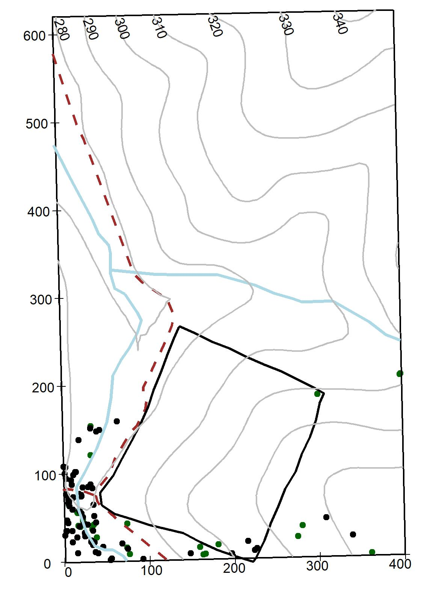{width=50%}{width=50%}
<table class="table table table-striped" style="font-size: 10px; margin-left: auto; margin-right: auto; margin-left: auto; margin-right: auto;">
 <thead>
  <tr>
   <th style="text-align:left;"> X </th>
   <th style="text-align:right;"> X2008 </th>
   <th style="text-align:right;"> X2013 </th>
   <th style="text-align:right;"> X2018 </th>
  </tr>
 </thead>
<tbody>
  <tr>
   <td style="text-align:left;"> Total Stems </td>
   <td style="text-align:right;"> 196 </td>
   <td style="text-align:right;"> 77.0 </td>
   <td style="text-align:right;"> 47 </td>
  </tr>
  <tr>
   <td style="text-align:left;"> New Stems (recruit rate) </td>
   <td style="text-align:right;"> NA </td>
   <td style="text-align:right;"> NA </td>
   <td style="text-align:right;"> NA </td>
  </tr>
  <tr>
   <td style="text-align:left;"> Dead Stems </td>
   <td style="text-align:right;"> 102 </td>
   <td style="text-align:right;"> 221.0 </td>
   <td style="text-align:right;"> 251 </td>
  </tr>
  <tr>
   <td style="text-align:left;"> Min DBH </td>
   <td style="text-align:right;"> 10 </td>
   <td style="text-align:right;"> 10.2 </td>
   <td style="text-align:right;"> 10 </td>
  </tr>
  <tr>
   <td style="text-align:left;"> Max DBH </td>
   <td style="text-align:right;"> 32 </td>
   <td style="text-align:right;"> 27.1 </td>
   <td style="text-align:right;"> 25 </td>
  </tr>
</tbody>
</table>

### *Rubus allegheniensis* Porter {-#Rubus-alleghiensis}
Common name: Allegheny Blackberry. Species code: rual. Stratum: understory. Native. Conservation status: Least concern.

Shrubs up to 3 m, stems erect or highly arching, rigid or angled when young, hairless, pubescence or with minute glands, usually armed with straight prickles; leaves  3- or 5-foliate, soft and short pubescent beneath; leaflets ovate to ovate-oblong, lateral leaflets narrower, terminal leaflets up to 20 cm; inflorescences racemiform, commonly elongate, multi flowered, flowers white; fruits a drupe, globose, 2.5 x 1.5 cm, black. Common through the plot.

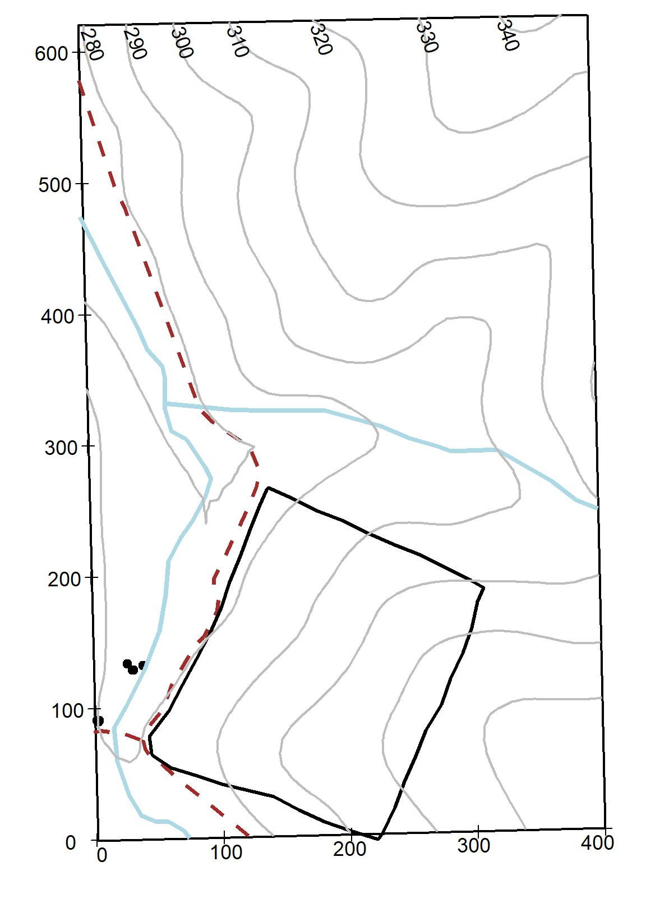{width=50%}{width=50%}
<table class="table table table-striped" style="font-size: 10px; margin-left: auto; margin-right: auto; margin-left: auto; margin-right: auto;">
 <thead>
  <tr>
   <th style="text-align:left;"> X </th>
   <th style="text-align:right;"> X2008 </th>
   <th style="text-align:right;"> X2013 </th>
   <th style="text-align:right;"> X2018 </th>
  </tr>
 </thead>
<tbody>
  <tr>
   <td style="text-align:left;"> Total Stems </td>
   <td style="text-align:right;"> 14.0 </td>
   <td style="text-align:right;"> 0 </td>
   <td style="text-align:right;"> 0 </td>
  </tr>
  <tr>
   <td style="text-align:left;"> New Stems (recruit rate) </td>
   <td style="text-align:right;"> NA </td>
   <td style="text-align:right;"> NA </td>
   <td style="text-align:right;"> NA </td>
  </tr>
  <tr>
   <td style="text-align:left;"> Dead Stems </td>
   <td style="text-align:right;"> 0.0 </td>
   <td style="text-align:right;"> 14 </td>
   <td style="text-align:right;"> 14 </td>
  </tr>
  <tr>
   <td style="text-align:left;"> Min DBH </td>
   <td style="text-align:right;"> 10.1 </td>
   <td style="text-align:right;"> Inf </td>
   <td style="text-align:right;"> Inf </td>
  </tr>
  <tr>
   <td style="text-align:left;"> Max DBH </td>
   <td style="text-align:right;"> 33.6 </td>
   <td style="text-align:right;"> -Inf </td>
   <td style="text-align:right;"> -Inf </td>
  </tr>
</tbody>
</table>

### *Rubus pensilvanicus*	Poir. {-#Rubus-pensilvanicus}
Common name: Pennsylvania Blackberry. Species code: rupe. Stratum: understory. Native. Conservation status: Least concern.

Shrubs up to 3 m, stems erect or ascending, 4-sided, glabrous or finely pubescent, purple when mature; leaves 3- or 5-foliate; leaflets oblong or oblong-lanceolate to ovate, serrate or doubly serrate, terminal leaflets up to 20 cm; petals 1.2-2.5 mm, white; fruits a small drupelet, 1-3 x 0.9-1.5 cm, globose to thick-cylindric, black.

{width=50%}{width=50%}
<table class="table table table-striped" style="font-size: 10px; margin-left: auto; margin-right: auto; margin-left: auto; margin-right: auto;">
 <thead>
  <tr>
   <th style="text-align:left;"> X </th>
   <th style="text-align:right;"> X2008 </th>
   <th style="text-align:right;"> X2013 </th>
   <th style="text-align:right;"> X2018 </th>
  </tr>
 </thead>
<tbody>
  <tr>
   <td style="text-align:left;"> Total Stems </td>
   <td style="text-align:right;"> 2.0 </td>
   <td style="text-align:right;"> 0 </td>
   <td style="text-align:right;"> 0 </td>
  </tr>
  <tr>
   <td style="text-align:left;"> New Stems (recruit rate) </td>
   <td style="text-align:right;"> NA </td>
   <td style="text-align:right;"> NA </td>
   <td style="text-align:right;"> NA </td>
  </tr>
  <tr>
   <td style="text-align:left;"> Dead Stems </td>
   <td style="text-align:right;"> 0.0 </td>
   <td style="text-align:right;"> 2 </td>
   <td style="text-align:right;"> 2 </td>
  </tr>
  <tr>
   <td style="text-align:left;"> Min DBH </td>
   <td style="text-align:right;"> 11.2 </td>
   <td style="text-align:right;"> Inf </td>
   <td style="text-align:right;"> Inf </td>
  </tr>
  <tr>
   <td style="text-align:left;"> Max DBH </td>
   <td style="text-align:right;"> 13.3 </td>
   <td style="text-align:right;"> -Inf </td>
   <td style="text-align:right;"> -Inf </td>
  </tr>
</tbody>
</table>

### *Rubus phoenicolasius* Maxim. {-#Rubus-phoenicolasius}
Common name: Wineberry. Species code: ruph. Stratum: understory. Introduced, highly invasive. Conservation status: Least concern.

Shrubs up to 2 m, stems arching, not angled; leaves 3-foliate, densely white-tomentose beneath; leaflets narrowly to broadly ovate, coarsely serrate, terminal leaflets 5-8 cm; petals 0.9-1.1 cm, pink or rose; fruits a small drupelet, 1-1.5 cm long and wide, purplish red.

{width=50%}{width=50%}
<table class="table table table-striped" style="font-size: 10px; margin-left: auto; margin-right: auto; margin-left: auto; margin-right: auto;">
 <thead>
  <tr>
   <th style="text-align:left;"> X </th>
   <th style="text-align:right;"> X2008 </th>
   <th style="text-align:right;"> X2013 </th>
   <th style="text-align:right;"> X2018 </th>
  </tr>
 </thead>
<tbody>
  <tr>
   <td style="text-align:left;"> Total Stems </td>
   <td style="text-align:right;"> 36.0 </td>
   <td style="text-align:right;"> 0 </td>
   <td style="text-align:right;"> 0 </td>
  </tr>
  <tr>
   <td style="text-align:left;"> New Stems (recruit rate) </td>
   <td style="text-align:right;"> NA </td>
   <td style="text-align:right;"> NA </td>
   <td style="text-align:right;"> NA </td>
  </tr>
  <tr>
   <td style="text-align:left;"> Dead Stems </td>
   <td style="text-align:right;"> 0.0 </td>
   <td style="text-align:right;"> 36 </td>
   <td style="text-align:right;"> 36 </td>
  </tr>
  <tr>
   <td style="text-align:left;"> Min DBH </td>
   <td style="text-align:right;"> 10.0 </td>
   <td style="text-align:right;"> Inf </td>
   <td style="text-align:right;"> Inf </td>
  </tr>
  <tr>
   <td style="text-align:left;"> Max DBH </td>
   <td style="text-align:right;"> 17.8 </td>
   <td style="text-align:right;"> -Inf </td>
   <td style="text-align:right;"> -Inf </td>
  </tr>
</tbody>
</table>

## Sapindaceae
### *Acer negundo* L. var negundo {-#Acer-negundo}
Common name: Eastern Boxelder. Species code: acne. Stratum: understory to subcanopy. Native. Conservation status: Least concern.

Trees up to 25 m, bark pale gray, becoming fissured throughout maturity; twigs glabrous and glossy green; leaves compound, leaflets 3-7 (-9), 4-15 cm long and up to 11 cm wide, ovate to elliptic or obovate, irregularly serrate or lobed, pubescent to hairless beneath; buds white, fuzzy, encapsulated by petiole base; flowers minute, male flowers in clusters, female flowers in narrow drooping racemes, yellow to brownish; fruits a double samara, 2-5 cm.

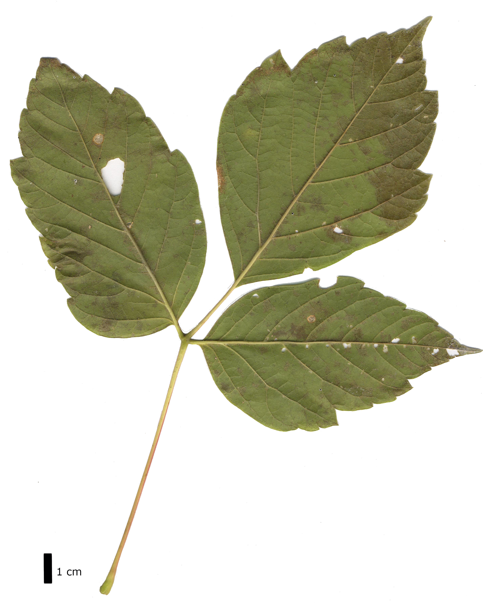{width=50%}{width=50%}
{width=75%}
<table class="table table table-striped" style="font-size: 10px; margin-left: auto; margin-right: auto; margin-left: auto; margin-right: auto;">
 <thead>
  <tr>
   <th style="text-align:left;"> X </th>
   <th style="text-align:right;"> X2008 </th>
   <th style="text-align:right;"> X2013 </th>
   <th style="text-align:right;"> X2018 </th>
  </tr>
 </thead>
<tbody>
  <tr>
   <td style="text-align:left;"> Total Stems </td>
   <td style="text-align:right;"> 38.0 </td>
   <td style="text-align:right;"> 64 </td>
   <td style="text-align:right;"> 139 </td>
  </tr>
  <tr>
   <td style="text-align:left;"> New Stems (recruit rate) </td>
   <td style="text-align:right;"> NA </td>
   <td style="text-align:right;"> NA </td>
   <td style="text-align:right;"> NA </td>
  </tr>
  <tr>
   <td style="text-align:left;"> Dead Stems </td>
   <td style="text-align:right;"> 124.0 </td>
   <td style="text-align:right;"> 98 </td>
   <td style="text-align:right;"> 23 </td>
  </tr>
  <tr>
   <td style="text-align:left;"> Min DBH </td>
   <td style="text-align:right;"> 10.4 </td>
   <td style="text-align:right;"> 10 </td>
   <td style="text-align:right;"> 10 </td>
  </tr>
  <tr>
   <td style="text-align:left;"> Max DBH </td>
   <td style="text-align:right;"> 214.2 </td>
   <td style="text-align:right;"> 238 </td>
   <td style="text-align:right;"> 242 </td>
  </tr>
</tbody>
</table>

### *Acer platanoides* L. {-#Acer-platanoides}
Common name: Norway Maple. Species code: acpl. Stratum: subcanopy to understory. Introduced. Conservation status: Least concern.

Trees up to 30 m; bark tight with interlacing, diamondlike pattern; leaves simple, shallow to deeply 3-5 (-7) lobed, 8-16 x 10-18 cm, glabrous, teeth few, irregular, sharp; erect inflorescences of 15-20 flowers, minute, yellow to pale-green; fruits a double samara, 3.5-5 cm.

{width=50%}{width=50%}
<table class="table table table-striped" style="font-size: 10px; margin-left: auto; margin-right: auto; margin-left: auto; margin-right: auto;">
 <thead>
  <tr>
   <th style="text-align:left;"> X </th>
   <th style="text-align:right;"> X2008 </th>
   <th style="text-align:right;"> X2013 </th>
   <th style="text-align:right;"> X2018 </th>
  </tr>
 </thead>
<tbody>
  <tr>
   <td style="text-align:left;"> Total Stems </td>
   <td style="text-align:right;"> 11.0 </td>
   <td style="text-align:right;"> 12.0 </td>
   <td style="text-align:right;"> 16 </td>
  </tr>
  <tr>
   <td style="text-align:left;"> New Stems (recruit rate) </td>
   <td style="text-align:right;"> NA </td>
   <td style="text-align:right;"> NA </td>
   <td style="text-align:right;"> NA </td>
  </tr>
  <tr>
   <td style="text-align:left;"> Dead Stems </td>
   <td style="text-align:right;"> 5.0 </td>
   <td style="text-align:right;"> 4.0 </td>
   <td style="text-align:right;"> 0 </td>
  </tr>
  <tr>
   <td style="text-align:left;"> Min DBH </td>
   <td style="text-align:right;"> 11.7 </td>
   <td style="text-align:right;"> 18.1 </td>
   <td style="text-align:right;"> 12 </td>
  </tr>
  <tr>
   <td style="text-align:left;"> Max DBH </td>
   <td style="text-align:right;"> 308.7 </td>
   <td style="text-align:right;"> 329.1 </td>
   <td style="text-align:right;"> 374 </td>
  </tr>
</tbody>
</table>

### *Acer rubrum*	L. {-#Acer-rubrum}
Common name: Red Maple. Species code: acru. Stratum: understory. Native. Conservation status: Least concern.

Trees up to 40 m, bark gray and smooth when young, mature trunks rough and platelike, twigs and buds reddish; leaves 5-15 x 3-18 cm, 3-5 lobed, margin coarsely serrate or irregularly dentate, red petioles; inflorescences semi globose, male flowers sessile, and female flowers short stalked, born in hanging clusters; petals red; fruits a double samara, 1-3 cm.

{width=50%}{width=50%}
<table class="table table table-striped" style="font-size: 10px; margin-left: auto; margin-right: auto; margin-left: auto; margin-right: auto;">
 <thead>
  <tr>
   <th style="text-align:left;"> X </th>
   <th style="text-align:right;"> X2008 </th>
   <th style="text-align:right;"> X2013 </th>
   <th style="text-align:right;"> X2018 </th>
  </tr>
 </thead>
<tbody>
  <tr>
   <td style="text-align:left;"> Total Stems </td>
   <td style="text-align:right;"> 388.0 </td>
   <td style="text-align:right;"> 340.0 </td>
   <td style="text-align:right;"> 309 </td>
  </tr>
  <tr>
   <td style="text-align:left;"> New Stems (recruit rate) </td>
   <td style="text-align:right;"> NA </td>
   <td style="text-align:right;"> NA </td>
   <td style="text-align:right;"> NA </td>
  </tr>
  <tr>
   <td style="text-align:left;"> Dead Stems </td>
   <td style="text-align:right;"> 34.0 </td>
   <td style="text-align:right;"> 82.0 </td>
   <td style="text-align:right;"> 113 </td>
  </tr>
  <tr>
   <td style="text-align:left;"> Min DBH </td>
   <td style="text-align:right;"> 9.5 </td>
   <td style="text-align:right;"> 10.4 </td>
   <td style="text-align:right;"> 10 </td>
  </tr>
  <tr>
   <td style="text-align:left;"> Max DBH </td>
   <td style="text-align:right;"> 699.5 </td>
   <td style="text-align:right;"> 715.0 </td>
   <td style="text-align:right;"> 745 </td>
  </tr>
</tbody>
</table>

## Simaroubaceae
### *Ailanthus altissima* (P. Miller) Swingle {-#Ailanthus-altissima}
Common name: Tree-of-Heaven. Species code: aial. Stratum: canopy. Introduced. Conservation status: Least concern.

Trees up to 25 m, bark light brown to gray, turning darker gray and rough at maturity, twigs stout, yellow to red-brown, with fine-short hairs when young; leaves compound, alternate, 30-90 cm long, leaflets 11-41, oblong to lanceolate, pointed at the tip with large, glandular teeth near the base, 8-18 cm long, margin entire, green above and below; inflorescences pyramidal, 10-30 cm, flowers small, 5-6 cm wide, greenish to yellow-green, in long 15-30 cm clusters, males have a strong odor; fruits an oblong, twisted samara, 2.4 cm long, hanging in clusters.

{width=50%}{width=50%}
<table class="table table table-striped" style="font-size: 10px; margin-left: auto; margin-right: auto; margin-left: auto; margin-right: auto;">
 <thead>
  <tr>
   <th style="text-align:left;"> X </th>
   <th style="text-align:right;"> X2008 </th>
   <th style="text-align:right;"> X2013 </th>
   <th style="text-align:right;"> X2018 </th>
  </tr>
 </thead>
<tbody>
  <tr>
   <td style="text-align:left;"> Total Stems </td>
   <td style="text-align:right;"> 43.0 </td>
   <td style="text-align:right;"> 34.0 </td>
   <td style="text-align:right;"> 26 </td>
  </tr>
  <tr>
   <td style="text-align:left;"> New Stems (recruit rate) </td>
   <td style="text-align:right;"> NA </td>
   <td style="text-align:right;"> NA </td>
   <td style="text-align:right;"> NA </td>
  </tr>
  <tr>
   <td style="text-align:left;"> Dead Stems </td>
   <td style="text-align:right;"> 3.0 </td>
   <td style="text-align:right;"> 12.0 </td>
   <td style="text-align:right;"> 20 </td>
  </tr>
  <tr>
   <td style="text-align:left;"> Min DBH </td>
   <td style="text-align:right;"> 10.2 </td>
   <td style="text-align:right;"> 14.3 </td>
   <td style="text-align:right;"> 24 </td>
  </tr>
  <tr>
   <td style="text-align:left;"> Max DBH </td>
   <td style="text-align:right;"> 327.0 </td>
   <td style="text-align:right;"> 341.0 </td>
   <td style="text-align:right;"> 353 </td>
  </tr>
</tbody>
</table>

## Ulmaceae
### *Ulmus americana*	L. {-#Ulmus-americana}
Common name: American Elm. Species code: ulam. Stratum: subcanopy. Native. Conservation status: Least concern.

Trees 20-40 m, dichotomously forked, arching, vase-shaped, bark gray and flaky with whitish and brown cross sections; twigs drooping, glabrous or slightly hairy; buds brown, glabrous to lightly hairy; leaves 5-18 x 4-9 cm, ovate-oblong to obovate or oval, abruptly pointed, margin double serrate; flowers minute, green to pinkish-brown in compact semi globose clusters, fruit a single elliptical to ellipsoid samara, deeply notched at apex, 8-12 mm, ciliate margins.

{width=50%}{width=50%}
<table class="table table table-striped" style="font-size: 10px; margin-left: auto; margin-right: auto; margin-left: auto; margin-right: auto;">
 <thead>
  <tr>
   <th style="text-align:left;"> X </th>
   <th style="text-align:right;"> X2008 </th>
   <th style="text-align:right;"> X2013 </th>
   <th style="text-align:right;"> X2018 </th>
  </tr>
 </thead>
<tbody>
  <tr>
   <td style="text-align:left;"> Total Stems </td>
   <td style="text-align:right;"> 41.0 </td>
   <td style="text-align:right;"> 28.0 </td>
   <td style="text-align:right;"> 16 </td>
  </tr>
  <tr>
   <td style="text-align:left;"> New Stems (recruit rate) </td>
   <td style="text-align:right;"> NA </td>
   <td style="text-align:right;"> NA </td>
   <td style="text-align:right;"> NA </td>
  </tr>
  <tr>
   <td style="text-align:left;"> Dead Stems </td>
   <td style="text-align:right;"> 4.0 </td>
   <td style="text-align:right;"> 17.0 </td>
   <td style="text-align:right;"> 29 </td>
  </tr>
  <tr>
   <td style="text-align:left;"> Min DBH </td>
   <td style="text-align:right;"> 28.5 </td>
   <td style="text-align:right;"> 12.5 </td>
   <td style="text-align:right;"> 40 </td>
  </tr>
  <tr>
   <td style="text-align:left;"> Max DBH </td>
   <td style="text-align:right;"> 292.0 </td>
   <td style="text-align:right;"> 241.2 </td>
   <td style="text-align:right;"> 257 </td>
  </tr>
</tbody>
</table>

### *Ulmus rubra*	Muhl. {-#Ulmus-rubra}
Common name: Red Elm, Slippery Elm. Species code: ulru. Stratum: understory. Native. Conservation status: Least concern.

Trees up to 15-30 m, arching, bark gray and rough on outer surface, reddish wood, twigs stout; leaves 10-20 x 5-9 cm, oblong to obovate, very rough above, margins finely toothed; flowers minute, in born in subglobose clusters pink or red, densely ciliate; fruit a single nearly orbicular samara, 1.5-2 cm, slightly pubescent or glabrous. In the US, populations of *Ulmus* spp. has decline over the past 40 years due to Dutch Elm Disease fungi (Ophiostoma ulmi).

{width=50%}{width=50%}
<table class="table table table-striped" style="font-size: 10px; margin-left: auto; margin-right: auto; margin-left: auto; margin-right: auto;">
 <thead>
  <tr>
   <th style="text-align:left;"> X </th>
   <th style="text-align:right;"> X2008 </th>
   <th style="text-align:right;"> X2013 </th>
   <th style="text-align:right;"> X2018 </th>
  </tr>
 </thead>
<tbody>
  <tr>
   <td style="text-align:left;"> Total Stems </td>
   <td style="text-align:right;"> 683 </td>
   <td style="text-align:right;"> 391 </td>
   <td style="text-align:right;"> 432 </td>
  </tr>
  <tr>
   <td style="text-align:left;"> New Stems (recruit rate) </td>
   <td style="text-align:right;"> NA </td>
   <td style="text-align:right;"> NA </td>
   <td style="text-align:right;"> NA </td>
  </tr>
  <tr>
   <td style="text-align:left;"> Dead Stems </td>
   <td style="text-align:right;"> 297 </td>
   <td style="text-align:right;"> 589 </td>
   <td style="text-align:right;"> 548 </td>
  </tr>
  <tr>
   <td style="text-align:left;"> Min DBH </td>
   <td style="text-align:right;"> 10 </td>
   <td style="text-align:right;"> 10 </td>
   <td style="text-align:right;"> 10 </td>
  </tr>
  <tr>
   <td style="text-align:left;"> Max DBH </td>
   <td style="text-align:right;"> 535 </td>
   <td style="text-align:right;"> 379 </td>
   <td style="text-align:right;"> 335 </td>
  </tr>
</tbody>
</table>
